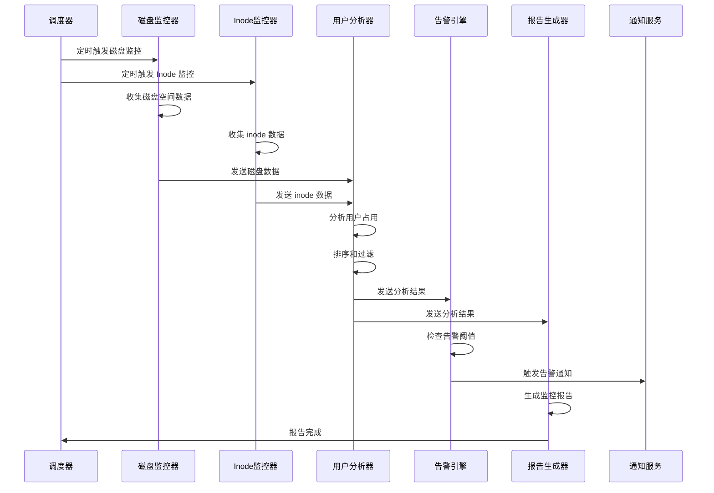
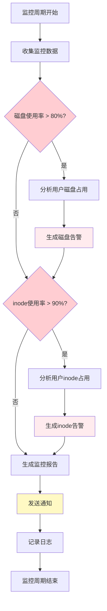

# RFC: ACK 磁盘监控系统设计

**RFC 类型:** 新项目设计  
**状态:** 草案  
**创建日期:** 2026-01-02  
**作者:** Architect团队  
**目标版本:** v1.0.0

---

## 目录

1. [概述](#1-概述)
2. [需求分析](#2-需求分析)
3. [系统架构](#3-系统架构)
4. [技术方案](#4-技术方案)
5. [核心功能设计](#5-核心功能设计)
6. [监控和告警策略](#6-监控和告警策略)
7. [部署方案](#7-部署方案)
8. [数据结构](#8-数据结构)
9. [性能考虑](#9-性能考虑)
10. [安全性考虑](#10-安全性考虑)
11. [测试策略](#11-测试策略)
12. [实施计划](#12-实施计划)

---

## 1. 概述

### 1.1 背景与动机

在服务器运维过程中，磁盘空间耗尽和 inode 不足是常见的故障原因，会导致：

- 服务不可用
- 数据丢失
- 系统崩溃
- 需要紧急扩容或清理数据

传统的监控方案往往缺乏：

- 用户级别的详细分析
- 和 inode 的联合监控
- 自动化的用户占用排序和通报
- 轻量级的容器化部署

### 1.2 目标

构建一个轻量级、高效的磁盘监控系统，能够：

- 实时监控磁盘空间和 inode 使用情况
- 按用户维度分析占用情况
- 提供智能告警和用户通报
- 支持容器化部署，易于集成

### 1.3 范围

**包含:**

- 磁盘空间监控
- inode 使用监控
- 用户级别的磁盘占用分析
- 告警通知机制
- Docker 容器化部署
- 配置管理系统

**不包含:**

- 磁盘自动清理功能
- 历史数据持久化和可视化
- 多服务器中央监控
- 成本分析和预测

---

## 2. 需求分析

### 2.1 功能需求

#### FR-1: 磁盘空间监控

- 系统应能够监控挂载的 /home 分区的磁盘空间使用情况
- 支持获取总容量、已使用容量、可用空间和使用百分比
- 监控周期可配置（默认 5 分钟）

#### FR-2: Inode 监控

- 系统应能够监控挂载的 /home 分区的 inode 使用情况
- 支持获取总 inode 数、已使用 inode 数、可用 inode 数和使用百分比
- 监控周期与磁盘空间监控一致

#### FR-3: 用户级别分析

- 系统应能够分析 /home 下每个用户的磁盘占用
- 支持按磁盘占用大小排序
- 支持按 inode 占用数量排序
- 记录用户占用时间戳

#### FR-4: 告警触发

- 磁盘空间使用率超过 80% 时触发告警
- inode 使用率超过 90% 时触发告警
- 告警应包含详细的使用情况数据

#### FR-5: 用户通报

- 磁盘占用超过 200GB 的用户需要进行通报
- inode 占用超过 10000 个的用户需要进行通报
- 通报信息应包含用户名、占用大小/数量、时间

#### FR-6: 告警通知

- 支持多种通知渠道（邮件、Webhook、Slack、企业微信等）
- 告警内容应包含：
  - 告警级别（WARNING/CRITICAL）
  - 监控指标值
  - 阈值
  - 受影响的用户列表
  - 建议措施

#### FR-7: 报告生成

- 生成包含磁盘使用情况、inode 使用情况的详细报告
- 报告格式支持 Markdown、JSON、HTML
- 支持输出到文件或标准输出

### 2.2 非功能需求

#### NFR-1: 性能

- 监控任务执行时间应小于 30 秒（针对 1000 个用户）
- 内存占用应小于 500MB
- 不应显著影响宿主机磁盘 I/O 性能

#### NFR-2: 可靠性

- 系统应具备自动重启机制
- 监控失败应进行重试（最多 3 次）
- 关键错误应记录日志

#### NFR-3: 可扩展性

- 支持配置多个监控阈值
- 支持添加自定义通知渠道
- 支持扩展监控指标

#### NFR-4: 可维护性

- 代码结构清晰，易于理解和修改
- 配置文件集中管理
- 提供详细的日志输出

#### NFR-5: 安全性

- 容器运行时应使用最小权限
- 不应暴露敏感信息
- 支持设置通知凭据的环境变量

---

## 3. 系统架构

### 3.1 架构概览

```mermaid
flowchart TB
    subgraph Host[宿主机环境]
        HomeFilesystem[/home 文件系统]
    end

    subgraph Container[Docker 容器]
        subgraph Components[监控组件]
            Scheduler[调度器]
            DiskMonitor[磁盘空间监控器]
            InodeMonitor[Inode监控器]
            UserAnalyzer[用户分析器]
            AlertEngine[告警引擎]
            ReportGenerator[报告生成器]
            ConfigManager[配置管理器]
            Logger[日志系统]
        end

        subgraph Tools[工具集成]
            GDU[gdu 工具]
            DF[df 命令]
            DU[du 命令]
            Find[find 命令]
        end
        
        subgraph Notification[通知服务]
            Email[邮件通知]
            Webhook[Webhook 通知]
            Slack[Slack 通知]
            WeWork[企业微信通知]
        end
    end

    HomeFilesystem -->|mount| Container
    Container -->|读取| HomeFilesystem

    Scheduler --> DiskMonitor
    Scheduler --> InodeMonitor
    
    DiskMonitor --> UserAnalyzer
    InodeMonitor --> UserAnalyzer
    
    UserAnalyzer --> AlertEngine
    UserAnalyzer --> ReportGenerator
    
    AlertEngine --> Notification
    
    GDU --> UserAnalyzer
    DF --> DiskMonitor
    DF --> InodeMonitor
    DU --> UserAnalyzer
    Find --> InodeMonitor
    
    ConfigManager --> Scheduler
    ConfigManager --> AlertEngine
    ConfigManager --> ReportGenerator
    
    Logger --> Components

    style Host fill:#e1f5fe
    style Container fill:#f3e5f5
    style AlertEngine fill:#ffcdd2
    style Notification fill:#fff9c4
```

### 3.2 数据流图



### 3.3 目录结构

```
packages/ack-disk-monitor/
├── README.md
├── pyproject.toml
├── uv.lock
├── dockerfiles/
│   ├── Dockerfile
│   └── .dockerignore
├── config/
│   ├── config.yaml
│   └── alerts.yaml
├── src/
│   └── ack_disk_monitor/
│       ├── __init__.py
│       ├── main.py
│       ├── config/
│       │   ├── __init__.py
│       │   ├── settings.py
│       │   └── constants.py
│       ├── core/
│       │   ├── __init__.py
│       │   ├── scheduler.py
│       │   ├── monitor.py
│       │   └── analyzer.py
│       ├── monitors/
│       │   ├── __init__.py
│       │   ├── disk_monitor.py
│       │   ├── inode_monitor.py
│       │   └── user_analyzer.py
│       ├── alerts/
│       │   ├── __init__.py
│       │   ├── alert_engine.py
│       │   ├── notifier.py
│       │   └── channels/
│       │       ├── __init__.py
│       │       ├── email.py
│       │       ├── webhook.py
│       │       ├── slack.py
│       │       └── wework.py
│       ├── reports/
│       │   ├── __init__.py
│       │   ├── generator.py
│       │   └── formatters/
│       │       ├── __init__.py
│       │       ├── markdown.py
│       │       ├── json.py
│       │       └── html.py
│       ├── utils/
│       │   ├── __init__.py
│       │   ├── gdu_wrapper.py
│       │   ├── shell.py
│       │   ├── logger.py
│       │   └── helpers.py
│       └── models/
│           ├── __init__.py
│           └── schemas.py
├── tests/
│   ├── __init__.py
│   ├── conftest.py
│   ├── test_monitor.py
│   ├── test_analyzer.py
│   ├── test_alerts.py
│   └── test_reports.py
└── docs/
    ├── usage.md
    └── configuration.md
```

---

## 4. 技术方案

### 4.1 技术栈选择

| 组件 | 技术选型 | 理由 |
|------|---------|------|
| 编程语言 | Python 3.10+ | 开发效率高、生态丰富、社区活跃 |
| 磁盘分析工具 | gdu (Go) | 高性能、支持并行、跨平台 |
| 调度框架 | APScheduler | 成熟稳定、支持多种触发器 |
| 邮件通知 | smtplib | Python 标准库，无需额外依赖 |
| HTTP 请求 | httpx | 异步、类型提示、现代设计 |
| 配置管理 | Pydantic | 高效的数据验证、类型安全 |
| 日志 | structlog | 结构化日志、易于过滤和分析 |
| 容器 | Docker | 轻量级、易部署、环境隔离 |

### 4.2 gdu 工具集成方案

#### 方案选择：容器内直接安装 gdu

**理由:**

- 轻量级（单个二进制文件）
- 无需复杂依赖
- 可以通过异步调用与 Python 主程序集成
- 支持非交互式模式，适合脚本调用

**安装方案:**

```dockerfile
# Dockerfile
FROM python:3.11-slim

# 安装 gdu (固定版本以确保稳定)
RUN curl -L https://github.com/dundee/gdu/releases/download/v5.29.0/gdu_linux_amd64.tgz | tar xz && \
    mv gdu_linux_amd64 /usr/local/bin/gdu && \
    chmod +x /usr/local/bin/gdu

# 安装 Python 依赖
# ...
```

#### gdu 调用策略

**用途 1: 快速磁盘概览**

```bash
# 获取磁盘使用情况总览
gdu -nts /mnt/home
```

**用途 2: 用户级别分析**

```bash
# 获取 /mnt/home 下每个用户的磁盘占用
gdu -npt -d 1 /mnt/home
```

**用途 3: 导出 JSON 进行详细分析**

```bash
# 导出完整分析结果为 JSON
gdu -o- /mnt/home > analysis.json
```

### 4.3 inode 监控方案

由于 gdu 主要用于磁盘空间分析，inode 监控需要额外方案：

#### 方案：使用 find 命令统计 inode

```bash
# 统计每个用户的 inode 占用
for user in /mnt/home/*/; do
    username=$(basename "$user")
    inode_count=$(find "$user" -xdev | wc -l)
    echo "$username:$inode_count"
done
```

**优化策略:**

- 并行执行用户分析（使用多进程）
- 缓存结果，避免重复计算
- 使用 `-maxdepth` 限制深度以减少开销
- 考虑使用 `stat` 命令获取更精确的 inode 信息

---

## 5. 核心功能设计

### 5.1 磁盘监控器 (DiskMonitor)

**职责:**

- 定期收集磁盘空间使用数据
- 调用 gdu 获取详细磁盘占用信息
- 格式化并返回监控数据

**接口设计:**

```python
class DiskMonitor:
    def __init__(self, mount_point: str):
        self.mount_point = mount_point
        self.gdu_path = "/usr/local/bin/gdu"
    
    async def collect_disk_usage(self) -> DiskUsage:
        """收集磁盘使用情况"""
        pass
    
    async def collect_top_directories(self, top_n: int = 20) -> List[DirectoryInfo]:
        """收集占用最大的目录"""
        pass
    
    def check_threshold(self, usage_percent: float, threshold: float) -> bool:
        """检查是否超过阈值"""
        pass
```

**实现细节:**

- 使用 `subprocess.run` 调用 gdu 命令
- 解析 JSON 或文本格式的输出
- 使用异步 I/O 提高性能
- 添加超时控制（默认 60 秒）

### 5.2 Inode 监控器 (InodeMonitor)

**职责:**

- 定期收集 inode 使用数据
- 分析每个用户的 inode 占用
- 格式化并返回监控数据

**接口设计:**

```python
class InodeMonitor:
    def __init__(self, mount_point: str):
        self.mount_point = mount_point
    
    async def collect_inode_usage(self) -> InodeUsage:
        """收集 inode 使用情况"""
        pass
    
    async def collect_user_inodes(self) -> Dict[str, int]:
        """收集每个用户的 inode 占用"""
        pass
    
    def check_threshold(self, usage_percent: float, threshold: float) -> bool:
        """检查是否超过阈值"""
        pass
```

**实现细节:**

- 使用 `subprocess.run` 调用 `df -i` 获取总体 inode 信息
- 使用 `find` 命令并行统计用户 inode
- 使用 `multiprocessing.Pool` 提高并行效率

### 5.3 用户分析器 (UserAnalyzer)

**职责:**

- 结合磁盘和 inode 数据
- 按用户维度进行排序和过滤
- 识别占用异常的用户

**接口设计:**

```python
class UserAnalyzer:
    def __init__(self, disk_threshold_gb: float, inode_threshold: int):
        self.disk_threshold_gb = disk_threshold_gb
        self.inode_threshold = inode_threshold
    
    async def analyze_user_usage(
        self, 
        disk_data: DiskUsage,
        inode_data: InodeUsage
    ) -> UserAnalysisResult:
        """分析用户使用情况"""
        pass
    
    def sort_by_disk_usage(self, users: List[UserInfo]) -> List[UserInfo]:
        """按磁盘使用量排序"""
        pass
    
    def sort_by_inode_usage(self, users: List[UserInfo]) -> List[UserInfo]:
        """按 inode 使用量排序"""
        pass
    
    def filter_high_usage_users(self, users: List[UserInfo]) -> List[UserInfo]:
        """过滤高占用用户"""
        pass
```

### 5.4 告警引擎 (AlertEngine)

**职责:**

- 检查监控数据是否触发告警
- 生成告警消息
- 调用通知服务发送告警

**接口设计:**

```python
class AlertEngine:
    def __init__(self, config: AlertConfig):
        self.config = config
        self.notifier = Notifier(config.channels)
    
    async def evaluate_alerts(
        self, 
        disk_data: DiskUsage,
        inode_data: InodeUsage,
        analysis: UserAnalysisResult
    ) -> List[Alert]:
        """评估是否需要告警"""
        pass
    
    async def send_alert(self, alert: Alert) -> bool:
        """发送告警"""
        pass
```

**告警级别:**

```python
class AlertSeverity(Enum):
    INFO = "info"          # 信息性告警
    WARNING = "warning"    # 警告（超过阈值但未严重）
    CRITICAL = "critical"  # 严重告警（磁盘或 inode 即将耗尽）
```

**告警类型:**

```python
class AlertType(Enum):
    DISK_USAGE_HIGH = "disk_usage_high"
    INODE_USAGE_HIGH = "inode_usage_high"
    USER_DISK_HIGH = "user_disk_high"
    USER_INODE_HIGH = "user_inode_high"
```

### 5.5 通知服务 (Notifier)

**职责:**

- 支持多种通知渠道
- 统一的通知接口
- 处理通知失败的重试逻辑

**接口设计:**

```python
class Notifier:
    def __init__(self, channels: List[NotificationChannel]):
        self.channels = channels
    
    async def send(self, alert: Alert) -> Dict[str, bool]:
        """发送告警到所有配置的渠道"""
        results = {}
        for channel in self.channels:
            try:
                success = await channel.send(alert)
                results[channel.name] = success
            except Exception as e:
                logger.error(f"Notification failed for {channel.name}: {e}")
                results[channel.name] = False
        return results
```

**通知渠道实现:**

```python
class NotificationChannel(ABC):
    @abstractmethod
    async def send(self, alert: Alert) -> bool:
        pass

class EmailChannel(NotificationChannel):
    async def send(self, alert: Alert) -> bool:
        pass

class WebhookChannel(NotificationChannel):
    async def send(self, alert: Alert) -> bool:
        pass

class SlackChannel(NotificationChannel):
    async def send(self, alert: Alert) -> bool:
        pass

class WeWorkChannel(NotificationChannel):
    async def send(self, alert: Alert) -> bool:
        pass
```

---

## 6. 监控和告警策略

### 6.1 监控阈值配置

```yaml
# config/thresholds.yaml
thresholds:
  disk:
    warning_percent: 80    # 磁盘使用率警告阈值
    critical_percent: 90   # 磁盘使用率严重告警阈值
    high_usage_gb: 200     # 用户高占用阈值(GB)
  
  inode:
    warning_percent: 90    # inode 使用率警告阈值
    critical_percent: 95   # inode 使用率严重告警阈值
    high_usage_count: 10000  # 用户高占用阈值(inode数量)
```

### 6.2 告警触发逻辑



### 6.3 告警消息格式

#### 磁盘告警示例

```markdown
# 🚨 磁盘使用率告警

**级别:** WARNING  
**时间:** 2026-01-02 16:00:00  
**挂载点:** /home  
**使用率:** 82.5% (warning_threshold: 80%)

## 磁盘使用情况
- 总容量: 2.0 TB
- 已使用: 1.65 TB
- 可用空间: 350 GB

## 高占用用户 (>200GB)
| 排名 | 用户名 | 占用量 (GB) | 占比 |
|------|--------|-------------|------|
| 1 | user1 | 350.2 | 21.2% |
| 2 | user2 | 280.5 | 17.0% |
| 3 | user3 | 215.8 | 13.1% |

## 建议措施
1. 联系上述用户进行数据清理
2. 检查是否有临时文件可以清理
3. 考虑扩容或迁移数据
```

#### Inode 告警示例

```markdown
# 🚨 Inode 使用率告警

**级别:** CRITICAL  
**时间:** 2026-01-02 16:00:00  
**挂载点:** /home  
**使用率:** 92.3% (critical_threshold: 90%)

## Inode 使用情况
- 总 inode 数: 10,000,000
- 已使用: 9,230,000
- 可用 inode: 770,000

## 高占用用户 (>10000 inodes)
| 排名 | 用户名 | inode 数量 | 占比 |
|------|--------|-----------|------|
| 1 | user1 | 150,000 | 1.6% |
| 2 | user2 | 85,000 | 0.9% |
| 3 | user3 | 32,000 | 0.3% |

## 建议措施
1. 上述用户可能存在大量小文件
2. 检查是否有日志文件或缓存文件堆积
3. 考虑重新格式化分区或增加 inode 密度
```

### 6.4 告警抑制策略

为避免告警风暴，实施以下抑制策略：

1. **告警冷却期**: 同一类型的告警在 1 小时内只发送一次
2. **告警升级**: 如果告警持续未解决，告警级别会升级
3. **告警恢复**: 当指标回落到阈值以下时，发送恢复通知
4. **维护窗口**: 支持配置维护时间段，该期间不发送告警

---

## 7. 部署方案

### 7.1 Dockerfile 设计

```dockerfile
# dockerfiles/Dockerfile
FROM python:3.11-slim

LABEL maintainer="iroot-llm team"
LABEL description="ACK 磁盘监控系统"

# 安装系统依赖
RUN apt-get update && apt-get install -y \
    curl \
    procps \
    coreutils \
    findutils \
    && rm -rf /var/lib/apt/lists/*

# 安装 gdu (固定版本 v5.29.0)
RUN curl -L https://github.com/dundee/gdu/releases/download/v5.29.0/gdu_linux_amd64.tgz | tar xz && \
    mv gdu_linux_amd64 /usr/local/bin/gdu && \
    chmod +x /usr/local/bin/gdu && \
    rm -rf gdu_linux_amd64*

# 设置工作目录
WORKDIR /app

# 复制依赖文件
COPY pyproject.toml uv.lock /app/

# 安装 Python 依赖 (使用 uv)
COPY --from=ghcr.io/astral-sh/uv:latest /uv-bin /uv-bin
RUN /uv-bin/uv sync --frozen --no-dev

# 复制源代码
COPY src/ /app/src/

# 创建非 root 用户
RUN useradd -r -u 1000 -m -s /bin/bash monitor
USER monitor

# 创建数据目录
RUN mkdir -p /app/logs /app/reports

# 暴露配置文件路径
VOLUME ["/app/config", "/app/logs"]

# 设置环境变量
ENV PYTHONUNBUFFERED=1
ENV CONFIG_FILE=/app/config/config.yaml

# 入口点
ENTRYPOINT ["uv", "run", "--no-dev", "python", "-m", "ack_disk_monitor.main"]
CMD ["--config", "/app/config/config.yaml"]
```

### 7.2 Docker Compose 配置

```yaml
# docker-compose.yml
version: '3.8'

services:
  disk-monitor:
    build:
      context: .
      dockerfile: dockerfiles/Dockerfile
    container_name: ack-disk-monitor
    restart: unless-stopped
    
    # 挂载 /home 目录
    volumes:
      - /home:/mnt/home:ro
      - ./config/config.yaml:/app/config/config.yaml:ro
      - ./config/alerts.yaml:/app/config/alerts.yaml:ro
      - ./logs:/app/logs
      - ./reports:/app/reports
    
    # 环境变量配置
    environment:
      - TZ=Asia/Shanghai
      - MONITOR_INTERVAL=300  # 监控间隔(秒)
      # 邮件通知配置
      - SMTP_HOST=smtp.example.com
      - SMTP_PORT=587
      - SMTP_USER=alerts@example.com
      - SMTP_PASSWORD=${SMTP_PASSWORD}
      # Slack 通知配置
      - SLACK_WEBHOOK_URL=${SLACK_WEBHOOK_URL}
      # 企业微信通知配置
      - WEWORK_WEBHOOK_URL=${WEWORK_WEBHOOK_URL}
    
    # 资源限制
    deploy:
      resources:
        limits:
          cpus: '1.0'
          memory: 512M
        reservations:
          cpus: '0.5'
          memory: 256M
    
    # 网络模式（可选）
    network_mode: host
    
    # 日志配置
    logging:
      driver: "json-file"
      options:
        max-size: "10m"
        max-file: "3"
```

### 7.3 运行命令

```bash
# 构建镜像
docker-compose build

# 启动服务
docker-compose up -d

# 查看日志
docker-compose logs -f

# 停止服务
docker-compose down

# 重新加载配置
docker-compose restart
```

### 7.4 Docker 直接运行（不使用 Compose）

```bash
# 构建镜像
docker build -f dockerfiles/Dockerfile -t ack-disk-monitor:latest .

# 运行容器
docker run -d \
  --name ack-disk-monitor \
  --restart unless-stopped \
  --network host \
  --memory 512m \
  --cpus 1.0 \
  -v /home:/mnt/home:ro \
  -v $(pwd)/config/config.yaml:/app/config/config.yaml:ro \
  -v $(pwd)/config/alerts.yaml:/app/config/alerts.yaml:ro \
  -v $(pwd)/logs:/app/logs \
  -v $(pwd)/reports:/app/reports \
  -e TZ=Asia/Shanghai \
  -e SMTP_HOST=smtp.example.com \
  -e SMTP_PORT=587 \
  -e SMTP_USER=alerts@example.com \
  -e SMTP_PASSWORD=your_password \
  ack-disk-monitor:latest
```

---

## 8. 数据结构

### 8.1 监控数据模型

```python
# src/ack_disk_monitor/models/schemas.py
from pydantic import BaseModel, Field
from typing import Optional, List
from datetime import datetime
from enum import Enum

class AlertSeverity(str, Enum):
    INFO = "info"
    WARNING = "warning"
    CRITICAL = "critical"

class AlertType(str, Enum):
    DISK_USAGE_HIGH = "disk_usage_high"
    INODE_USAGE_HIGH = "inode_usage_high"
    USER_DISK_HIGH = "user_disk_high"
    USER_INODE_HIGH = "user_inode_high"

class DiskUsage(BaseModel):
    """磁盘使用情况"""
    mount_point: str
    total_gb: float = Field(..., description="总容量(GB)")
    used_gb: float = Field(..., description="已使用(GB)")
    available_gb: float = Field(..., description="可用空间(GB)")
    usage_percent: float = Field(..., description="使用百分比")
    timestamp: datetime = Field(default_factory=datetime.now)

class InodeUsage(BaseModel):
    """Inode 使用情况"""
    mount_point: str
    total: int = Field(..., description="总 inode 数")
    used: int = Field(..., description="已使用 inode 数")
    available: int = Field(..., description="可用 inode 数")
    usage_percent: float = Field(..., description="使用百分比")
    timestamp: datetime = Field(default_factory=datetime.now)

class UserInfo(BaseModel):
    """用户占用信息"""
    username: str
    disk_usage_gb: float = Field(default=0.0, description="磁盘占用(GB)")
    inode_usage: int = Field(default=0, description="inode 占用数")
    last_updated: datetime = Field(default_factory=datetime.now)
    
    # 目录位置
    path: Optional[str] = None

class UserAnalysisResult(BaseModel):
    """用户分析结果"""
    scan_timestamp: datetime = Field(default_factory=datetime.now)
    
    # 用户列表
    users: List[UserInfo] = Field(default_factory=list)
    
    # 排序后的用户列表
    top_disk_users: List[UserInfo] = Field(default_factory=list)
    top_inode_users: List[UserInfo] = Field(default_factory=list)
    
    # 高占用用户
    high_disk_users: List[UserInfo] = Field(default_factory=list)
    high_inode_users: List[UserInfo] = Field(default_factory=list)
    
    # 统计信息
    total_users: int = 0
    total_disk_usage: float = 0.0
    total_inode_usage: int = 0

class Alert(BaseModel):
    """告警信息"""
    id: str = Field(default_factory=lambda: str(uuid.uuid4()))
    alert_type: AlertType
    severity: AlertSeverity
    title: str
    message: str
    
    # 关联的监控数据
    disk_data: Optional[DiskUsage] = None
    inode_data: Optional[InodeUsage] = None
    analysis: Optional[UserAnalysisResult] = None
    
    # 受影响的用户
    affected_users: List[str] = Field(default_factory=list)
    
    # 建议措施
    recommendations: List[str] = Field(default_factory=list)
    
    # 时间戳
    created_at: datetime = Field(default_factory=datetime.now)
    
    class Config:
        use_enum_values = True

class MonitoringReport(BaseModel):
    """监控报告"""
    report_id: str = Field(default_factory=lambda: str(uuid.uuid4()))
    generated_at: datetime = Field(default_factory=datetime.now)
    
    # 监控数据
    disk_data: DiskUsage
    inode_data: InodeUsage
    user_analysis: UserAnalysisResult
    
    # 告警信息
    alerts: List[Alert] = Field(default_factory=list)
    
    # 报告摘要
    summary: str = ""
```

### 8.2 配置数据模型

```python
class ThresholdConfig(BaseModel):
    """阈值配置"""
    disk_warning_percent: float = 80.0
    disk_critical_percent: float = 90.0
    disk_high_usage_gb: float = 200.0
    
    inode_warning_percent: float = 90.0
    inode_critical_percent: float = 95.0
    inode_high_usage_count: int = 10000

class NotificationChannelConfig(BaseModel):
    """通知渠道配置"""
    enabled: bool = True
    name: str
    
class EmailChannelConfig(NotificationChannelConfig):
    """邮件通知配置"""
    smtp_host: str
    smtp_port: int = 587
    smtp_username: str
    smtp_password: str
    from_address: str
    to_addresses: List[str] = []
    subject_prefix: str = "[磁盘监控]"

class WebhookChannelConfig(NotificationChannelConfig):
    """Webhook 通知配置"""
    url: str
    method: str = "POST"
    headers: Optional[Dict[str, str]] = None

class SlackChannelConfig(NotificationChannelConfig):
    """Slack 通知配置"""
    webhook_url: str
    channel: str = "#alerts"

class WeWorkChannelConfig(NotificationChannelConfig):
    """企业微信通知配置"""
    webhook_url: str
    mentioned_list: List[str] = []

class AlertConfig(BaseModel):
    """告警配置"""
    thresholds: ThresholdConfig = Field(default_factory=ThresholdConfig)
    cooldown_period: int = 3600  # 告警冷却期(秒)
    
    # 通知渠道
    channels: List[NotificationChannelConfig] = Field(default_factory=list)
    
    # 维护窗口
    maintenance_windows: List[Dict[str, str]] = Field(default_factory=list)

class MonitorConfig(BaseModel):
    """监控配置"""
    scan_mount_point: str = "/home"
    scan_interval_seconds: int = 300  # 5 分钟
    
    # gdu 配置
    gdu_path: str = "/usr/local/bin/gdu"
    gdu_timeout_seconds: int = 60
    
    # 并发配置
    max_workers: int = 4
    
    # 日志配置
    log_level: str = "INFO"
    log_file: str = "/app/logs/monitor.log"
    log_format: str = "json"
    
    # 报告配置
    report_enabled: bool = True
    report_formats: List[str] = ["markdown", "json"]
    report_output_dir: str = "/app/reports"
    
    # 告警配置
    alerts: AlertConfig = Field(default_factory=AlertConfig)
```

---

## 9. 性能考虑

### 9.1 性能优化策略

#### 9.1.1 并行处理

- **用户分析并行化**: 使用 `multiprocessing.Pool` 或 `asyncio.gather` 并行分析多个用户的磁盘占用
- **监控任务异步化**: 使用 `asyncio` 实现磁盘和 inode 监控的并发执行
- **避免阻塞**: 所有 I/O 操作都使用异步方式实现

#### 9.1.2 数据缓存

- **缓存用户列表**: 避免每次都扫描 /home 目录获取用户列表
- **缓存分析结果**: 在同一监控周期内，磁盘和 inode 分析结果可以复用
- **选择性扫描**: 对于占用量小的用户，减少扫描深度

#### 9.1.3 智能扫描策略

- **增量扫描**: 只扫描变化的目录（需要维护文件修改时间戳）
- **深度限制**: 限制 gdu 的扫描深度，避免过度深入
- **目录白名单/黑名单**: 支持配置忽略某些目录（如 `.cache`, `.node_modules`）

### 9.2 性能指标

| 指标 | 目标值 | 测量方法 |
|------|--------|----------|
| 单次监控耗时 | < 30 秒 | 监控主程序执行时间 |
| 内存占用 | < 512MB | 容器资源监控 |
| CPU 使用率 | < 50% | 容器 CPU 监控 |
| gdu 响应时间 | < 10 秒 | gdu 命令执行时间 |
| 告警发送延迟 | < 5 秒 | 从检测到发送的时间 |

### 9.3 监控性能

在生产环境中，应该监控以下性能指标：

- 平均监控周期时长
- P95/P99 监控周期时长
- gdu 调用失败率
- 告警发送成功率
- 内存和 CPU 使用趋势

---

## 10. 安全性考虑

### 10.1 容器安全

**1. 最小权限原则**

- 容器以非 root 用户运行（使用 `monitor` 用户）
- 挂载目录
