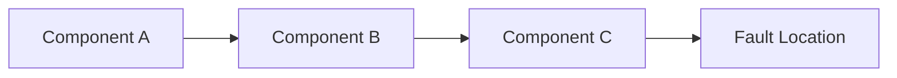
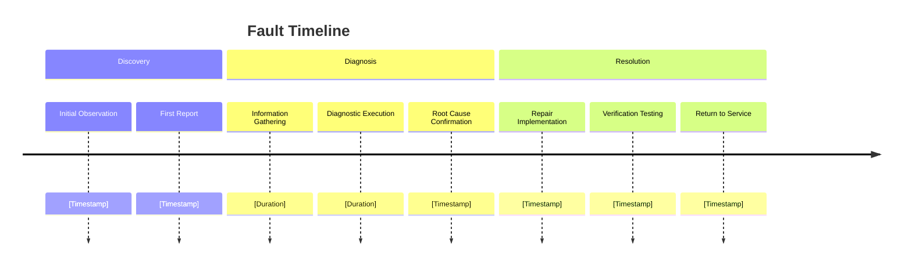
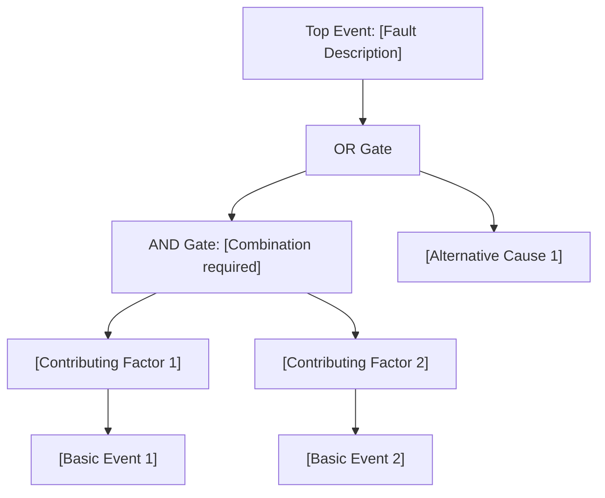
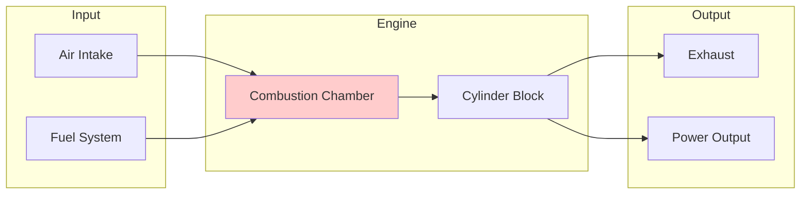
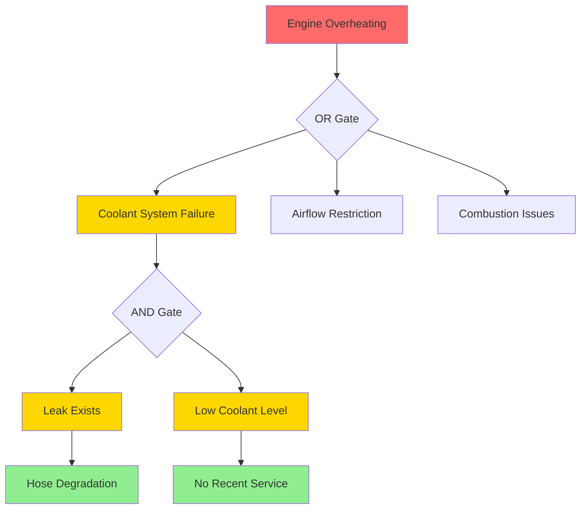

# Case Document Skill

## Overview

Provides templates, formats, and structural guidelines for creating professional fault case documentation. This skill is a **template reference** - it supplies the structure and formatting patterns, but the actual report generation must use the **complete diagnostic context** from the current agent's conversation history.

## Critical Requirement: Contextual Generation

**REQUIRED**: Case reports MUST be generated by the **calling agent** (the agent with complete diagnostic conversation context), NOT delegated to a subagent or background task.

**Why**: 
- Subagents cannot access the full diagnostic conversation history
- Summary data passed to subagents loses critical details (user responses, measurement values, decision rationale)
- Report quality depends on complete contextual information

**Execution Mode: REFERENCE** - This skill provides templates; the calling agent executes the generation.

## When to Use

Reference this skill when the calling agent needs to create case documentation:

- Root cause has been identified and verified
- Corrective actions have been implemented
- Fault has been resolved and verified
- Knowledge needs to be captured for future reference

## Source Attribution

**Reference**: Include `citation` capability for all factual claims in the report.

**Requirements**:
- All technical specifications cite source: `[^1]: [title](uri)`
- All case references include case ID and URI
- Use `manual://` URIs for manuals, `https://` for web resources
- Place references at first mention in each section
- Training or case study material is required
- Maintenance records require formal documentation

## Using This Skill

### For the Calling Agent

When you have completed a diagnostic session and need to create documentation:

1. **Load this skill** to access report templates and formatting guidelines
2. **Use your conversation context** - access the complete diagnostic history from your conversation
3. **Apply templates** - use the section templates provided by this skill
4. **Generate in current context** - produce the report directly (do NOT delegate)

### Data Requirements

The calling agent should have collected during the diagnostic session:

| Data Category | Source in Conversation |
|---------------|----------------------|
| Equipment details | Phase 1 information gathering |
| Fault description | Initial user report + clarification |
| Diagnostic steps | Phase 3 execution records |
| Test results | User responses during interaction |
| Root cause | Phase 4 confirmation |
| Corrective actions | User or agent actions taken |

### Report Generation Process

```
1. Load case-document skill (REFERENCE mode)
   ↓
2. Select appropriate templates from skill
   ↓
3. Gather data from current conversation context
   ↓
4. Apply templates with actual diagnostic data
   ↓
5. Generate report IN CURRENT AGENT (not delegated)
   ↓
6. Present to user
```

## Report Structure Templates

Use these templates as guides when creating the report.

---

## Section 1: Executive Summary

### Template

```markdown
## Executive Summary

| Field | Value |
|-------|-------|
| **Equipment** | [Manufacturer] [Model] - [Type] |
| **Fault** | [Brief description] |
| **Root Cause** | [Primary cause identification] |
| **Resolution** | [Corrective action summary] |
| **Status** | [Resolved / Monitoring / Escalated] |
| **Downtime** | [Duration, if tracked] |
| **Documentation Date** | [Timestamp] |

### Key Findings
- [Primary technical finding]
- [Critical decision or observation]
- [Preventive recommendation]

### Recommended Actions
1. [Immediate action if any]
2. [Preventive maintenance recommendation]
3. [Follow-up monitoring suggestion]
```

---

## Section 2: Equipment Information

### 2.1 Equipment Specifications

| Parameter | Value | Notes |
|-----------|-------|-------|
| Type | | |
| Manufacturer | | |
| Model | | |
| Serial Number | | (if available) |
| Operating Hours | | At time of fault |
| Key Specifications | | |

### 2.2 System Architecture

Include Mermaid diagram showing relevant system:



**Diagram guidelines**:
- Show components relevant to fault path
- Highlight fault location visually
- Include flow direction (mechanical, electrical, fluid)
- Keep to 5-10 nodes for clarity

### 2.3 Component Details

| Component | Function | Specification | Condition |
|-----------|----------|---------------|-----------|
| [Name] | [Purpose] | [Spec] | [Normal/Abnormal] |

---

## Section 3: Fault Description

### 3.1 Initial Report

```markdown
**Reported by**: [User/technician name if available]
**Date Reported**: [Timestamp]
**Initial Description**: [Original user description]
```

### 3.2 Symptom Analysis

| Symptom | Severity | Pattern | Relation to Root Cause |
|---------|----------|---------|----------------------|
| [Symptom 1] | High/Med/Low | Continuous/Intermittent | Direct effect |
| [Symptom 2] | | | Secondary effect |

### 3.3 Timeline



---

## Section 4: Diagnostic Process

### 4.1 Methodology

```markdown
**Diagnostic Approach**: [Systematic troubleshooting / FTA / Half-split / Other]
**Tools Used**: [List diagnostic tools]
**References Consulted**: [Manuals, diagrams, standards]
```

### 4.2 Diagnostic Steps

| Step | Action | Expected Result | Actual Result | Interpretation |
|------|--------|-----------------|---------------|----------------|
| 1 | | | | |
| 2 | | | | |
| 3 | | | | |

### 4.3 Evidence Summary

```markdown
**Physical Evidence**:
- [Visual observations]
- [Measurement data]
- [Component condition]

**Data Evidence**:
- [Parameter readings]
- [Alarm logs]
- [Performance records]

**Analytical Evidence**:
- [Pattern analysis]
- [Comparative analysis]
```

---

## Section 5: Root Cause Analysis

### 5.1 Root Cause Identification

```markdown
**Primary Root Cause**: [Clear, specific identification]
**Confidence Level**: [Percentage]
**Evidence Strength**: [Strong/Moderate/Circumstantial]
```

### 5.2 Failure Mechanism

Explain technical cause-effect chain:

```markdown
1. [Initial cause]
   ↓
2. [Intermediate effect]
   ↓
3. [Observable symptom]
```

### 5.3 Contributing Factors

| Factor | Impact | Preventable | Notes |
|--------|--------|-------------|-------|
| [Factor 1] | Primary/Secondary | Yes/No | |
| [Factor 2] | | | |

### 5.4 Fault Tree Analysis



---

## Section 6: Corrective Actions

### 6.1 Immediate Actions

| Action | Description | Performed By | Date |
|--------|-------------|--------------|------|
| [Action 1] | | | |
| [Action 2] | | | |

### 6.2 Repairs and Replacements

| Component | Action | Specification | Part Number | Qty |
|-----------|--------|---------------|-------------|-----|
| | Repaired/Replaced | | | |

### 6.3 Adjustments and Settings

| Parameter | Before | After | Reason |
|-----------|--------|-------|--------|
| | | | |

### 6.4 Repair Procedure Summary

```markdown
**Safety Precautions**:
- [List safety steps taken]

**Key Steps**:
1. [Major repair step]
2. [Critical procedure point]
3. [Quality check]

**Torque Specifications**:
| Fastener | Torque | Unit |
|----------|--------|------|
| | | |
```

---

## Section 7: Verification

### 7.1 Test Procedures

| Test | Procedure | Expected Result | Actual Result | Pass/Fail |
|------|-----------|-----------------|---------------|-----------|
| [Test 1] | | | | |
| [Test 2] | | | | |

### 7.2 Performance Validation

```markdown
**Parameter Verification**:
| Parameter | Pre-Repair | Specification | Post-Repair | Status |
|-----------|------------|---------------|-------------|--------|
| | | | | |

**Operational Test**:
- Duration: [Test run time]
- Conditions: [Load, environment]
- Observations: [Performance notes]
- Result: [Pass / Monitor / Fail]
```

### 7.3 Acceptance Criteria

```markdown
**Criteria Met**:
- [ ] All symptoms resolved
- [ ] Parameters within specification
- [ ] No new issues introduced
- [ ] Safety systems functional
- [ ] Operational test passed
```

---

## Section 8: Lessons Learned

### 8.1 Diagnostic Insights

```markdown
**What Worked Well**:
- [Effective diagnostic approach]
- [Key decision or observation]

**What Could Be Improved**:
- [Earlier detection opportunity]
- [Tool/method limitation]
```

### 8.2 Prevention Recommendations

| Recommendation | Priority | Timeline | Responsibility |
|----------------|----------|----------|----------------|
| [Preventive action 1] | High/Med/Low | Immediate/Scheduled | |
| [Preventive action 2] | | | |

### 8.3 Knowledge Gaps Identified

```markdown
**Documentation Needs**:
- [Missing manual information]
- [Unclear procedure]

**Training Opportunities**:
- [Skill gap observed]
- [Common mistake pattern]
```

---

## Section 9: Attachments and References

### 9.1 Technical References

```markdown
**Manuals Consulted**:
- [Manual name, section, revision]

**Standards Applied**:
- [Standard reference, version]

**Diagrams Referenced**:
- [Figure numbers from manuals]
```

### 9.2 Image References

```markdown
**Diagnostic Images**:
- [Description and location if stored]

**Repair Documentation**:
- [Photos of repair process if applicable]
```

---

## Section 10: Approval and Distribution

```markdown
**Document Prepared By**: [System/Analyst]
**Review Status**: [Draft / Reviewed / Approved]
**Distribution**:
- [ ] Maintenance Records
- [ ] Knowledge Base
- [ ] Training Materials
- [ ] Management Report

**Retention**: [Retention period or standard]
```

---

## Mermaid Diagram Guidelines

### System Architecture Diagram



**Style guidelines**:
- Use `style` to highlight fault location
- Group related components with `subgraph`
- Keep arrows showing flow direction
- Use clear, short node labels

### Fault Tree Diagram



**Diagram types**:
- Use `graph TD` for top-down fault trees
- Use `graph LR` for left-right system flows
- Use `timeline` for chronological sequences
- Use `subgraph` for logical grouping

---

## Report Quality Standards

### Completeness Checklist

- [ ] Executive summary captures key points
- [ ] Equipment specifications accurate and complete
- [ ] Fault timeline is clear and chronological
- [ ] Root cause is specific, not generic
- [ ] Evidence supports root cause identification
- [ ] Corrective actions are documented with specifications
- [ ] Verification proves resolution
- [ ] Lessons learned are actionable
- [ ] Diagrams are clear and accurate
- [ ] References are specific and verifiable

### Language Guidelines

- Use specific technical terms
- Quantify where possible ("temperature exceeded 100°C" not "overheated")
- Use active voice for actions
- Avoid blame language
- Focus on facts and evidence

### Formatting Standards

- Use tables for structured data
- Use Mermaid for diagrams
- Use hierarchical headers (H2, H3, H4)
- Bold critical values and findings
- Include units with all measurements

---

## Integration Notes

### Receiving from Systematic-Troubleshooting

Expected input structure:

```yaml
diagnostic_session:
  context: {information_gathering output}
  plan: {diagnosis_planning report reference}
  execution:
    steps: [list of diagnostic actions taken]
    results: [measurements and findings]
  root_cause:
    identification: string
    confidence: number
    evidence: array
  resolution:
    actions: [repairs, replacements]
    verification: [test results]
    status: resolved|monitoring
```

### Output Destinations

- Maintenance management system
- Training documentation library
- Knowledge base / Case database
- Engineering review process

---

## Example Usage

```markdown
User: "Document the excavator engine overheating case we just resolved"

Skill receives complete session data
↓
Generates all 10 sections
↓
Produces: professional_case_report.md
```
