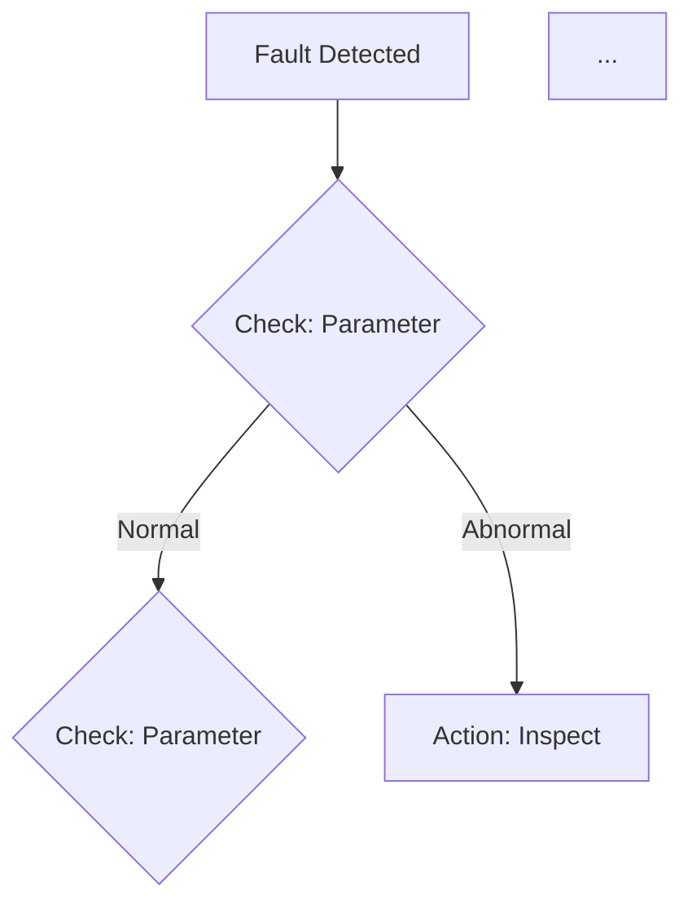
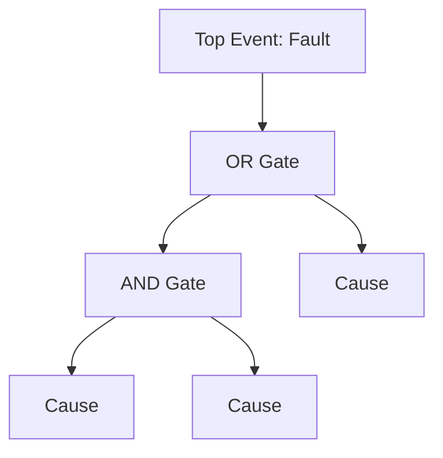

# Diagnosis Planning Skill

## Overview

Generate comprehensive diagnostic planning reports that serve as complete field manuals for systematic equipment fault diagnosis. These reports integrate expert diagnostic reasoning with retrieved technical documentation, diagrams, and historical data to create actionable, print-ready troubleshooting guides.

Reports must include ALL information needed for fault localization, troubleshooting, and resolution - including technical diagrams, component schematics, system layouts, and visual references that engineers need in the field.

## Core Workflow

### Step 1: Parallel Research and Information Retrieval

Conduct comprehensive parallel research to gather all diagnostic-relevant information:

#### 1.1 Research Scope

Research these categories in parallel:

| Research Area | Query Focus | Expected Output |
|---------------|-------------|-----------------|
| Equipment Specifications | Technical manual, datasheet, nameplate data | Standard operating values, tolerances, limits |
| Failure Mode Analysis | Fault symptom + equipment type + causes | Possible causes, mechanisms, occurrence frequency |
| Troubleshooting Procedures | Manufacturer diagnostic guides, SOPs | Step-by-step inspection sequences, decision trees |
| Historical Cases | Similar equipment + fault + case study | Resolved incidents, effective solutions, lessons |
| Technical Diagrams | Schematics, system layouts, component drawings | Visual references for diagnosis and repair |
| Standards & Codes | Industry standards for equipment class | Inspection criteria, acceptance tolerances |

#### 1.2 Search Query Patterns

| Category | Query Pattern |
|----------|--------------|
| Equipment Manual | `{Model} technical manual specifications` |
| Parameters | `{Model} {parameter} standard value tolerance` |
| Failure Knowledge | `{Equipment type} {symptom} causes failure mode` |
| Procedures | `{Manufacturer} {model} troubleshooting procedure` |
| Diagrams | `{Model} schematic diagram system layout` |
| Cases | `{Model} {fault} case study field report` |
| Standards | `{Equipment type} inspection standard {ISO/GB}` |

#### 1.3 Information Synthesis

Combine retrieved information:
- Cross-reference failure hypotheses with technical documentation
- Validate standard values against manufacturer specifications
- Prioritize causes by historical frequency and evidence strength
- Map diagrams and schematics to inspection steps
- Identify required visual aids for field reference

### Step 2: Generate Comprehensive Diagnostic Planning Report

Create a detailed, field-ready report with all sections below:

---

#### Section 1: Executive Summary

- Equipment identification and fault description
- Key research findings and data sources
- Diagnostic strategy overview
- Estimated troubleshooting timeline
- Resource requirements summary

---

#### Section 2: Equipment Technical Information

**2.1 Equipment Specifications**
| Parameter | Specification | Source |
|-----------|--------------|--------|
| Model/Type | | |
| Manufacturer | | |
| Rated capacity | | |
| Operating limits | | |
| Key components | | |

**2.2 System Overview**
- System architecture description
- Component interactions
- Operating principles relevant to fault

**2.3 Technical Diagrams**
Include all relevant diagrams with proper figure formatting:

```html
<figure>
    
    <figcaption>
        <p>Figure X: %figure_name%</p>
        <p>%detailed_diagnostic_purpose%</p>
        <p>%annotation_legend_details%</p>
        <p>Source: %citation%</p>
    </figcaption>
</figure>
```

Required diagrams (when available):
- System block diagram / Overall layout
- Component location diagrams
- Hydraulic/Pneumatic/Electrical schematics
- Assembly/disassembly views
- Measurement point locations

---

#### Section 3: Evidence-Based Failure Analysis

| Cause | Probability | Failure Mechanism | Key Indicators | Evidence Source |
|-------|-------------|-------------------|----------------|-----------------|
| [Cause 1] | High/Med/Low | Technical explanation of cause-effect | Parameters/symptoms to check | [Manual/Case ref] |
| [Cause 2] | High/Med/Low | Technical explanation of cause-effect | Parameters/symptoms to check | [Manual/Case ref] |

For each cause include:
- **Detailed failure mechanism**: How the cause produces observed symptoms
- **Supporting evidence**: Frequency data, historical precedents, manufacturer data
- **Quick validation test**: Simple check to confirm/invalidate
- **Required diagrams**: Visual references for component inspection

---

#### Section 4: Inspection Procedures

**4.1 Inspection Checklist**

| Step | Inspection Item | Priority | Procedure | Normal Value | Tools Required | Reference |
|------|----------------|----------|-----------|--------------|----------------|-----------|
| 1 | | Critical/High/Med/Low | Detailed procedure | Expected range | Specific tools | [Manual/Diag. ref] |

**4.2 Detailed Inspection Procedures**

For each critical inspection step, provide:
- Step-by-step procedure with safety notes
- Measurement method and technique
- Normal vs abnormal criteria
- Required tools with specifications
- Expected time duration
- Reference to relevant diagrams/figures

**4.3 Component Location Visuals**

Include annotated diagrams showing:
- Inspection point locations on equipment
- Access requirements and preparations
- Tool positioning for measurements

---

#### Section 5: Diagnostic Standards and Values

**5.1 Operating Parameters Reference Table**

| Parameter | Normal Range | Warning Threshold | Critical Threshold | Unit | Measurement Point | Source |
|-----------|--------------|-------------------|-------------------|------|-------------------|--------|
| | | | | | | |

**5.2 Component Specifications**

| Component | Specification | Tolerance | Unit | Inspection Method | Source |
|-----------|--------------|-----------|------|-------------------|--------|
| | | | | | |

**5.3 Acceptance Criteria**
- Pass/fail criteria for each inspection
- Relevant industry standards (ISO, GB, etc.)
- Manufacturer-specific requirements

---

#### Section 6: Required Tools and Resources

**6.1 Diagnostic Tools**
| Tool | Specification | Purpose | Source Reference |
|------|--------------|---------|------------------|
| | Model/accuracy range | What to measure | [Manual ref] |

**6.2 Hand Tools and Equipment**
| Tool | Size/Specification | Application |
|------|-------------------|-------------|
| | | |

**6.3 Consumables and Spares**
| Item | Part Number | Quantity | Application |
|------|-------------|----------|-------------|
| | | | |

**6.4 Safety Equipment**
- PPE requirements per manufacturer/standard
- Lockout/tagout procedures
- Safety warnings specific to procedures

**6.5 Reference Documents Required On-Site**
- [ ] Equipment manual (sections: ___)
- [ ] Schematics and diagrams
- [ ] This diagnostic plan (printed)
- [ ] Maintenance history records
- [ ] Service bulletins (as applicable)

---

#### Section 7: Troubleshooting Logic and Flowcharts

**7.1 Decision Flowchart**



Flowchart must include:
- All decision points from inspection procedures
- Branch logic based on measurement results
- Clear action nodes for each finding
- References to related inspection steps

**7.2 Fault Tree Analysis (if applicable)**



**7.3 Diagnostic Decision Table**

| Symptom/Reading | Likely Cause | Next Step | Reference |
|-----------------|--------------|-----------|-----------|
| | | | |

---

#### Section 8: Repair and Resolution Guidance

**8.1 Corrective Actions by Cause**

| Cause | Corrective Action | Procedure Reference | Safety Notes |
|-------|-------------------|---------------------|--------------|
| | | | |

**8.2 Repair Procedures**
- Step-by-step repair instructions
- Required tools and materials
- Torque specifications
- Reassembly notes
- Post-repair verification tests

**8.3 Verification and Testing**
- Acceptance test procedures
- Parameter validation checklists
- Run-in/test run requirements

---

#### Section 9: Visual Reference Gallery

Include all relevant technical images using proper figure format:

```html
<figure>
    
    <figcaption>
        <p>Figure X: %Name per source%</p>
        <p>Purpose: How this image aids diagnosis/repair (e.g., "Shows bearing housing location for temperature measurement described in Step 3")</p>
        <p>Details: All annotations, legends, labels from source</p>
        <p>Source: %Citation%</p>
    </figcaption>
</figure>
```

Image categories to include when available:
1. System overview diagrams
2. Component layout and identification
3. Measurement procedure illustrations
4. Critical component close-ups
5. Assembly/disassembly sequences
6. Tool setup examples

---

#### Section 10: Appendices

**A. Glossary of Terms**
**B. Units Conversion Table**
**C. Emergency Contacts / Escalation Procedures**
**D. Document Revision History**

---

#### Section 11: References and Citations

List all footnote citations with full source information:

[^1]: Full citation including document title, section, publisher, date
[^2]: ...

---

#### Section 12: Information Gaps and Limitations

**Purpose**: Transparently document missing or unavailable information that may affect diagnostic accuracy or completeness.

**Critical Rule**: Explicitly list ALL information that was searched but not found. This section is essential for assessing report reliability and identifying areas requiring field verification or expert consultation.

##### 12.1 Information Gap Inventory

| Category | Requested Information | Search Attempted | Gap Impact | Recommended Action |
|----------|----------------------|------------------|------------|-------------------|
| Equipment Specifications | [Specific missing spec] | [Sources searched] | [High/Med/Low] | [e.g., Verify on-site nameplate] |
| Operating Parameters | [Missing parameter] | [Sources searched] | [High/Med/Low] | [e.g., Measure during inspection] |
| Troubleshooting Procedures | [Missing procedure] | [Sources searched] | [High/Med/Low] | [e.g., Contact manufacturer] |
| Technical Diagrams | [Missing diagram type] | [Sources searched] | [High/Med/Low] | [e.g., Request from service dept] |
| Historical Cases | [Missing case data] | [Sources searched] | [High/Med/Low] | [e.g., Check field service records] |

**Gap Categories to Check**:
- [ ] Equipment manual sections not found
- [ ] Component specifications unavailable
- [ ] Standard values/tolerances not retrieved
- [ ] Troubleshooting flowcharts missing
- [ ] Technical diagrams not located
- [ ] Historical failure data not found
- [ ] Industry standards not identified
- [ ] Tool specifications incomplete

**Impact Assessment**:
- **High**: Critical missing information; diagnosis may be incomplete or unsafe without field verification
- **Medium**: Important information missing; may affect efficiency but core diagnosis possible
- **Low**: Supplementary information; nice to have but not essential

##### 12.2 Limitations Statement

```markdown
## Diagnostic Planning Limitations

This diagnostic plan was developed based on the following constraints:

### Data Availability
- [List specific data gaps from table above]
- Sources consulted: [List databases, manuals, resources searched]
- Search date: [Timestamp]

### Impact on Diagnostic Reliability
[Describe how gaps may affect the diagnostic process]

### Field Verification Required
The following items MUST be verified during on-site inspection due to missing documentation:
1. [Item requiring field measurement/verification]
2. [Item requiring physical inspection]

### Escalation Triggers
If the following unavailable information becomes critical during diagnosis:
- [Gap 1]: Escalate to [manufacturer/service provider]
- [Gap 2]: Consult [expert/resource]
```

##### 12.3 User Acknowledgment

Include at end of Section 12:

```markdown
---

**Field Engineer Acknowledgment**:

I understand that this diagnostic plan has the following information gaps:
- [Gap summary 1]
- [Gap summary 2]

I will verify these items during field inspection and adjust the diagnostic approach as needed.

Engineer Signature: _______________ Date: _______
```

---

### Step 3: Completion

Generate the final diagnostic planning report containing:
- All 12 sections completed with retrieved data
- **Section 12 must include all information gaps identified during research**
- Properly formatted technical diagrams and figures
- Comprehensive inline citations
- Print-ready formatting
- Complete information for field use
- **Clear indication of limitations where data is unavailable**

## Information Sourcing Guidelines

### Source Hierarchy

1. **Primary Source**: Equipment manufacturer manuals, original specifications, factory drawings
2. **Secondary Source**: Authorized service documentation, OEM technical bulletins
3. **Tertiary Source**: Industry standards (ISO, GB, ASME, etc.), technical textbooks
4. **Reference Source**: Historical case databases, field service reports

### When to Retrieve

Research must be conducted for:
- Equipment standard values and tolerances
- Manufacturer-recommended procedures
- Component specifications and part numbers
- Technical diagrams and schematics
- Historical precedents for failure modes
- Industry inspection standards

### Citation Format

Use inline footnotes for all technical data:

```markdown
Bearing temperature should not exceed 70°C under normal operation[^manual_bearing_temp].

[^manual_bearing_temp]: CP-2000 Pump Technical Manual, Section 4.2 - Operating Specifications, Manufacturer Documentation, Rev. 3.2
```

## Image and Diagram Requirements

### Mandatory Image Inclusion

All relevant technical images, diagrams, and schematics must be included using proper figure structure:

```html
<figure>
    
    <figcaption>
        <p>Figure X: %Name from source%</p>
        <p>%Detailed diagnostic purpose - explain what this shows and which inspection step it corresponds to%</p>
        <p>%All annotations, legends, labels from source%</p>
        <p>Source: %Full citation%</p>
    </figcaption>
</figure>
```

### Image Categories (Include ALL available)

- System overview and block diagrams
- Component location and identification diagrams
- Schematics (hydraulic, pneumatic, electrical)
- Measurement procedure illustrations
- Assembly/disassembly views
- Tool setup and positioning guides
- Technical specification drawings

### Image Processing Rules - NO HALLUCINATION

**CRITICAL: Images must be REAL and VERIFIED**

#### Image Source Rules (MUST FOLLOW)

1. **ONLY use images from actual search results**: The `src` attribute must contain a URL or path that was explicitly returned from your research (e.g., from search results, database queries, or retrieved documents).

2. **NEVER create placeholder or fake URLs**:
   - ❌ FORBIDDEN: `/resources/placeholder`
   - ❌ FORBIDDEN: `/resources/example.png`
   - ❌ FORBIDDEN: `image_not_found.jpg`
   - ❌ FORBIDDEN: Any path you construct without verification
   - ❌ FORBIDDEN: URLs from training data memory

3. **If no real image is available**: Do NOT include any `<figure>` tag. Simply describe the diagram/visual in text or note that "technical diagram not retrieved from sources."

#### Image Verification Checklist

Before including any `<figure>` element, verify:

- [ ] The `src` URL/path was explicitly provided in your research results
- [ ] You can trace the exact source document containing this image
- [ ] The caption accurately describes what is shown in the actual image
- [ ] The annotations/legend details match the actual image content
- [ ] The purpose description correctly links to specific inspection steps

**Verification Example**:
```
Research result shows: "/resources/pump_cp2000_sectional.png" from "CP-2000 Manual Plate A-3"

✓ Include: 
✗ DO NOT fabricate: 
```

#### Image-Caption Alignment Requirements

The caption must accurately reflect what is ACTUALLY in the image:

| Element | Requirement |
|---------|-------------|
| Figure Name | Must match title from source document |
| Purpose | Must accurately describe the diagnostic use (which step refers to this image) |
| Details | Must list actual annotations, labels, legend items visible in image |
| Source | Must cite the exact document where this image was retrieved |

**If details are uncertain**: Either omit the figure or clearly state "Details based on source description, verify actual image annotations."

#### Content Integration Rules

- Include ALL visual information from sources: annotations, legends, callouts, dimensions (only if verified from actual source)
- Cross-reference images to related inspection steps
- If image quality is poor or details unclear, note this in the caption
- Multiple angles of same component? Include each as separate figure if from different sources

## Output Format Standards

- Clear hierarchical headers (H1, H2, H3)
- Tables for structured data
- Mermaid diagrams for flowcharts and fault trees
- HTML figure tags for all images
- Bullet lists for items under 10 entries
- Bold emphasis for critical values and warnings
- Inline footnote citations for all technical claims
- Consistent formatting throughout

## Example

See `examples/pump_overheating.md` for a comprehensive retrieval-augmented diagnostic planning report with full diagram integration.

**IMPORTANT**: The image paths (e.g., `/resources/pump_xxx.png`) in the example are ILLUSTRATIVE placeholders to demonstrate proper formatting. In actual use:
- Image `src` attributes MUST contain real URLs/paths explicitly returned from your research
- NEVER fabricate, hallucinate, or create placeholder image paths
- If no image is retrieved from sources, omit the `<figure>` tag entirely

## References

- `references/search_strategy.md`: Detailed search methodologies and query patterns
