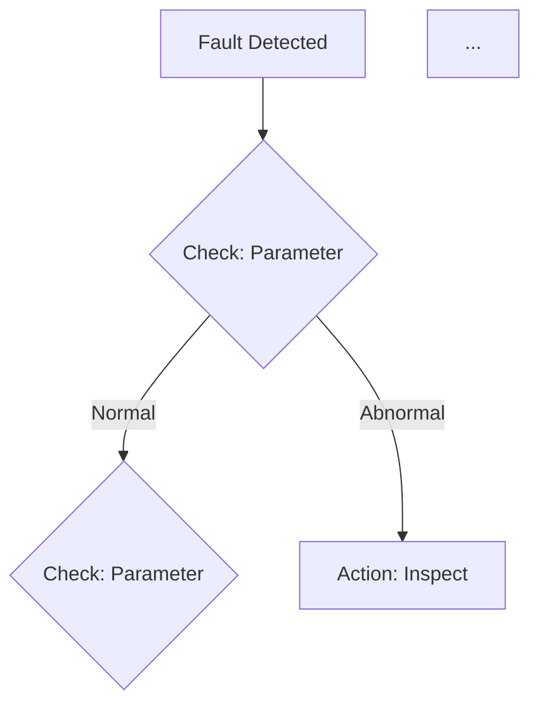
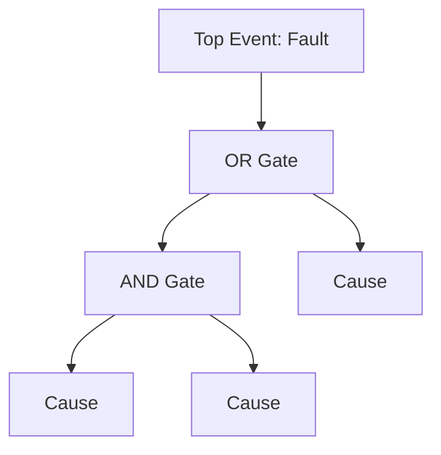

# Diagnosis Planning Skill

## Overview

Generate comprehensive diagnostic planning reports that serve as complete field manuals for systematic equipment fault diagnosis. These reports integrate expert diagnostic reasoning with retrieved technical documentation, diagrams, and historical data to create actionable, print-ready troubleshooting guides.

Reports must include ALL information needed for fault localization, troubleshooting, and resolution - including technical diagrams, component schematics, system layouts, and visual references that engineers need in the field.

## Prerequisites

Before generating the diagnostic plan, confirm:

- [ ] Equipment model/name provided or confirmed
- [ ] Fault symptoms or error codes described
- [ ] Operating context available (environment, usage hours, recent maintenance)

If critical information is missing, ask the user to provide it before proceeding with research.

## Output Delivery

Generate the complete diagnostic planning report and **present directly in conversation**.
Output should be comprehensive markdown suitable for:
- Immediate review by requesting engineer
- Copy/paste to documentation system
- Print for field use

## Document Conventions

### References and Citations

All technical data must include traceable footnote citations using the format `[^id]: [Title](uri)`.

**Syntax**:
- Bibliographic entry: `[^ref-id]: [Source Title](uri)`
- Inline reference: `Text with citation [^ref-id].`
- Inline addition (for sources discovered mid-report): Add entry immediately after first use

**URI Schemes**:
- `manual://{uuid}` - Technical manuals
- `case://{id}` - Historical case records  
- `internal://{resource}` - Internal databases
- `https://...` - Web sources

### Image and Figure Format

All technical images must use this HTML structure with verified source attribution:

```html
<figure>
    
    <figcaption>
        <p>Figure X: %Name from source%</p>
        <p>Purpose: %How this aids diagnosis - links to specific step%</p>
        <p>Details: %Key annotations visible in image%</p>
        <p>Source: %Full citation with URI%</p>
    </figcaption>
</figure>
```

**Critical Rule**: Only use `src` URLs explicitly returned from research. NEVER fabricate or hallucinate image paths.

## Core Workflow

### Step 1: Parallel Research and Information Retrieval

Conduct comprehensive parallel research to gather all diagnostic-relevant information:

#### 1.1 Research Scope

Research these categories in parallel:

| Research Area | Query Focus | Expected Output |
|---------------|-------------|-----------------|
| Equipment Specifications | Technical manual, datasheet, nameplate data | Standard operating values, tolerances, limits |
| Failure Mode Analysis | Fault symptom + equipment type + causes | Possible causes, mechanisms, occurrence frequency |
| Troubleshooting Procedures | Manufacturer diagnostic guides, SOPs | Step-by-step inspection sequences, decision trees |
| Historical Cases | Similar equipment + fault + case study | Resolved incidents, effective solutions, lessons |
| Technical Diagrams | Schematics, system layouts, component drawings | Visual references for diagnosis and repair |
| Standards & Codes | Industry standards for equipment class | Inspection criteria, acceptance tolerances |

#### 1.2 Search Query Patterns

| Category | Query Pattern |
|----------|--------------|
| Equipment Manual | `{Model} technical manual specifications` |
| Parameters | `{Model} {parameter} standard value tolerance` |
| Failure Knowledge | `{Equipment type} {symptom} causes failure mode` |
| Procedures | `{Manufacturer} {model} troubleshooting procedure` |
| Diagrams | `{Model} schematic diagram system layout` |
| Cases | `{Model} {fault} case study field report` |
| Standards | `{Equipment type} inspection standard {ISO/GB}` |

#### 1.3 Information Synthesis

Combine retrieved information:
- Cross-reference failure hypotheses with technical documentation
- Validate standard values against manufacturer specifications
- Prioritize causes by historical frequency and evidence strength
- Map diagrams and schematics to inspection steps
- Identify required visual aids for field reference

#### 1.4 Evidence Review and Gap Analysis

Thoroughly analyze retrieved information before proceeding:

**Identify Conflicts and Inconsistencies**:
| Aspect | Check | Action if Conflict Found |
|--------|-------|-------------------------|
| Parameter values | Multiple sources claiming different specs | Flag for verification; prioritize manufacturer manual |
| Failure causes | Contradictory explanations for same symptom | Note both theories; check historical case frequency |
| Procedures | Different manufacturers suggest different steps | Document both; note equipment-specific applicability |
| Standards | Industry vs manufacturer tolerance differences | Highlight both; explain context of each |

**Completeness Assessment**:
- [ ] Equipment background (model, year, operating hours, environment)
- [ ] Fault symptom complete description
- [ ] All possible causes identified and ranked
- [ ] Standard values for relevant parameters found
- [ ] Troubleshooting procedures verified
- [ ] Technical diagrams retrieved or noted as unavailable
- [ ] Applicable standards identified

**Iterative Research Decision**:
If gaps or conflicts exist, judge whether additional searches are needed:
- Use alternative keywords (e.g., "hydraulic pressure" → "system pressure" → "operating pressure")
- Expand equipment model variations (e.g., "SY215C" → "SY215 series" → "Sany excavator hydraulic")
- Cross-reference with related symptoms or components
- Continue until confident or diminishing returns evident

**Rule**: Exhaust reasonable search avenues before concluding research. Better to over-search than under-search.

#### 1.5 Research Tool Priority

Execute searches in this order to maximize source reliability:

| Priority | Source Type | Tools/Methods | Rationale |
|----------|-------------|---------------|-----------|
| 1 | **Technical Manuals** | Knowledge base queries, MCP document retrieval, `manual://{uuid}` sources | Authoritative manufacturer data, equipment-specific |
| 2 | **Internal Knowledge Base** | Case databases, maintenance records, organizational documentation | Proprietary data, organizational context, historical precedents |
| 3 | **Web Resources** | Search APIs (Tavily, web search, documentation sites) | Supplementary, cross-verification, filling gaps only |

**Rule**: Always attempt primary sources (manuals/knowledge base) before web search. Web results should be used for filling gaps, not as primary evidence. All web findings must be cross-referenced with manufacturer data when possible.

### Step 2: Content Organization and Outline

Before generating the final report, systematically organize all collected information:

**Create a Structured Outline**:
```markdown
## Report Outline

### Key Findings Summary
- Equipment: [Model, Manufacturer, Key Specs]
- Fault: [Symptom description, observed behavior]
- Primary Hypotheses: [Cause 1 - evidence], [Cause 2 - evidence]...
- Confidence Level: [High/Medium/Low based on source quality]

### Supporting Evidence by Section
- Section 2 (Equipment): Specs from [^manual-1], diagrams from [^manual-2]...
- Section 3 (Failure Analysis): Causes ranked by [^case-1], [^case-2]...
- Section 4 (Inspection): Procedures from [^manual-1]...
- [Continue for each section]

### Reference Materials Inventory
| Source ID | Document | Key Content | Target Section |
|-----------|----------|-------------|----------------|
| [^manual-1] | SY215C Technical Manual Ch. 3 | Hydraulic specs | Section 2, 5 |
| [^case-1] | Case #2023-0156 Overheat | Resolution: pump replacement | Section 3, 8 |
| [std-1] | ISO 10816 Vibration | Acceptable vibration limits | Section 5 |
```

**Conflict Documentation**:
| Topic | Source A | Source B | Resolution Decision |
|-------|----------|----------|---------------------|
| [e.g., Operating pressure] | Manual says 25MPa | Case file mentions 28MPa | Use manual value [^manual-1], note case anomaly [^case-2] |

**Gap List for Section 13**:
- [Spec X] not found in manual - impact: High
- [Procedure Y] not documented - impact: Medium

**Stop and Review**: Confirm outline covers all user requirements and collected data before proceeding to Step 3.

### Step 3: Generate Comprehensive Diagnostic Planning Report

Create a detailed, field-ready report using the outline from Step 2. Verify each section against your outline:

---

#### Section 0: Document References

At the start of the report, create a `## References` section listing all sources found during research using the citation format defined in [Document Conventions](#document-conventions).

**Required Format** (must follow exactly):
```markdown
## References

[^manual-1]: [SY215C Hydraulic System Specifications, Ch. 3 Operating Parameters](manual://a1b2c3d4-e5f6-7890-abcd-ef1234567890)
[^manual-2]: [CP-2000 Technical Manual, Section 4.2 - Bearing Installation](manual://b2c3d4e5-f6a7-8901-bcde-f23456789012)
[^case-1]: [Excavator Overheat Case #2023-0156 - Root Cause Analysis](case://2023-0156)
[^case-2]: [Hydraulic Pump Failure Field Report #2024-0089](case://2024-0089)
[^std-1]: [ISO 10816-1:1995 Mechanical Vibration - Evaluation Standards](https://www.iso.org/standard/10816-1.html)
[^web-1]: [Hydraulic System Troubleshooting Guide](https://example.com/hydraulic-guide) - Cross-reference only
```

**Format Rules**:
- **ID naming**: Use `[^manual-{n}]`, `[^case-{n}]`, `[^std-{n}]`, `[^web-{n}]` for clarity
- **Title**: Format as `[Section Name, Document Name]` or `[Case #{ID} - Brief Description]`
- **URI**: Use actual retrieved URIs (manual://, case://, https://)
- **Annotation**: Add brief notes for web sources (e.g., "cross-reference only", "supplementary info")

**Process**:
1. Extract all sources from your Step 2 outline
2. Assign consistent IDs following the naming convention above
3. List in priority order: Manuals → Standards → Cases → Web
4. Verify each URI is from actual retrieved results
5. Include brief annotation for supplementary web sources

**Verification Checklist**:
- [ ] Every source cited in the report appears in Section 0
- [ ] Every entry in Section 0 is cited at least once in the report
- [ ] IDs follow the `[^type-number]` naming convention
- [ ] Titles include both section/filename context
- [ ] URIs are complete and valid

If no sources are found, omit Section 0 entirely (do not create empty section).

---

#### Section 1: Executive Summary

- Equipment identification and fault description
- Key research findings and data sources
- Diagnostic strategy overview
- Estimated troubleshooting timeline
- Resource requirements summary

---

#### Section 2: Equipment Technical Information

**2.1 Equipment Specifications**
| Parameter | Specification | Source |
|-----------|--------------|--------|
| Model/Type | | |
| Manufacturer | | |
| Rated capacity | | |
| Operating limits | | |
| Key components | | |

**2.2 System Overview**
- System architecture description
- Component interactions
- Operating principles relevant to fault

**2.3 Technical Diagrams**
Include all relevant diagrams with proper figure formatting:

```html
<figure>
    
    <figcaption>
        <p>Figure X: %figure_name%</p>
        <p>%detailed_diagnostic_purpose%</p>
        <p>%annotation_legend_details%</p>
        <p>Source: %citation%</p>
    </figcaption>
</figure>
```

Required diagrams (when available):
- System block diagram / Overall layout
- Component location diagrams
- Hydraulic/Pneumatic/Electrical schematics
- Assembly/disassembly views
- Measurement point locations

---

#### Section 3: Evidence-Based Failure Analysis

| Cause | Probability | Failure Mechanism | Key Indicators | Evidence Source |
|-------|-------------|-------------------|----------------|-----------------|
| [Cause 1] | High/Med/Low | Technical explanation of cause-effect | Parameters/symptoms to check | [Manual/Case ref] |
| [Cause 2] | High/Med/Low | Technical explanation of cause-effect | Parameters/symptoms to check | [Manual/Case ref] |

For each cause include:
- **Detailed failure mechanism**: How the cause produces observed symptoms
- **Supporting evidence**: Frequency data, historical precedents, manufacturer data
- **Quick validation test**: Simple check to confirm/invalidate
- **Required diagrams**: Visual references for component inspection

---

#### Section 4: Inspection Procedures

**4.1 Inspection Checklist**

| Step | Inspection Item | Priority | Procedure | Normal Value | Tools Required | Reference |
|------|----------------|----------|-----------|--------------|----------------|-----------|
| 1 | | Critical/High/Med/Low | Detailed procedure | Expected range | Specific tools | [Manual/Diag. ref] |

**4.2 Detailed Inspection Procedures**

For each critical inspection step, provide:
- Step-by-step procedure with safety notes
- Measurement method and technique
- Normal vs abnormal criteria
- Required tools with specifications
- Expected time duration
- Reference to relevant diagrams/figures

**4.3 Component Location Visuals**

Include annotated diagrams showing:
- Inspection point locations on equipment
- Access requirements and preparations
- Tool positioning for measurements

---

#### Section 5: Diagnostic Standards and Values

**5.1 Operating Parameters Reference Table**

| Parameter | Normal Range | Warning Threshold | Critical Threshold | Unit | Measurement Point | Source |
|-----------|--------------|-------------------|-------------------|------|-------------------|--------|
| | | | | | | |

**5.2 Component Specifications**

| Component | Specification | Tolerance | Unit | Inspection Method | Source |
|-----------|--------------|-----------|------|-------------------|--------|
| | | | | | |

**5.3 Acceptance Criteria**
- Pass/fail criteria for each inspection
- Relevant industry standards (ISO, GB, etc.)
- Manufacturer-specific requirements

---

#### Section 6: Required Tools and Resources

**6.1 Diagnostic Tools**
| Tool | Specification | Purpose | Source Reference |
|------|--------------|---------|------------------|
| | Model/accuracy range | What to measure | [Manual ref] |

**6.2 Hand Tools and Equipment**
| Tool | Size/Specification | Application |
|------|-------------------|-------------|
| | | |

**6.3 Consumables and Spares**
| Item | Part Number | Quantity | Application |
|------|-------------|----------|-------------|
| | | | |

**6.4 Safety Equipment**
- PPE requirements per manufacturer/standard
- Lockout/tagout procedures
- Safety warnings specific to procedures

**6.5 Reference Documents Required On-Site**
- [ ] Equipment manual (sections: ___)
- [ ] Schematics and diagrams
- [ ] This diagnostic plan (printed)
- [ ] Maintenance history records
- [ ] Service bulletins (as applicable)

---

#### Section 7: Troubleshooting Logic and Flowcharts

**7.1 Decision Flowchart**



Flowchart must include:
- All decision points from inspection procedures
- Branch logic based on measurement results
- Clear action nodes for each finding
- References to related inspection steps

**7.2 Fault Tree Analysis (if applicable)**



**7.3 Diagnostic Decision Table**

| Symptom/Reading | Likely Cause | Next Step | Reference |
|-----------------|--------------|-----------|-----------|
| | | | |

---

#### Section 8: Repair and Resolution Guidance

**8.1 Corrective Actions by Cause**

| Cause | Corrective Action | Procedure Reference | Safety Notes |
|-------|-------------------|---------------------|--------------|
| | | | |

**8.2 Repair Procedures**
- Step-by-step repair instructions
- Required tools and materials
- Torque specifications
- Reassembly notes
- Post-repair verification tests

**8.3 Verification and Testing**
- Acceptance test procedures
- Parameter validation checklists
- Run-in/test run requirements

---

#### Section 9: Visual Reference Gallery

Include all relevant technical images using the figure format defined in [Document Conventions](#document-conventions).

Image categories to include when available:
1. System overview diagrams
2. Component layout and identification
3. Measurement procedure illustrations
4. Critical component close-ups
5. Assembly/disassembly sequences
6. Tool setup examples

---

#### Section 10: Appendices

**A. Glossary of Terms**
**B. Units Conversion Table**
**C. Emergency Contacts / Escalation Procedures**
**D. Document Revision History**

---

#### Section 11: References and Citations

All factual claims must include citations using the format defined in [Document Conventions](#document-conventions).

**Requirements**:
- All technical specifications must have citations
- All standard values must reference source with URI
- Case references include case ID and URI
- Place references at first mention (not document end)

---

#### Section 12: Information Gaps and Limitations

**Purpose**: Transparently document missing or unavailable information that may affect diagnostic accuracy or completeness.

**Critical Rule**: Explicitly list ALL information that was searched but not found. This section is essential for assessing report reliability and identifying areas requiring field verification or expert consultation.

##### 12.1 Information Gap Inventory

| Category | Requested Information | Search Attempted | Gap Impact | Recommended Action |
|----------|----------------------|------------------|------------|-------------------|
| Equipment Specifications | [Specific missing spec] | [Sources searched] | [High/Med/Low] | [e.g., Verify on-site nameplate] |
| Operating Parameters | [Missing parameter] | [Sources searched] | [High/Med/Low] | [e.g., Measure during inspection] |
| Troubleshooting Procedures | [Missing procedure] | [Sources searched] | [High/Med/Low] | [e.g., Contact manufacturer] |
| Technical Diagrams | [Missing diagram type] | [Sources searched] | [High/Med/Low] | [e.g., Request from service dept] |
| Historical Cases | [Missing case data] | [Sources searched] | [High/Med/Low] | [e.g., Check field service records] |

**Gap Categories to Check**:
- [ ] Equipment manual sections not found
- [ ] Component specifications unavailable
- [ ] Standard values/tolerances not retrieved
- [ ] Troubleshooting flowcharts missing
- [ ] Technical diagrams not located
- [ ] Historical failure data not found
- [ ] Industry standards not identified
- [ ] Tool specifications incomplete

**Impact Assessment**:
- **High**: Critical missing information; diagnosis may be incomplete or unsafe without field verification
- **Medium**: Important information missing; may affect efficiency but core diagnosis possible
- **Low**: Supplementary information; nice to have but not essential

##### 12.2 Limitations Statement

```markdown
## Diagnostic Planning Limitations

This diagnostic plan was developed based on the following constraints:

### Data Availability
- [List specific data gaps from table above]
- Sources consulted: [List databases, manuals, resources searched]
- Search date: [Timestamp]

### Impact on Diagnostic Reliability
[Describe how gaps may affect the diagnostic process]

### Field Verification Required
The following items MUST be verified during on-site inspection due to missing documentation:
1. [Item requiring field measurement/verification]
2. [Item requiring physical inspection]

### Escalation Triggers
If the following unavailable information becomes critical during diagnosis:
- [Gap 1]: Escalate to [manufacturer/service provider]
- [Gap 2]: Consult [expert/resource]
```

##### 12.3 User Acknowledgment

Include at end of Section 12:

```markdown
---

**Field Engineer Acknowledgment**:

I understand that this diagnostic plan has the following information gaps:
- [Gap summary 1]
- [Gap summary 2]

I will verify these items during field inspection and adjust the diagnostic approach as needed.

Engineer Signature: _______________ Date: _______
```

---

### Step 4: Completion

Generate the final diagnostic planning report containing:
- All 13 sections completed with retrieved data
- **Section 12 must include all information gaps identified during research**
- Properly formatted technical diagrams and figures
- Comprehensive inline citations
- Print-ready formatting
- Complete information for field use
- **Clear indication of limitations where data is unavailable**

## Information Sourcing Guidelines

### Source Hierarchy

1. **Primary Source**: Equipment manufacturer manuals, original specifications, factory drawings
2. **Secondary Source**: Authorized service documentation, OEM technical bulletins
3. **Tertiary Source**: Industry standards (ISO, GB, ASME, etc.), technical textbooks
4. **Reference Source**: Historical case databases, field service reports

### When to Retrieve

Research must be conducted for:
- Equipment standard values and tolerances
- Manufacturer-recommended procedures
- Component specifications and part numbers
- Technical diagrams and schematics
- Historical precedents for failure modes
- Industry inspection standards

## Output Format Standards

- Clear hierarchical headers (H1, H2, H3)
- Tables for structured data
- Mermaid diagrams for flowcharts and fault trees
- HTML figure tags for all images using the format defined in [Document Conventions](#document-conventions)
- Bullet lists for items under 10 entries
- Bold emphasis for critical values and warnings
- Inline footnote citations for all technical claims
- Consistent formatting throughout

**Image Handling**: All images must be from verified sources. See [Document Conventions](#document-conventions) for detailed requirements. If no image is retrieved from sources, omit the `<figure>` tag entirely and describe the visual in text.
