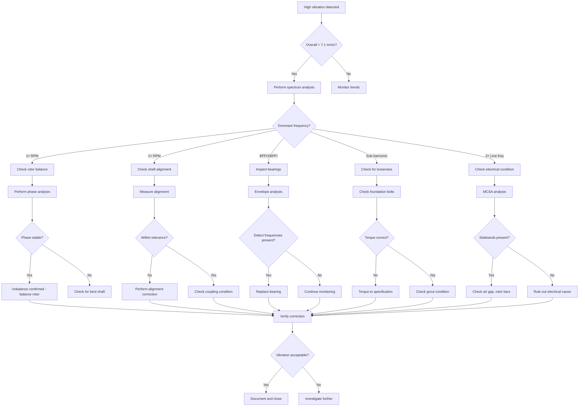

# Example: Electric Motor Excessive Vibration Diagnosis Plan

## Executive Summary

**Equipment**: Three-phase induction motor, 75kW, 4-pole  
**Fault**: Vibration levels exceed 7.1 mm/s RMS (ISO 10816 limit)  
**Approach**: Vibration spectrum analysis following mechanical→electrical→structural sequence  
**Estimated Duration**: 3-5 hours  

---

## Possible Failure Causes

| Cause | Probability | Supporting Evidence | Quick Check |
|-------|-------------|---------------------|-------------|
| Unbalance | High | High 1X frequency amplitude | Phase analysis and balance check |
| Misalignment | High | High 2X frequency, axial vibration | Alignment verification |
| Bearing defects | Medium | BPFO/BPFI frequency peaks | Envelope analysis |
| Loose foundation | Medium | Sub-harmonic frequencies | Bolt torque check |
| Electrical faults | Medium | 2X line frequency sidebands | Current signature analysis |
| Resonance | Low | Vibration varies with speed | Bump test/modal analysis |

---

## Inspection Steps and Priorities

### Critical Priority

1. **Initial Vibration Assessment**
   - **Method**: Measure overall vibration at all bearings (horizontal, vertical, axial)
   - **Standard Value**: < 4.5 mm/s RMS (ISO 10816, Class II)
   - **Tools**: Vibration analyzer with accelerometers
   - **Time**: 15 minutes

2. **Spectrum Analysis**
   - **Method**: Capture vibration spectrum to identify dominant frequencies
   - **Standard Value**: 1X = running speed, 2X = 2×running speed
   - **Tools**: FFT analyzer
   - **Time**: 20 minutes

### High Priority

3. **Rotor Balance Check**
   - **Method**: Phase analysis at 1X frequency, check balance quality grade
   - **Standard Value**: Balance grade G2.5 or better per ISO 1940
   - **Tools**: Vibration analyzer with phase reference
   - **Time**: 30 minutes

4. **Shaft Alignment Verification**
   - **Method**: Laser alignment or dial indicator measurement
   - **Standard Value**: Angular < 0.05mm/100mm, Offset < 0.10mm
   - **Tools**: Laser alignment tool or dial indicators
   - **Time**: 60 minutes

### Medium Priority

5. **Bearing Condition Analysis**
   - **Method**: Envelope analysis for BPFO, BPFI, BSF, FTF frequencies
   - **Standard Value**: No bearing defect frequency peaks
   - **Tools**: Vibration analyzer with envelope capability
   - **Time**: 30 minutes

6. **Foundation and Mounting Inspection**
   - **Method**: Check bolt torque, grout condition, baseplate flatness
   - **Standard Value**: Bolts torqued to spec, no grout cracks
   - **Tools**: Torque wrench, inspection hammer
   - **Time**: 30 minutes

7. **Electrical Fault Detection**
   - **Method**: Motor current signature analysis (MCSA)
   - **Standard Value**: No 2×line frequency sidebands around 1X
   - **Tools**: Current clamps, spectrum analyzer
   - **Time**: 20 minutes

---

## Required Tools and Documents

### Tools
- Vibration analyzer (FFT capability, minimum 1600 lines)
- Accelerometers (100 mV/g sensitivity)
- Phase reference sensor (tachometer or keyphasor)
- Laser shaft alignment system
- Torque wrench
- Current clamps (for MCSA)
- Stroboscope (for visual inspection)

### Documents
- Motor specifications and nameplate data
- ISO 10816 vibration standards
- Bearing frequency calculator (for defect frequencies)
- Alignment tolerance guidelines
- Previous vibration baseline data

---

## Standard Values Reference

### Vibration Limits (ISO 10816-1, Class II - Medium Machines)

| Zone | Vibration Velocity (mm/s RMS) | Condition |
|------|------------------------------|-----------|
| A | < 2.8 | Newly commissioned machines |
| B | 2.8 - 4.5 | Machines acceptable for unrestricted long-term operation |
| C | 4.5 - 7.1 | Machines unsatisfactory for long-term operation |
| D | > 7.1 | Damage likely to occur |

### Frequency Analysis Guidelines

| Frequency | Possible Cause | Action Threshold |
|-----------|---------------|------------------|
| 1× RPM | Unbalance, misalignment, bent shaft | Amplitude > 70% of total |
| 2× RPM | Misalignment, mechanical looseness | Amplitude > 40% of 1× |
| 3× RPM | Misalignment (specific types) | Any significant peak |
| Blade pass | Flow-related issues | Amplitude > 20% of 1× |
| BPFO/BPFI | Bearing outer/inner race defects | Amplitude > 0.5 gE |
| 2× Line freq | Electrical faults (eccentricity) | Sideband amplitude > 60 dB down |

### Alignment Tolerances

| Coupling Type | Angular (mm/100mm) | Offset (mm) |
|---------------|-------------------|-------------|
| Flexible | < 0.10 | < 0.15 |
| Gear | < 0.05 | < 0.08 |
| Rigid | < 0.03 | < 0.05 |

---

## Troubleshooting Flowchart

---

## Next Steps

Would you like to:
1. **Begin vibration measurement** - I'll guide you through data collection
2. **Review previous vibration data** - Compare with baseline if available
3. **Focus on specific frequency** - Target the dominant vibration component
4. **Schedule maintenance** - Plan corrective actions based on findings
