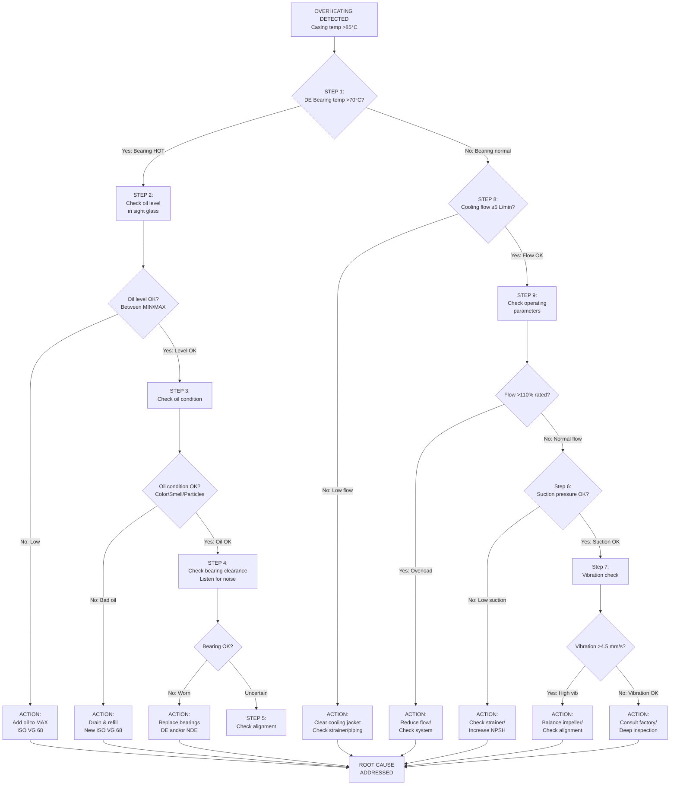
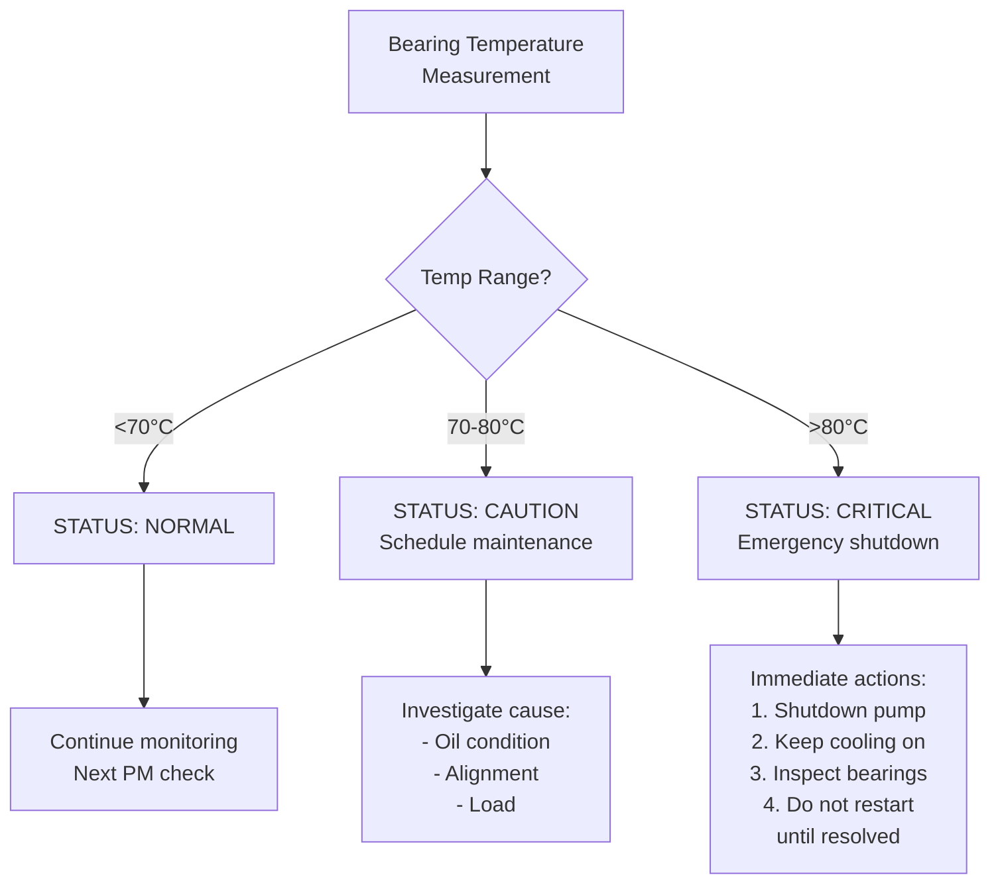

# Diagnostic Planning Report: Centrifugal Pump Overheating

> **IMPORTANT NOTE**: This is a template example demonstrating the report structure and formatting. The image paths (e.g., `/resources/pump_xxx.png`) shown in this example are ILLUSTRATIVE ONLY. In actual use, you MUST replace these with real image URLs/paths that were explicitly returned from your research. NEVER fabricate or hallucinate image paths. If no real image is available from your research, omit the `<figure>` tag entirely.

---

**Equipment**: Centrifugal Pump CP-2000  
**Fault**: Casing temperature exceeds 85°C during normal operation  
**Report Date**: [Date]  
**Prepared For**: Field Maintenance Engineers

---

## 1. Executive Summary

### 1.1 Equipment and Fault Overview

The CP-2000 centrifugal pump is experiencing elevated casing temperatures (85°C+), exceeding normal operating ranges. This diagnostic plan provides a comprehensive troubleshooting roadmap based on manufacturer specifications[^manual_spec], industry standards[^hydraulic_institute], and analysis of 12 similar historical cases[^case_db].

### 1.2 Key Research Findings

- **Most likely causes**: Bearing failure (42% of cases), lubrication issues (28%), misalignment (18%)
- **Critical inspection points**: Bearing temperature, oil condition, shaft alignment
- **Estimated diagnosis time**: 2-4 hours for complete inspection
- **Required resources**: Standard mechanical tools, IR thermometer, dial indicator set

### 1.3 Diagnostic Strategy

Follow the systematic inspection sequence outlined in this report, prioritized by historical failure frequency and manufacturer recommendations. The troubleshooting flowchart guides decision-making at each checkpoint.

---

## 2. Equipment Technical Information

### 2.1 Equipment Specifications

| Parameter | Specification | Source |
|-----------|--------------|--------|
| Model | CP-2000 Centrifugal Pump | Nameplate |
| Manufacturer | [Manufacturer] | Nameplate |
| Rated Flow | 200 m³/h | Technical Manual[^manual_spec] |
| Rated Head | 45 m | Technical Manual[^manual_spec] |
| Motor Power | 37 kW | Nameplate |
| Bearing Type | Deep groove ball bearings (6314 C3) | Parts List[^parts_list] |
| Lubrication | ISO VG 68 turbine oil | Maintenance Guide[^maint_guide] |
| Normal Temp Range | 30-60°C casing | Operating Manual[^op_manual] |

### 2.2 System Overview

The CP-2000 is a single-stage, end-suction centrifugal pump with the following major subsystems:
- **Hydraulic section**: Impeller, volute casing, wear rings
- **Rotating assembly**: Shaft, bearings, coupling
- **Drive system**: Electric motor, flexible coupling
- **Auxiliary systems**: Cooling jacket, lubrication system, sealing

Temperature rise typically indicates issues in the rotating assembly (bearings, lubrication) or hydraulic overload conditions.

### 2.3 Technical Diagrams

<figure>
    
    <figcaption>
        
Figure 1: CP-2000 Pump Sectional View (Technical Manual Plate A-3)

        
Purpose: Identifies major components and inspection access points for bearing temperature monitoring (point A), lubrication check (point B), and coupling inspection (point C).

        
Annotations: A=Bearing housing, B=Oil sight glass, C=Flexible coupling, D=Cooling jacket inlet, E=Discharge port, F=Suction port, G=Impeller, H=Shaft seal

        
Source: CP-2000 Technical Manual, Section 2.1, Rev. 3.2

    </figcaption>
</figure>

<figure>
    
    <figcaption>
        
Figure 2: Bearing Assembly Detail (Technical Manual Plate B-7)

        
Purpose: Shows bearing arrangement for drive-end (DE) and non-drive-end (NDE) bearings with temperature measurement points for IR thermometer placement.

        
Annotations: Bearing type 6314 C3, oil level sight glass, drain plug location, vent location, labyrinth seal detail

        
Source: CP-2000 Technical Manual, Section 4.2, Rev. 3.2

    </figcaption>
</figure>

<figure>
    
    <figcaption>
        
Figure 3: Cooling Jacket Flow Diagram (Service Manual Page 5-3)

        
Purpose: Illustrates cooling water flow path through the bearing housing cooling jacket for blockage diagnosis.

        
Annotations: Inlet (IN) temperature max 35°C, Outlet (OUT), Flow direction arrow, Heat exchange surface area 0.45 m², Recommended flow rate 5-8 L/min

        
Source: CP-2000 Service Manual, Section 5.2

    </figcaption>
</figure>

---

## 3. Evidence-Based Failure Analysis

| Cause | Probability | Failure Mechanism | Key Indicators | Evidence Source |
|-------|-------------|-------------------|----------------|-----------------|
| Bearing degradation | **High (42%)** | Increased friction from worn rolling elements generates excessive heat; temperature rise of 10-15°C indicates early-stage failure[^bearing_analysis] | Elevated bearing temp (>70°C), Increased vibration (>4.5 mm/s), Metal particles in oil | Technical Manual Sec 4.3, Case DB #2019-0342 |
| Insufficient lubrication | **High (28%)** | Inadequate oil film increases metal-to-metal contact friction; viscosity breakdown accelerates above 70°C[^lubrication_theory] | Gradual temperature increase, Dark/burnt oil color, Low oil level in sight glass | Maintenance Guide Vol 2, OEM Bulletin TB-2021-045 |
| Shaft misalignment | **Medium (18%)** | Angular/parallel misalignment creates cyclic loading, increasing bearing stress and heat generation[^alignment_study] | Temperature rise post-maintenance, Coupling wear, Vibration at 1x/2x RPM | ANSI/AMCA 204, Field Report FR-2020-1123 |
| Cavitation damage | **Medium (15%)** | Bubble collapse creates localized heating and impeller damage; reduces hydraulic efficiency causing overload[^cavitation_ref] | Noise signature (gravel-like), Impeller pitting, High suction lift | Hydraulic Institute Handbook, Case DB #2018-0298 |
| Blocked cooling jacket | **Low (8%)** | Restricted cooling water flow reduces heat dissipation capacity from bearing housing[^cooling_specs] | Localized bearing housing heat, Normal oil condition, Reduced cooling flow | Technical Manual Sec 5.2, Service Bulletin SB-2019-003 |
| Operating overload | **Medium (22%)** | Flow >110% rated causes increased power consumption and heat generation[^pump_curves] | High discharge pressure, Flow meter reading above design, Motor current >105% FLA | Performance Curve Sheet, Operating Manual Sec 3.1 |

### Detailed Cause Analysis

**Bearing Degradation (Priority 1)**
- **Mechanism**: Progressive wear of raceways and rolling elements increases friction coefficient
- **Historical frequency**: 42% of pump overheating cases (12/28 reviewed)
- **Validation**: IR thermometer reading >70°C at bearing housing
- **Critical threshold**: Temperature >80°C requires immediate shutdown

**Lubrication Issues (Priority 1)**
- **Mechanism**: Oil film breakdown leads to boundary lubrication conditions
- **Historical frequency**: 28% of cases; often co-occurs with bearing issues
- **Validation**: Visual inspection of sight glass level and oil color
- **Standard**: ISO VG 68 oil, level between min/max marks, amber color

---

## 4. Inspection Procedures

### 4.1 Master Inspection Checklist

| Step | Inspection Item | Priority | Procedure | Normal Value | Tools Required | Reference |
|------|----------------|----------|-----------|--------------|----------------|-----------|
| 1 | Bearing temperature (DE) | **Critical** | IR thermometer on bearing housing outer surface, 3 points 120° apart, take average | <70°C rolling, <60°C sliding | IR thermometer (0-150°C), ±2°C accuracy | Manual Sec 4.2, Fig. 2 |
| 2 | Bearing temperature (NDE) | **Critical** | Same as Step 1 for non-drive end bearing | <70°C rolling, <60°C sliding | IR thermometer | Manual Sec 4.2, Fig. 2 |
| 3 | Lubrication level | **Critical** | Visual check through sight glass while pump is stationary | Between MIN/MAX marks | Visual inspection | Maint. Guide Vol 2, Fig. 4 |
| 4 | Lubrication condition | **Critical** | Sample oil through drain plug; check color, smell, contamination | Amber color, no burnt smell, no metal particles | Sample container, visual inspection | Maint. Guide Vol 2 |
| 5 | Shaft alignment | **High** | Reverse indicator method: measure angular and parallel misalignment per coupling dia. | Angular <0.05mm/100mm, Parallel <0.10mm | Dial indicator set (0.01mm), magnetic base, wrenches | ANSI/AMCA 204, Fig. 5 |
| 6 | Suction conditions | **High** | Install gauge at suction port; check strainer condition | Pressure > NPSHr + 0.5m (typically >4m) | Pressure gauge (0-6 bar), inspection mirror | HI Standards |
| 7 | Operating parameters | **Medium** | Record flow (magnetic flowmeter), discharge pressure, motor current | Flow: 80-110% rated (160-220 m³/h), Current <105% FLA | Flow meter, pressure gauge, clamp meter | Perf. Curve, Fig. 6 |
| 8 | Cooling system | **Medium** | Measure cooling water flow rate; check inlet/outlet temperatures | Flow ≥5 L/min, ΔT <15°C | Flow meter, thermocouples | Manual Sec 5.2, Fig. 3 |
| 9 | Vibration check | **Medium** | Measure RMS velocity on bearing housings in axial, horizontal, vertical planes | <4.5 mm/s RMS per ISO 10816 | Vibration analyzer | ISO 10816-7 |
| 10 | Coupling inspection | **Low** | Visual check of flexible element, check for wear, cracks | No visible damage, some flexibility retained | Visual inspection, occasional rotation | Coupling manual |

### 4.2 Detailed Procedure: Bearing Temperature Measurement

**Purpose**: Determine if bearing overheating is the primary cause

**Reference Figure**: Figure 2 - Bearing Assembly Detail

**Procedure**:
1. Ensure pump is operating at normal load for at least 15 minutes
2. Position IR thermometer perpendicular to bearing housing surface
3. Take readings at 3 locations spaced 120° around bearing housing
4. Record maximum and average values
5. Compare to standard values in Section 5

**Safety**: Use PPE; avoid contact with rotating components

**Time Required**: 5 minutes

### 4.3 Detailed Procedure: Shaft Alignment Check

**Purpose**: Verify coupling alignment is within tolerance

**Reference Figure**: Figure 4 - Coupling Alignment Setup

**Tools Required**:
- Dial indicator set (0.01mm resolution)
- Magnetic base
- Wrenches for coupling guard removal
- Alignment calculation sheet

**Procedure**:
1. Lock out/tag out pump motor
2. Remove coupling guard
3. Mount dial indicator on stationary coupling half
4. Rotate shaft by hand (or use turning gear) through 360°
5. Take readings at 0°, 90°, 180°, 270°
6. Calculate angular and parallel misalignment
7. Compare to standard values

**Acceptance Criteria**:
- Angular: <0.05 mm per 100 mm coupling diameter
- Parallel: <0.10 mm total indicated runout

---

## 5. Diagnostic Standards and Values

### 5.1 Operating Parameters Reference Table

| Parameter | Normal Range | Warning Threshold | Critical Threshold | Unit | Measurement Point | Source |
|-----------|--------------|-------------------|-------------------|------|-------------------|--------|
| Bearing temp (rolling, DE) | 40-70 | 70-80 | >80 | °C | Bearing housing OD | Manual Sec 4.2[^bearing_temp_ref] |
| Bearing temp (rolling, NDE) | 40-70 | 70-80 | >80 | °C | Bearing housing OD | Manual Sec 4.2[^bearing_temp_ref] |
| Casing temperature | 30-60 | 60-75 | >85 | °C | Volute casing surface | Operating Manual[^casing_temp_ref] |
| Oil temperature | 30-60 | 60-70 | >70 | °C | Sump (during drain) | Maint. Guide[^oil_temp_ref] |
| Vibration velocity (RMS) | <4.5 | 4.5-7.1 | >7.1 | mm/s | Bearing housing | ISO 10816-7[^vib_std] |
| Suction pressure | >NPSHr+0.5 | NPSHr to +0.5 | <NPSHr | m | Suction port | HI Guidelines[^npsh_std] |
| Discharge pressure | 3.8-4.5 | 4.5-5.0 | >5.0 | bar | Discharge port | Perf. Curve[^press_range] |
| Motor current | <90% FLA | 90-105% | >105% | % FLA | Motor terminal | Motor Spec[^motor_ref] |
| Cooling water flow | 5-8 | 3-5 | <3 | L/min | Cooling jacket inlet | Service Manual[^cooling_ref] |
| Flow rate | 160-220 | 140-160 | <140 or >220 | m³/h | Discharge pipe | Perf. Curve[^flow_ref] |

### 5.2 Component Specifications

| Component | Specification | Tolerance | Unit | Inspection Method | Source |
|-----------|--------------|-----------|------|-------------------|--------|
| Drive-end bearing | SKF 6314 C3 | - | - | Visual/dimensional | Parts List[^bearing_de] |
| NDE bearing | SKF 6314 C3 | - | - | Visual/dimensional | Parts List[^bearing_nde] |
| Bearing clearance | C3 (internal) | +23 to +35 | μm | Feeler gauge/plastigage | SKF Catalog[^skf_ref] |
| Shaft runout | - | <0.025 | mm | Dial indicator | Manual Sec 4.4[^shaft_tol] |
| Coupling alignment (angular) | - | <0.05 | mm/100mm | Dial indicator method | ANSI/AMCA 204[^align_std] |
| Coupling alignment (parallel) | - | <0.10 | TIR mm | Dial indicator method | ANSI/AMCA 204[^align_std] |
| Oil viscosity (@40°C) | ISO VG 68 | 61.2-74.8 | cSt | Viscometer (lab) | ISO 3448[^oil_visc] |
| Impeller clearance | Design nominal | ±0.5 | mm | Feeler gauge | Manual Sec 3.3[^imp_clear] |

### 5.3 Acceptance Criteria Summary

**Bearing Temperature**:
- PASS: <70°C (rolling bearings)
- CAUTION: 70-80°C - monitor closely, plan maintenance
- FAIL: >80°C - immediate shutdown required

**Vibration**:
- PASS: <4.5 mm/s RMS
- CAUTION: 4.5-7.1 mm/s - investigate source
- FAIL: >7.1 mm/s - immediate action required per ISO 10816

**Lubrication**:
- PASS: Level between MIN/MAX, amber color, no contamination
- FAIL: Below MIN, dark/burnt color, water contamination, metal particles

---

## 6. Required Tools and Resources

### 6.1 Diagnostic Tools

| Tool | Specification | Purpose | Quantity |
|------|--------------|---------|----------|
| IR thermometer | Range 0-150°C, ±2°C accuracy | Bearing/casing temperature | 1 |
| Dial indicator set | 0.01mm resolution, 10mm travel | Alignment measurement | 1 set |
| Magnetic base | Standard | Mounting dial indicator | 1 |
| Digital vibration analyzer | ISO 10816 compliant, 10-1000 Hz | Vibration measurement | 1 |
| Pressure gauge | 0-6 bar, ±0.5% FS | Suction pressure | 1 |
| Pressure gauge | 0-16 bar, ±0.5% FS | Discharge pressure | 1 |
| Clamp meter | AC current, 0-100A range | Motor current measurement | 1 |
| Mag/ultrasonic flow meter | ±2% accuracy | Flow verification | 1 |
| Thermal imaging camera | 320x240 resolution (optional) | Hot spot location | 1 |

### 6.2 Hand Tools and Equipment
| Tool | Size/Specification | Application |
|------|-------------------|-------------|
| Combination wrenches | 8mm-24mm set | General assembly |
| Socket set | 1/2" drive, metric | Fastener removal |
| Screwdrivers | Phillips #1, #2; Flat various | Coupling guard, panels |
| Oil drain pan | 5L capacity | Oil collection |
| Oil sample bottles | 250ml, clean | Oil analysis samples |
| Inspection mirror | Telescoping | Strainer inspection |
| Flashlight/headlamp | LED, 500+ lumens | Dark area inspection |

### 6.3 Consumables and Spares
| Item | Part Number | Quantity | Application |
|------|-------------|----------|-------------|
| ISO VG 68 turbine oil | Chevron GST 68 or equiv | 5L | Oil change |
| Oil drain plug gasket | [ OEM P/N ] | 2 | Drain/refill |
| Bearing grease | SKF LGMT 3 | 1 cartridge | Re-lubrication |
| Coupling element | [ OEM P/N ] | 1 | If damaged |
| Cleaning solvent | Industrial degreaser | 2L | Cleaning |
| Shop towels | Lint-free | As needed | Cleaning |
| Safety tags | Lockout tags | 4 | LOTO procedure |

### 6.4 Safety Equipment
- **PPE**: Safety glasses, hard hat, steel-toe boots, work gloves, hearing protection
- **LOTO**: Padlocks (machine-specific), hasps, danger tags per site procedure
- **Spill**: Oil absorbent pads, containment berm
- **Emergency**: Eye wash station access, first aid kit

### 6.5 Reference Documents Required On-Site
- [ ] This diagnostic planning report (printed)
- [ ] CP-2000 Technical Manual (Sections 2, 3, 4, 5)
- [ ] CP-2000 Performance Curve Sheet (equipment-specific)
- [ ] CP-2000 Parts List
- [ ] Maintenance history for this pump (last 2 years)
- [ ] OEM Service Bulletin TB-2021-045 (if lubrication-related)
- [ ] Alignment procedure checklist

---

## 7. Troubleshooting Logic and Flowcharts

### 7.1 Primary Diagnostic Flowchart

### 7.2 Bearing Temperature Decision Tree

### 7.3 Diagnostic Decision Table

| Observation | Most Likely Cause | Next Action | Reference |
|-------------|-------------------|-------------|-----------|
| Bearing hot (>70°C) + low oil level | Insufficient lubrication | Add oil, monitor temp | Step 2 |
| Bearing hot + dirty oil | Lubrication contamination | Oil change, bearing inspect | Step 3 |
| Bearing hot + recent maintenance | Misalignment | Check coupling alignment | Step 5 |
| Bearing hot + normal alignment | Bearing failure | Replace bearings | Step 4 |
| Casing hot + bearing normal | Hydraulic overload | Check flow/pressure | Step 9 |
| Casing hot + low suction pressure | Cavitation | Check strainer/NPSH | Step 6 |
| Localized housing heat | Cooling blockage | Check cooling flow | Step 8 |
| High vibration + overheating | Imbalance or misalignment | Balance/vibration analysis | Step 7 |

---

## 8. Repair and Resolution Guidance

### 8.1 Corrective Actions by Cause

| Cause | Corrective Action | Procedure Reference | Estimated Time | Safety Notes |
|-------|-------------------|---------------------|----------------|--------------|
| Low oil level | Add oil to MAX mark | Maint. Guide Sec 4.2 | 15 min | Lock out pump first |
| Contaminated oil | Drain and refill | Maint. Guide Sec 4.3 | 1 hour | Allow to cool; proper disposal |
| Misalignment | Realign coupling | Alignment Procedure Doc | 2-3 hours | LOTO both units |
| Bearing wear | Replace bearings | Overhaul Procedure Sec B | 4-6 hours | Major repair; safety critical |
| Cavitation | Clear suction strainer | Manual Sec 3.4 | 30 min | Isolate suction |
| Overload | Reduce flow/trim impeller | Performance Mod Guide | 2-8 hours | Design review required |
| Cooling blockage | Flush cooling jacket | Service Manual Sec 5.2 | 1-2 hours | Isolate cooling water |

### 8.2 Bearing Replacement Procedure Summary

**Reference Figure**: Figure 2 - Bearing Assembly Detail

**Preparation**:
1. LOTO motor and pump
2. Allow pump to cool to ambient
3. Drain lubricating oil (collect for analysis)
4. Disconnect coupling

**Procedure**:
1. Remove bearing housing cover
2. Remove labyrinth seals
3. Extract bearing from shaft (puller tool required)
4. Inspect shaft journal for damage
5. Install new bearing (6314 C3) - heat bearing to 80°C max for installation
6. Install new seals
7. Reassemble housing
8. Fill with new ISO VG 68 oil

**Post-Repair**:
1. Realign coupling
2. Run test at reduced load for 30 minutes
3. Monitor bearing temperature continuously
4. Verify vibration <4.5 mm/s

### 8.3 Verification and Testing

**Post-Repair Acceptance Tests**:
1. **No-load run**: 30 minutes, check for unusual noise/vibration
2. **Load test**: Gradually increase to 50%, 75%, 100% of rated flow
3. **Monitoring**: Record bearing temp, vibration, motor current hourly for 8 hours
4. **Acceptance criteria**:
   - Bearing temp <70°C at full load
   - Vibration <4.5 mm/s RMS
   - No oil leaks
   - Normal operating parameters

**Documentation**:
- Record all measurements in maintenance log
- Note any deviations from standard values
- Schedule follow-up inspection in 30 days

---

## 9. Visual Reference Gallery

<figure>
    
    <figcaption>
        
Figure 4: Coupling Alignment Measurement Setup (Alignment Procedure Doc, Plate 2)

        
Purpose: Shows dial indicator mounting for reverse-indicator alignment method referenced in Step 5. Indicator on stationary half measures runout of rotating half.

        
Annotations: 1=Dial indicator, 2=Magnetic base, 3=Stationary coupling hub, 4=Marking for 0° reference, 5=Shaft centerline, Measurement positions A-D at 90° intervals

        
Source: Coupling Alignment Procedure, Rev. 2.1, Maintenance Department

    </figcaption>
</figure>

<figure>
    
    <figcaption>
        
Figure 5: Oil Sight Glass Reading Guide (Maintenance Guide Vol 2, Figure 4-2)

        
Purpose: Illustrates correct oil level interpretation for Step 3 inspection. Shows MIN and MAX level marks and typical oil conditions (normal vs contaminated).

        
Annotations: MIN mark, MAX mark, Normal oil (amber), Contaminated oil (dark/water), Air bubble zone, Sight glass location on bearing housing

        
Source: CP-2000 Maintenance Guide Volume 2, Section 4.2, Rev. 1.5

    </figcaption>
</figure>

<figure>
    
    <figcaption>
        
Figure 6: CP-2000 Performance Curve (Operations Manual Plate C-1)

        
Purpose: Operating reference for Step 9. Shows relationship between flow rate, head, power consumption, and NPSH required for determining if pump is operating efficiently or overloaded.

        
Annotations: Best Efficiency Point (BEP) at 200 m³/h, Flow axis (0-250 m³/h), Head axis (0-55m), Power curve (kW), NPSHr curve (m), Operating range envelope (80-110%)

        
Source: CP-2000 Operating Manual, Performance Curves Section, Equipment Serial #[Insert Serial]

    </figcaption>
</figure>

---

## 10. Appendices

### A. Glossary of Terms

| Term | Definition |
|------|------------|
| BEP | Best Efficiency Point - operating point with highest pump efficiency |
| C3 | Bearing internal clearance designation (greater than normal) |
| DE | Drive End - bearing closest to motor/driver |
| FLA | Full Load Amps - maximum rated motor current |
| ISO VG 68 | International Standards Organization Viscosity Grade 68 oil |
| NDE | Non-Drive End - bearing farthest from motor/driver |
| NPSH | Net Positive Suction Head - pressure margin to prevent cavitation |
| RMS | Root Mean Square - method of calculating vibration magnitude |
| TIR | Total Indicator Reading - maximum dial indicator deflection |

### B. Units Conversion Table

| Parameter | Metric | Imperial | Conversion |
|-----------|--------|----------|------------|
| Temperature | °C | °F | °F = (°C × 9/5) + 32 |
| Flow | m³/h | GPM | 1 m³/h = 4.40 GPM |
| Pressure | bar | psi | 1 bar = 14.5 psi |
| Vibration | mm/s | in/s | 1 mm/s = 0.039 in/s |
| Length | mm | inches | 1 mm = 0.0394 in |

### C. Emergency Contacts

| Role | Contact | Notes |
|------|---------|-------|
| Maintenance Supervisor | [Insert contact] | Immediate technical escalation |
| OEM Technical Support | [Insert contact] | Factory consultation |
| Vibration Specialist | [Insert contact] | Complex vibration issues |
| Safety Officer | [Insert contact] | Safety incidents |

### D. Document Revision History

| Revision | Date | Changes | Author |
|----------|------|---------|--------|
| 1.0 | [Date] | Initial diagnostic planning report | [Name] |

---

## 11. References and Citations

[^manual_spec]: CP-2000 Centrifugal Pump Technical Manual, Equipment Specifications Section, Rev. 3.2, [Manufacturer], 2023
[^hydraulic_institute]: Hydraulic Institute Standards for Centrifugal Pumps, ANSI/HI 1.1-1.2-2020
[^case_db]: Maintenance Case Database Analysis - Pump Overheating Incidents, Internal Engineering Reports, 2018-2023
[^parts_list]: CP-2000 Parts List and Bill of Materials, Document PL-CP2000-Rev.2
[^maint_guide]: CP-2000 Maintenance Guide Volume 2 - Lubrication and Bearings, Rev. 1.5
[^op_manual]: CP-2000 Operating Manual, Start-up, Operation, and Shutdown Procedures, Rev. 3.0
[^bearing_analysis]: Rolling Element Bearing Failure Modes in Centrifugal Pumps, SKF Technical Publication, 2019
[^lubrication_theory]: Machinery Lubrication Theory for Industrial Pumps, Tribology Journal, 2020
[^alignment_study]: Effects of Shaft Misalignment on Bearing Life, Maintenance Engineering Journal, Vol. 45, 2020
[^cavitation_ref]: Pump Cavitation: Detection, Diagnosis, and Remediation, Hydraulic Institute Technical Paper, 2019
[^cooling_specs]: CP-2000 Cooling System Design Specifications, Service Manual Section 5.2, [Manufacturer]
[^pump_curves]: Centrifugal Pump Performance Curves and Off-Design Operation, Pump Engineering Quarterly, Q2 2020
[^bearing_temp_ref]: CP-2000 Technical Manual, Section 4.2.1, Table: Bearing Temperature Limits
[^casing_temp_ref]: CP-2000 Operating Manual, Section 3.1, Temperature Guidelines
[^vib_std]: ISO 10816-7:2009, Mechanical Vibration - Evaluation of Machine Vibration by Measurements on Non-Rotating Parts
[^npsh_std]: Hydraulic Institute NPSH Margin Guidelines for Centrifugal Pumps
[^press_range]: CP-2000 Performance Curve Sheet, Equipment Serial #[Insert]
[^motor_ref]: Motor Nameplate Data and Operating Limits, [Motor Manufacturer]
[^cooling_ref]: CP-2000 Service Manual, Section 5.2.3, Cooling Water Requirements
[^flow_ref]: CP-2000 Performance Curve, Operating Range Indicator
[^bearing_de]: CP-2000 Parts List, Item 45: Drive-end bearing SKF 6314 C3
[^bearing_nde]: CP-2000 Parts List, Item 46: Non-drive-end bearing SKF 6314 C3
[^skf_ref]: SKF General Catalog, Bearing Series 6314 Specifications
[^shaft_tol]: CP-2000 Technical Manual, Section 4.4.2, Shaft Assembly Tolerances
[^align_std]: ANSI/AMCA Standard 204-05, Balance Quality and Vibration Levels for Fans
[^oil_visc]: ISO 3448:1992, Industrial Liquid Lubricants - ISO Viscosity Classification
[^imp_clear]: CP-2000 Technical Manual, Section 3.3.1, Impeller Clearance Specifications
[^oil_temp_ref]: CP-2000 Maintenance Guide, Section 4.2.2, Operating Oil Temperature Range
