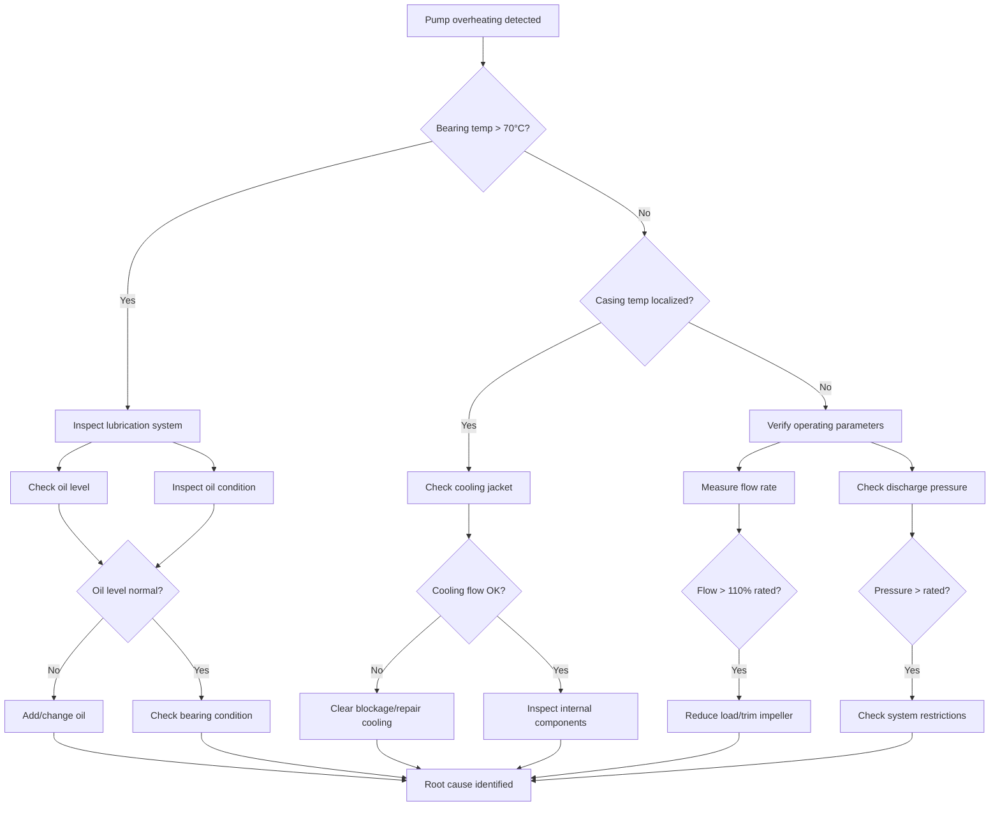

# Example: Centrifugal Pump Overheating Diagnosis Plan

## Executive Summary

**Equipment**: Centrifugal Pump Model CP-2000  
**Fault**: Pump casing temperature exceeds 85°C during operation  
**Approach**: Systematic thermal analysis following mechanical→hydraulic→electrical sequence  
**Estimated Duration**: 2-4 hours  

---

## Possible Failure Causes

| Cause | Probability | Supporting Evidence | Quick Check |
|-------|-------------|---------------------|-------------|
| Bearing failure | High | High temp + vibration correlation | Check bearing temperature with IR thermometer |
| Insufficient lubrication | High | Gradual temperature increase | Inspect oil level and condition |
| Misalignment | Medium | Recent maintenance history | Check coupling alignment with dial indicator |
| Cavitation | Medium | Noise + temperature correlation | Check suction pressure and NPSH |
| Blocked cooling jacket | Low | Localized hot spots | Thermal imaging of casing |
| Overloading | Medium | High discharge pressure | Compare actual vs rated flow rate |

---

## Inspection Steps and Priorities

### Critical Priority

1. **Bearing Temperature Check**
   - **Method**: Use IR thermometer on bearing housings
   - **Standard Value**: < 70°C for rolling bearings
   - **Tools**: IR thermometer
   - **Time**: 5 minutes

2. **Lubrication System Inspection**
   - **Method**: Check oil level sight glass, inspect oil color
   - **Standard Value**: Level between min/max marks, amber color
   - **Tools**: Visual inspection
   - **Time**: 10 minutes

### High Priority

3. **Shaft Alignment Verification**
   - **Method**: Measure coupling misalignment with dial indicator
   - **Standard Value**: Angular < 0.05mm/100mm, Parallel < 0.10mm
   - **Tools**: Dial indicator set, wrenches
   - **Time**: 45 minutes

4. **Suction Condition Assessment**
   - **Method**: Measure suction pressure, check strainer
   - **Standard Value**: Suction pressure > NPSH required + 0.5m margin
   - **Tools**: Pressure gauge, inspection mirror
   - **Time**: 20 minutes

### Medium Priority

5. **Operating Parameter Verification**
   - **Method**: Record flow rate, discharge pressure, power consumption
   - **Standard Value**: Compare to pump curve and nameplate data
   - **Tools**: Flow meter, pressure gauges, power analyzer
   - **Time**: 15 minutes

6. **Cooling System Check**
   - **Method**: Verify cooling water flow, check for blockages
   - **Standard Value**: Flow rate per manufacturer specification
   - **Tools**: Flow meter, thermal camera
   - **Time**: 20 minutes

---

## Required Tools and Documents

### Tools
- IR thermometer (range 0-150°C)
- Dial indicator set (0.01mm resolution)
- Pressure gauges (suction and discharge)
- Vibration analyzer
- Thermal imaging camera
- Standard hand tools (wrenches, screwdrivers)
- PPE (safety glasses, gloves)

### Documents
- Pump datasheet and performance curves
- Bearing specifications
- Alignment tolerances
- Maintenance history records
- Lubrication chart

---

## Standard Values Reference

| Parameter | Normal Range | Warning | Critical | Unit |
|-----------|--------------|---------|----------|------|
| Bearing temperature | 40-70 | 70-80 | >80 | °C |
| Casing temperature | 30-60 | 60-75 | >75 | °C |
| Vibration (RMS) | < 4.5 | 4.5-7.1 | >7.1 | mm/s |
| Oil level | Min-Max | - | Below Min | visual |
| Suction pressure | > NPSHr+0.5 | NPSHr to NPSHr+0.5 | < NPSHr | m |
| Flow rate | 80-110% rated | 70-80% | <70% or >110% | m³/h |

---

## Troubleshooting Flowchart

---

## Next Steps

Would you like to:
1. **Start interactive troubleshooting** - I'll guide you through each inspection step
2. **Adjust priorities** - Based on your available time or tools
3. **Focus on highest probability cause** - Start with bearing/lubrication checks
4. **Add additional checks** - Include specific concerns you have
