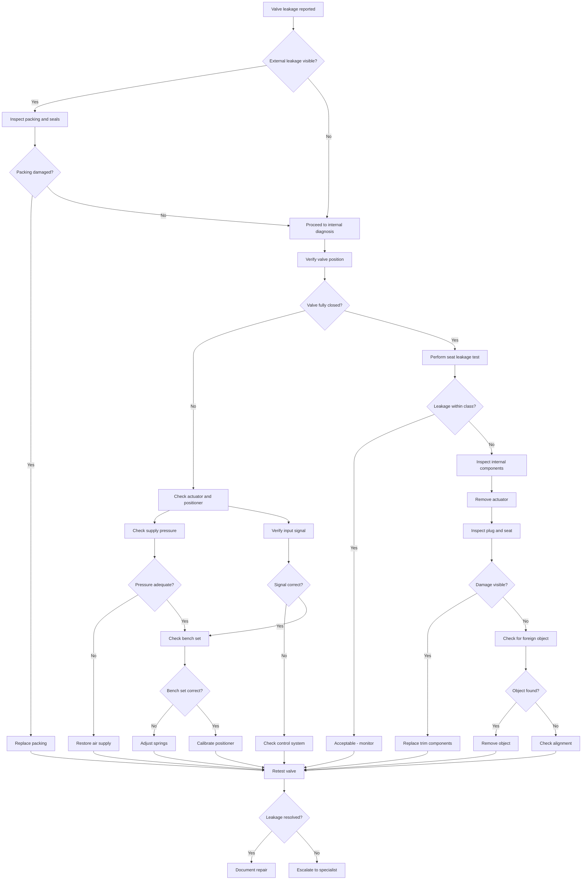

# Example: Control Valve Leakage Diagnosis Plan

## Executive Summary

**Equipment**: Pneumatic control valve, 6-inch, ANSI 300  
**Fault**: Internal leakage when valve is commanded closed  
**Approach**: Progressive isolation testing from actuator→positioner→valve body  
**Estimated Duration**: 2-3 hours  

---

## Possible Failure Causes

| Cause | Probability | Supporting Evidence | Quick Check |
|-------|-------------|---------------------|-------------|
| Seat damage | High | Leakage increases over time | Seat leakage test |
| Plug/seat misalignment | Medium | Recent maintenance or impact | Visual inspection, travel check |
| Actuator malfunction | Medium | Incorrect positioning | Stroke test, signal verification |
| Foreign object trapped | Medium | Sudden onset after maintenance | Partial stroke test |
| Packing wear | Low | External leakage + internal | Packing inspection |
| Positioner drift | Low | Gradual performance degradation | Calibration check |

---

## Inspection Steps and Priorities

### Critical Priority

1. **Leakage Quantification**
   - **Method**: Measure leakage rate with flow meter or bubble test
   - **Standard Value**: Class IV (0.01% of rated Cv) or per specification
   - **Tools**: Flow meter, graduated cylinder, stopwatch
   - **Time**: 15 minutes

2. **Valve Position Verification**
   - **Method**: Verify valve fully closes at 0% signal, bench set check
   - **Standard Value**: 0% signal = fully closed, no travel remaining
   - **Tools**: Pressure gauge, calibrator
   - **Time**: 10 minutes

### High Priority

3. **Actuator Performance Test**
   - **Method**: Stroke test, check supply pressure, bench set verification
   - **Standard Value**: Supply pressure 20-40 PSI (typical), bench set per spec
   - **Tools**: Pressure calibrator, air supply
   - **Time**: 20 minutes

4. **Positioner Calibration Check**
   - **Method**: 4-20mA input test, verify 0-100% travel correlation
   - **Standard Value**: Linear response, < 1% hysteresis
   - **Tools**: mA calibrator, position indicator
   - **Time**: 25 minutes

### Medium Priority

5. **Internal Component Inspection**
   - **Method**: Remove actuator, inspect plug, seat, and trim
   - **Standard Value**: No scoring, erosion, or deformation
   - **Tools**: Valve wrench, inspection light, borescope
   - **Time**: 45 minutes

6. **Seat Leakage Test (Detailed)**
   - **Method**: Hydrostatic test per ANSI/FCI standards
   - **Standard Value**: Class IV, V, or VI per specification
   - **Tools**: Test pump, pressure gauge, collection vessel
   - **Time**: 30 minutes

---

## Required Tools and Documents

### Tools
- Pressure calibrator (0-60 PSI range)
- mA loop calibrator (4-20mA)
- Flow measurement device
- Valve packing wrenches
- Borescope (for internal inspection)
- Torque wrench
- Hydrostatic test pump
- Collection vessel (for leakage measurement)

### Documents
- Valve specification sheet (Cv, class, trim type)
- Actuator datasheet (bench set, spring range)
- Positioner manual and calibration procedure
- Seat leakage class requirements (FCI 70-2)
- Maintenance history
- P&ID showing valve location and function

---

## Standard Values Reference

### Seat Leakage Classes (FCI 70-2 / ANSI B16.104)

| Class | Maximum Leakage | Test Medium | Test Pressure |
|-------|-----------------|-------------|---------------|
| I | - | - | - |
| II | 0.5% rated Cv | Air | 10-15 PSI or max ΔP |
| III | 0.1% rated Cv | Air | 10-15 PSI or max ΔP |
| IV | 0.01% rated Cv | Air | 10-15 PSI or max ΔP |
| V | 5×10⁻⁴ mL/min/Pa | Water | Max service ΔP |
| VI | Bubble test | Air | 10-15 PSI or max ΔP |

### Typical Actuator Specifications

| Parameter | Standard Range | Notes |
|-----------|----------------|-------|
| Supply pressure | 20-40 PSI | Check nameplate |
| Bench set | 3-15 PSI or 6-30 PSI | Spring range |
| Stroke time | 1-5 seconds typical | Size dependent |
| Position accuracy | ±1% of span | With smart positioner |

### Valve Trim Materials

| Service | Plug Material | Seat Material |
|---------|---------------|---------------|
| General | 316 SS | 316 SS |
| Erosive | Hardened 416 SS | Stellite |
| Corrosive | Monel/Hastelloy | Monel/Hastelloy |
| Cavitation | Hardened + special design | Hardened |

---

## Troubleshooting Flowchart

---

## Next Steps

Would you like to:
1. **Start with leakage quantification** - Measure actual leakage rate
2. **Check actuator operation** - Verify pneumatic system first
3. **Review valve history** - Check for recent maintenance or events
4. **Schedule internal inspection** - Plan for valve removal if needed
