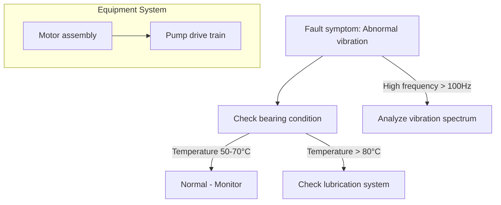

# Mermaid Generation Rules

## Core Principle
All Mermaid diagrams MUST follow strict string quoting and syntax structure rules to prevent parsing errors and ensure successful rendering in all viewers.

## Primary Rule: String Quoting (CRITICAL)

### ALL String Values MUST Be Quoted
**ALL string values in Mermaid diagrams MUST be wrapped in double quotes (`"`) to avoid parsing errors.**

This quoting requirement applies to:

1. **Fault symptom node labels**
   ```mermaid
   graph TD
     A["Vibration symptom"]  # ✅ CORRECT - Quoted
   ```

2. **Diagnostic flow edge labels**
   ```mermaid
   graph TD
     A -->|"High frequency"| C  # ✅ CORRECT - Quoted edge label
   ```

3. **Equipment category subgraph titles**
   ```mermaid
   subgraph "Pump Equipment Category"  # ✅ CORRECT - Quoted
     D["Motor inspection"] --> E["Pump assembly check"]
   end
   ```

4. **Decision point labels**
   ```mermaid
   decision{"Temperature > 80°C"}  # ✅ CORRECT - Quoted decision
   ```

5. **Any technical terminology**
   ```mermaid
   check["Check hydraulic pump pressure"]  # ✅ CORRECT - Quoted
   ```

## Proper Syntax Structure

### Graph Types

#### flowchart TD (Top-Down)


#### Decision Tree / Fault Tree
```mermaid
flowchart TD
    start([Start: Customer reports hydraulic failure])
    start --> check["Check hydraulic oil level and condition"]

    check -->|Oil level low| refill["Refill hydraulic oil to specification"]
    check -->|Oil contaminated| replace["Replace hydraulic oil and filter"]
    check -->|Oil normal| pressure["Check system pressure"]

    pressure -->|Pressure below 20 MPa| leak["Inspect for leaks"]
    pressure -->|Pressure normal (20-25 MPa)| pump["Test pump output flow"]

    leak --> found["Found leak - Repair or replace component"]
    leak --> notfound["No leaks found - Check pump"]

    pump -->|Flow < 180 L/min| failed["Pump failure - Replace pump"]
    pump -->|Flow 180-200 L/min| success["Pump normal - Check valves"]

    found --> end([End: Problem Resolved])
    refill --> end
    replace --> end
    failed --> end
    success --> end
```

## Common Pitfalls to Avoid (CRITICAL)

### 1. Unquoted Strings with Spaces
```mermaid
A["Check bearing temperature"]  # ✅ CORRECT - Properly quoted
```

### 2. Unquoted Multi-Word Fault Descriptions
```mermaid
A["Initial symptom"] -->|"Abnormal sound detected"| B["Next step"]  # ✅ CORRECT
```

### 3. Technical Terms Without Quotes
```mermaid
A["ISO 10816 limit: 4.5 mm/s"]  # ✅ CORRECT
```

### 4. Quoted Labels with Abbreviations
```mermaid
A["Check RPM Settings"]  # ✅ CORRECT
```

### 5. Labels with Numerical Values
```mermaid
A["Pressure check"] -->|"Pressure > 30 MPa"| B["Next step"]  # ✅ CORRECT
```

## Validation Protocol (CRITICAL)

### Before Presenting Any Mermaid Diagram, Validate:

#### Check 1: All Strings Are Quoted
- Scan diagram for unquoted strings containing spaces, numbers, or symbols
- Every node label must be in quotes: `["label"]`
- Every edge label must be in quotes: `--->|"label"|`
- Every subgraph title must be in quotes: `subgraph "subgraph title"`

#### Check 2: Proper Syntax Structure
- Verify graph type is specified: `flowchart TD`, `flowchart LR`, etc.
- Ensure proper node and edge connections
- Confirm all nodes and edges are closed properly
- Validate no orphaned connections

#### Check 3: Node Shape Usage
- Use appropriate shapes for meaning:
  - `[]` - Process/Action
  - `[()]` - Start/End (rounded)
  - `{{{}}}` - Decision/Condition
  - `(//)` - Input/Output (parallelogram)
  - `[[]]` - Database/Document

#### Check 4: Edge Connectors
- Use `-->` for standard directional connection
- Use `==>` for stronger emphasis
- Use `-.->` for weaker or conditional relationship
- Use `---` for undirected connection

## Error Prevention Strategy

### If Uncertain About a Specific Technical Label
**ALWAYS apply quotes as a safety measure**

```mermaid
A["Uncertain if this needs quotes? Use quotes anyway"]  # ✅ SAFE
```

**It's better to over-quote than to cause rendering failures in fault diagnosis diagrams.**
