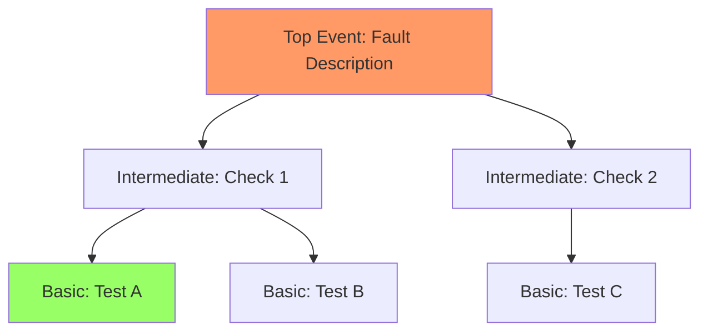

# Fault Case Report Generation Skill

## Overview

Generate comprehensive, educational fault case reports that document the entire diagnostic process from initial symptoms to final resolution.

## When to Use

- Fault diagnosis has been completed successfully
- Need to document lessons learned for future reference
- Creating training materials for maintenance teams
- Building knowledge base of resolved issues
- Reporting to management or technical review boards

## Core Principles

### No Fabrication Rule

**CRITICAL**: All report content must be based entirely on conversation history. Never invent:
- Measurements or data not provided by user
- Inspection results not confirmed
- Technical specifications not retrieved from verified sources
- Timeline events not documented

### Educational Value Focus

Reports should serve as learning resources:
- Explain diagnostic reasoning clearly
- Highlight key decision points
- Document what worked and what didn't
- Provide preventive recommendations

## Report Structure

### 1. Executive Summary

Brief overview containing:
- **Equipment**: Type, model, location
- **Fault Summary**: Primary symptom and impact
- **Root Cause**: Identified underlying issue
- **Resolution**: Solution implemented
- **Timeline**: Duration from report to resolution

### 2. Fault Manifestation

Detailed description of symptoms:
- **Initial Report**: User's original description
- **Observed Phenomena**: All symptoms noted during diagnosis
- **Alarm Codes**: Any error messages or alerts
- **Operating Conditions**: Context when fault occurred
- **Impact Assessment**: Effect on production/safety

### 3. Diagnostic Trajectory

Step-by-step timeline of the diagnostic process:
- **Phase 1: Information Gathering** - Questions asked, data collected
- **Phase 2: Initial Assessment** - Possible causes identified
- **Phase 3: Systematic Testing** - Each test performed and results
- **Phase 4: Root Cause Confirmation** - Final verification steps
- **Decision Points**: Key choices made and rationale

### 4. Troubleshooting Procedures

Detailed procedures that were executed:
- **Inspection Steps**: What was checked and how
- **Measurements**: Actual values obtained (with units)
- **Standard Comparisons**: Expected vs actual values
- **Findings**: What each test revealed
- **Tools Used**: Equipment utilized during diagnosis

### 5. Solution Implementation

Resolution details:
- **Root Cause**: Confirmed underlying problem
- **Corrective Action**: What was done to fix it
- **Parts Replaced**: Components changed (if any)
- **Adjustments Made**: Calibration or configuration changes
- **Verification**: How effectiveness was confirmed

### 6. Fault Tree Analysis (FTA)

Visual representation of diagnostic logic:
- **Top Event**: The reported fault
- **Intermediate Events**: Diagnostic decision points
- **Basic Events**: Individual tests and checks
- **Logic Gates**: AND/OR relationships
- **Path Taken**: Highlight the actual diagnostic path

**Mermaid FTA Syntax**:

### 7. Technical Insights

Knowledge gained from this case:
- **Diagnostic Logic**: Why certain paths were chosen
- **Key Indicators**: Symptoms that pointed to root cause
- **Distracting Factors**: Red herrings or misleading symptoms
- **Lessons Learned**: What to do differently next time
- **Preventive Measures**: Recommendations to avoid recurrence

### 8. Appendices

Supporting documentation:
- **Measurement Data Tables**: Organized test results
- **Technical References**: Manuals, standards consulted
- **Related Cases**: Similar previous incidents
- **Follow-up Actions**: Scheduled monitoring or maintenance

## Visual Elements

### Required Graphics

1. **Fault Tree Diagram**: Mermaid flowchart of diagnostic process
2. **Measurement Tables**: Tabular comparison of actual vs standard values
3. **Timeline Chart**: Visual representation of diagnostic phases

### Optional Graphics

- System diagrams showing component locations
- Before/after comparison charts
- Trend graphs if monitoring data available
- Photos of damaged components (if provided)

## Quality Standards

### Technical Accuracy
- All data verified against conversation history
- Units and measurements clearly stated
- Technical terms used correctly
- References cited properly

### Completeness
- All diagnostic phases documented
- No gaps in the troubleshooting narrative
- Decision rationale explained
- Both successes and failures recorded

### Clarity
- Logical flow from problem to solution
- Clear section headers and structure
- Visual aids support understanding
- Suitable for readers unfamiliar with the case

## Examples

See `examples/` directory for sample fault case reports:
- `pump_bearing_failure.md`: Complete bearing replacement case
- `motor_misalignment_resolution.md`: Alignment correction case
- `valve_seat_erosion.md`: Trim replacement case
