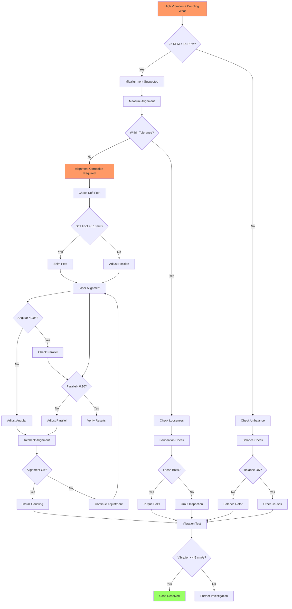

# Fault Case Report: Electric Motor Shaft Misalignment Resolution

## Executive Summary

| Field | Details |
|-------|---------|
| **Equipment** | 75kW Induction Motor + Centrifugal Pump |
| **Fault** | Excessive vibration (11.2 mm/s RMS), coupling wear |
| **Root Cause** | Angular and parallel misalignment exceeding tolerances |
| **Resolution** | Laser alignment correction, coupling replacement |
| **Duration** | 4 hours (diagnosis: 1.5h, repair: 2.5h) |

---

## 1. Fault Manifestation

### Initial Report
User reported: "Motor vibration has been increasing over the past month. Now it's shaking the whole platform. Coupling looks worn too."

### Observed Phenomena
- **Vibration**: 11.2 mm/s RMS (critical threshold: 7.1 mm/s)
- **Spectrum**: High 1× and 2× RPM components
- **Coupling**: Visible wear on elastomer elements
- **Temperature**: Bearing temperatures elevated (68°C vs normal 55°C)

### Operating Conditions
- Motor speed: 1485 RPM (4-pole, 50Hz)
- Load: 82% of rated power
- Runtime: 6 months since last alignment check
- Recent work: None reported

### Impact Assessment
- **Production**: Pump output reduced 10% due to vibration limits
- **Equipment**: Risk of bearing damage if continued
- **Safety**: Platform vibration creates trip hazard

---

## 2. Diagnostic Trajectory

### Phase 1: Information Gathering (20 minutes)
Key questions and findings:
1. "When was alignment last checked?" → "6 months ago during installation"
2. "Any recent impacts or foundation work?" → "No, but nearby equipment was installed 2 months ago"
3. "Vibration trend?" → "Gradual increase from 4.5 to 11.2 mm/s over 4 weeks"
4. "Which direction is worst?" → "Axial vibration is highest"

### Phase 2: Initial Assessment (25 minutes)
Possible causes:
1. **Misalignment (High)** - High 2× component suggests angular misalignment
2. **Unbalance (Medium)** - 1× component present but not dominant
3. **Looseness (Medium)** - Foundation work nearby could affect grouting
4. **Bearing wear (Low)** - Temperature elevated but not critical

### Phase 3: Systematic Testing (45 minutes)

**Test 3.1: Vibration Spectrum Analysis**
- 1× RPM: 6.8 mm/s (unbalance indicator)
- 2× RPM: 8.4 mm/s (misalignment indicator - highest!)
- Axial/Radial ratio: 0.85 (misalignment characteristic)
- Conclusion: Misalignment is primary issue

**Test 3.2: Phase Analysis**
- Phase difference between bearings: 165°
- Indicates angular misalignment component
- Supports spectrum analysis findings

**Test 3.3: Alignment Measurement**
- Method: Laser alignment system
- Results:
  - Angular misalignment: 0.18 mm/100mm (spec: <0.05)
  - Parallel offset: 0.25 mm (spec: <0.10)
  - Both severely out of tolerance

**Test 3.4: Soft Foot Check**
- All four motor feet measured
- Maximum soft foot: 0.08 mm (acceptable: <0.10)
- Soft foot not a contributing factor

**Test 3.5: Coupling Inspection**
- Elastomer spider: Cracked and compressed
- Hub bores: No visible damage
- Conclusion: Coupling damage secondary to misalignment

### Phase 4: Root Cause Confirmation (10 minutes)
Root cause confirmed: Combined angular and parallel misalignment causing:
- High vibration through coupling
- Premature coupling wear
- Increased bearing loads

Contributing factor: Nearby equipment installation may have affected foundation

---

## 3. Troubleshooting Procedures

### Procedure 1: Vibration Analysis
| Frequency | Amplitude (mm/s) | Diagnostic Significance | Threshold |
|-----------|------------------|------------------------|-----------|
| 1× RPM | 6.8 | Unbalance component | >70% of total |
| 2× RPM | 8.4 | Misalignment (dominant) | >40% of 1× |
| 3× RPM | 2.1 | Misalignment (secondary) | Monitor |
| Axial total | 9.5 | High axial = misalignment | Compare to radial |

**Tools Used**: Vibration analyzer, accelerometers (3 axes)

### Procedure 2: Alignment Verification
| Parameter | Measured | Specification | Deviation |
|-----------|----------|---------------|-----------|
| Angular (vertical) | 0.12 mm/100mm | <0.05 | 2.4× limit |
| Angular (horizontal) | 0.14 mm/100mm | <0.05 | 2.8× limit |
| Parallel (vertical) | 0.18 mm | <0.10 | 1.8× limit |
| Parallel (horizontal) | 0.17 mm | <0.10 | 1.7× limit |

**Tools Used**: Laser shaft alignment system, shim kit

### Procedure 3: Coupling Assessment
| Component | Condition | Assessment |
|-----------|-----------|------------|
| Motor hub | Good, no wear | Reuse |
| Pump hub | Good, no wear | Reuse |
| Elastomer spider | Cracked, compressed | Replace |
| Bolts | Slightly loose | Retorque |

**Tools Used**: Inspection light, torque wrench

---

## 4. Solution Implementation

### Root Cause
Primary: Shaft misalignment (angular and parallel) exceeding acceptable tolerances
Contributing: Nearby equipment installation may have caused foundation settling

### Corrective Actions

**Action 1: Alignment Correction**
- Removed coupling
- Adjusted motor position using jacking bolts
- Added shims under motor feet (total 1.2mm)
- Rechecked alignment after each adjustment
- Final alignment results:
  - Angular: 0.03 mm/100mm (within spec)
  - Parallel: 0.04 mm (within spec)

**Action 2: Coupling Replacement**
- Installed new elastomer spider
- Torqued coupling bolts to specification (45 Nm)
- Verified no binding during rotation

**Action 3: Verification Testing**
- Vibration measurement: 2.8 mm/s RMS (excellent)
- Bearing temperature: 52°C (normal)
- Run test: 2 hours continuous operation

### Verification Results
| Parameter | Before | After | Improvement |
|-----------|--------|-------|-------------|
| Overall vibration | 11.2 mm/s | 2.8 mm/s | 75% reduction |
| 2× RPM component | 8.4 mm/s | 0.9 mm/s | 89% reduction |
| Bearing temp (DE) | 68°C | 52°C | 16°C reduction |
| Axial vibration | 9.5 mm/s | 1.8 mm/s | 81% reduction |

---

## 5. Fault Tree Analysis

**Diagnostic Path Taken**: A → B → C → E → F → G → I → J → L → M → N → P → T → U → V → AF → AG → AH

---

## 6. Technical Insights

### Diagnostic Logic
The dominance of 2× RPM vibration component over 1× RPM is the classic signature of misalignment. The high axial vibration (85% of radial) further confirmed angular misalignment rather than simple unbalance.

### Key Indicators
1. **2× RPM dominance**: 8.4 mm/s vs 6.8 mm/s at 1× clearly indicated misalignment
2. **Axial vibration**: High axial levels are characteristic of angular misalignment
3. **Coupling wear**: Premature elastomer wear is a secondary effect of misalignment
4. **Gradual onset**: 4-week progression suggests foundation settling

### Distracting Factors
- Initial concern about unbalance due to significant 1× component
- Suspected bearing wear due to elevated temperature
- Both were secondary effects of misalignment, not root causes

### Lessons Learned
1. **Spectrum interpretation**: 2× > 1× is definitive for misalignment
2. **Alignment frequency**: 6-month check interval was too long for this application
3. **Environmental factors**: Nearby construction can affect alignment
4. **Coupling as indicator**: Premature coupling wear signals alignment issues

### Preventive Measures Recommended
1. **Alignment checks**: Quarterly instead of semi-annually
2. **Vibration monitoring**: Monthly trending to catch drift early
3. **Foundation monitoring**: Check after any nearby construction
4. **Coupling inspection**: Visual check during routine maintenance
5. **Training**: Maintenance team alignment procedure refresher

---

## 7. Appendices

### A. Vibration Trend Data

| Date | Overall (mm/s) | 1× (mm/s) | 2× (mm/s) | Notes |
|------|----------------|-----------|-----------|-------|
| 6 months ago | 3.8 | 2.9 | 1.2 | Post-installation |
| 4 months ago | 4.2 | 3.1 | 1.8 | Gradual increase |
| 2 months ago | 6.5 | 4.8 | 3.9 | Nearby work started |
| 1 month ago | 8.9 | 6.1 | 6.2 | Noticeable vibration |
| Today (before) | 11.2 | 6.8 | 8.4 | Critical level |
| Today (after) | 2.8 | 2.1 | 0.9 | Corrected |

### B. Alignment Correction Details

| Adjustment | Before | After | Change |
|------------|--------|-------|--------|
| Angular vertical | 0.12 | 0.03 | -0.09 |
| Angular horizontal | 0.14 | 0.03 | -0.11 |
| Parallel vertical | 0.18 | 0.04 | -0.14 |
| Parallel horizontal | 0.17 | 0.04 | -0.13 |
| Shim added (front) | - | 0.8mm | - |
| Shim added (rear) | - | 0.4mm | - |

### C. Parts and Materials

| Item | Part Number | Quantity | Cost |
|------|-------------|----------|------|
| Elastomer spider | Lovejoy L-150 | 1 | $45 |
| Shims (assorted) | Standard kit | 1 set | $20 |
| Labor (alignment) | - | 2.5h | - |

### D. References
- Laser alignment system manual
- ISO 14694 vibration standards for fans
- Lovejoy coupling installation guide
- Plant alignment procedure document

### E. Follow-up Actions
- [ ] Vibration check at 1 week
- [ ] Alignment verification at 1 month
- [ ] Review alignment check frequency
- [ ] Inspect nearby equipment foundations
- [ ] Schedule alignment training for maintenance team
