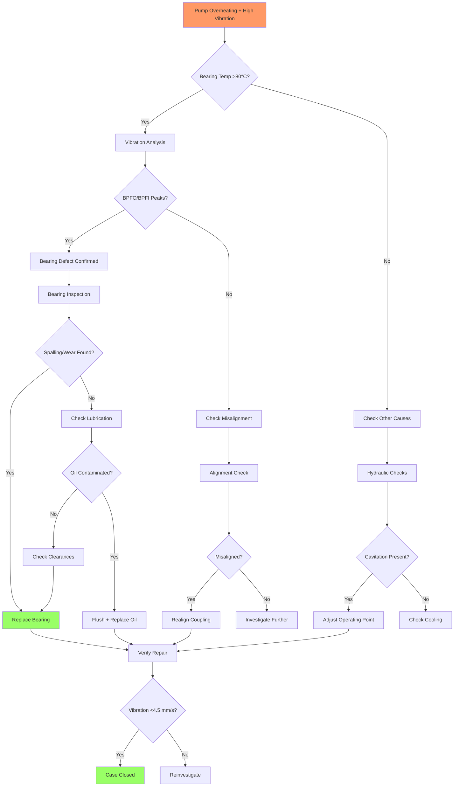

# Fault Case Report: Centrifugal Pump Bearing Failure

## Executive Summary

| Field | Details |
|-------|---------|
| **Equipment** | Centrifugal Pump CP-2000, Boiler Feed Water System |
| **Fault** | Excessive vibration and overheating (temperature >85°C) |
| **Root Cause** | Drive end bearing inner race spalling |
| **Resolution** | Bearing replacement, lubrication system flush |
| **Duration** | 6 hours (diagnosis: 2h, repair: 4h) |

---

## 1. Fault Manifestation

### Initial Report
User reported: "Pump is running hot and vibrating more than usual. Temperature gauge shows 85°C on the casing."

### Observed Phenomena
- **Temperature**: Casing temperature 85°C (normal: <60°C)
- **Vibration**: Overall level 8.2 mm/s RMS (normal: <4.5 mm/s)
- **Sound**: Audible grinding noise from drive end
- **Oil Condition**: Dark, contaminated lubricant in sight glass

### Operating Conditions at Time of Fault
- Load: 85% of rated flow
- Suction pressure: 2.1 bar (normal)
- Discharge pressure: 12.5 bar (normal)
- Runtime: 18,450 hours since last overhaul

### Impact Assessment
- **Production**: Reduced flow rate by 15% due to operator throttling
- **Safety**: High temperature alarm triggered
- **Urgency**: Critical - risk of catastrophic failure

---

## 2. Diagnostic Trajectory

### Phase 1: Information Gathering (30 minutes)
Questions asked and responses:
1. "What is the bearing temperature?" → "Drive end 92°C, non-drive end 78°C"
2. "When did this start?" → "Gradually over past week"
3. "Any recent maintenance?" → "Oil top-up 2 weeks ago"
4. "Vibration history?" → "Baseline 3.2 mm/s, now 8.2 mm/s"

### Phase 2: Initial Assessment (20 minutes)
Possible causes ranked by probability:
1. Bearing failure (High) - Temperature + vibration correlation
2. Lubrication breakdown (High) - Contaminated oil observed
3. Misalignment (Medium) - Could contribute but not primary cause
4. Cavitation (Low) - Suction conditions normal

### Phase 3: Systematic Testing (60 minutes)

**Test 3.1: Vibration Spectrum Analysis**
- Result: High 1× RPM (7.1 mm/s) with BPFO frequency peaks
- Interpretation: Confirms bearing outer race defect

**Test 3.2: Bearing Temperature Detailed Check**
- Drive end: 92°C (critical: >80°C)
- Non-drive end: 78°C (warning: 70-80°C)
- Conclusion: Drive end bearing failing

**Test 3.3: Oil Analysis**
- Visual: Black with metallic particles
- Smell: Burnt odor
- Conclusion: Lubrication degradation

**Test 3.4: Bearing Clearance Check**
- Method: Dial indicator measurement
- Result: 0.35mm clearance (spec: 0.10-0.15mm)
- Conclusion: Excessive wear confirmed

### Phase 4: Root Cause Confirmation (10 minutes)
Decision: Remove bearing for inspection

**Inspection Findings**:
- Inner race: Severe spalling and pitting
- Rolling elements: Scoring and discoloration
- Cage: Deformed and cracked
- Root cause: Fatigue failure due to extended service life

---

## 3. Troubleshooting Procedures

### Procedure 1: Vibration Assessment
| Parameter | Actual | Standard | Status |
|-----------|--------|----------|--------|
| Overall vibration | 8.2 mm/s | <4.5 mm/s | ❌ Critical |
| 1× RPM amplitude | 7.1 mm/s | <3.0 mm/s | ❌ High |
| BPFO frequency | 2.8 mm/s | <0.5 mm/s | ❌ Defect present |

**Tools Used**: Vibration analyzer, accelerometer

### Procedure 2: Temperature Monitoring
| Location | Temperature | Limit | Status |
|----------|-------------|-------|--------|
| Drive end bearing | 92°C | <80°C | ❌ Critical |
| Non-drive end bearing | 78°C | <80°C | ⚠️ Warning |
| Casing | 85°C | <75°C | ❌ High |

**Tools Used**: IR thermometer

### Procedure 3: Bearing Inspection
| Check | Finding | Assessment |
|-------|---------|------------|
| Visual inspection | Spalling on inner race | Failure confirmed |
| Clearance measurement | 0.35mm | 2× specification |
| Oil contamination | Metallic particles | Wear debris |
| Cage condition | Cracked | Secondary damage |

**Tools Used**: Dial indicator, borescope, inspection light

---

## 4. Solution Implementation

### Root Cause
Primary: Bearing fatigue failure after 18,450 hours operation (expected life: 15,000-20,000 hours)
Contributing: Lubrication degradation accelerated wear

### Corrective Actions
1. **Bearing Replacement**
   - Removed failed bearing (SKF 6314)
   - Installed new bearing with correct interference fit
   - Applied proper lubricant (ISO VG 68)

2. **Lubrication System Service**
   - Drained and flushed oil reservoir
   - Cleaned sight glass and breathers
   - Filled with new oil to correct level

3. **Alignment Verification**
   - Checked coupling alignment
   - Confirmed within tolerance (no adjustment needed)

### Verification
- **Vibration**: Reduced to 3.1 mm/s RMS
- **Temperature**: Stabilized at 58°C (drive end)
- **Sound**: Normal operating noise
- **Run test**: 4-hour continuous operation successful

---

## 5. Fault Tree Analysis

**Diagnostic Path Taken**: A → B → C → E → F → H → I → J → W → X → Y

---

## 6. Technical Insights

### Diagnostic Logic
The correlation between high temperature and high vibration immediately pointed to bearing issues. The presence of BPFO frequency peaks in the vibration spectrum provided quantitative confirmation before physical inspection.

### Key Indicators
1. **Temperature gradient**: Drive end 14°C hotter than non-drive end localized the problem
2. **Vibration spectrum**: BPFO peaks at specific frequencies are definitive for bearing defects
3. **Oil condition**: Metallic particles visible in oil indicated advanced wear

### Distracting Factors
- Initial concern about cavitation due to high flow rate
- Suspected misalignment due to coupling age
- These were ruled out by normal suction conditions and alignment measurements

### Lessons Learned
1. **Preventive**: Oil analysis program could have detected degradation earlier
2. **Diagnostic**: Vibration analysis is more definitive than temperature for bearing condition
3. **Maintenance**: Bearing replacement at 15,000 hours would have prevented emergency shutdown

### Preventive Measures Recommended
1. Implement vibration trending (monthly measurements)
2. Establish oil analysis program (quarterly sampling)
3. Schedule bearing replacement at 15,000-hour intervals
4. Install continuous temperature monitoring with alarms

---

## 7. Appendices

### A. Measurement Data Summary

| Time | Vibration (mm/s) | DE Temp (°C) | NDE Temp (°C) | Notes |
|------|------------------|--------------|---------------|-------|
| T+0h | 8.2 | 92 | 78 | Initial reading |
| T+1h | 8.4 | 94 | 79 | During diagnosis |
| T+3h | - | - | - | Bearing removed |
| T+5h | 3.1 | 58 | 52 | Post-repair |
| T+9h | 3.0 | 56 | 51 | After 4h run |

### B. Parts Replaced
| Part Number | Description | Quantity |
|-------------|-------------|----------|
| SKF 6314/C3 | Deep groove ball bearing | 1 |
| - | Bearing housing gasket | 1 |
| ISO VG 68 | Turbine oil (20L) | 1 |

### C. References Consulted
- Pump manufacturer maintenance manual
- SKF bearing failure mode guide
- ISO 10816 vibration standards
- Plant preventive maintenance procedures

### D. Follow-up Actions
- [ ] Vibration check after 1 week
- [ ] Oil analysis after 1 month
- [ ] Review bearing life prediction model
- [ ] Update PM schedule for similar pumps
