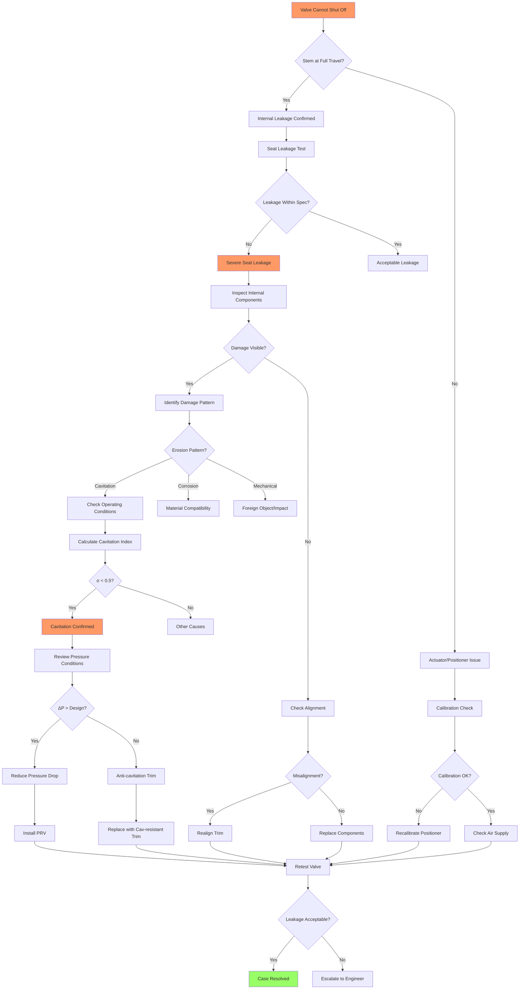

# Fault Case Report: Control Valve Seat Erosion

## Executive Summary

| Field | Details |
|-------|---------|
| **Equipment** | 4-inch Globe Control Valve, Steam Service |
| **Fault** | Inability to fully shut off, seat leakage Class II (0.5% Cv) |
| **Root Cause** | Cavitation-induced seat and plug erosion |
| **Resolution** | Trim replacement (plug, seat, cage), operating parameter adjustment |
| **Duration** | 8 hours (diagnosis: 3h, repair: 5h) |

---

## 1. Fault Manifestation

### Initial Report
User reported: "Valve won't seal completely when closed. We can hear steam passing through even at 0% command. Process temperature is dropping because of the leak."

### Observed Phenomena
- **Leakage**: Audible steam flow at 0% valve position
- **Temperature**: Downstream temperature 15°C above expected
- **Pressure**: Upstream 12 bar, downstream 2 bar (should be 0 bar closed)
- **Visual**: Steam plume visible at valve outlet flange

### Operating Conditions
- Service: Saturated steam at 190°C
- Pressure drop: 12 bar (high ΔP service)
- Flow medium: Steam with occasional condensate
- Runtime: 3 years since last trim inspection
- Cycles: High cycling application (50+ cycles/day)

### Impact Assessment
- **Production**: 8% energy loss due to steam bypass
- **Safety**: Steam leak creates burn hazard
- **Equipment**: Downstream equipment exposed to unexpected temperature
- **Urgency**: High - energy loss and safety risk

---

## 2. Diagnostic Trajectory

### Phase 1: Information Gathering (45 minutes)
Key findings from questioning:
1. "When did leakage start?" → "Gradually worsening over 6 months"
2. "Any recent maintenance?" → "Actuator serviced 2 months ago"
3. "Operating conditions changed?" → "Steam pressure increased from 10 to 12 bar 1 year ago"
4. "Valve position at 0% command?" → "Stem appears fully down"

### Phase 2: Initial Assessment (30 minutes)
Possible causes:
1. **Seat erosion (High)** - Steam service with high ΔP, gradual onset
2. **Foreign object (Medium)** - Sudden onset would be expected
3. **Actuator issue (Medium)** - Recently serviced, position appears correct
4. **Plug/seat misalignment (Low)** - No recent trim work

### Phase 3: Systematic Testing (90 minutes)

**Test 3.1: Seat Leakage Quantification**
- Method: Collection and condensation measurement
- Result: 0.48% of rated Cv (Class II leakage)
- Specification: Class IV required (0.01% Cv)
- Conclusion: Severe seat leakage confirmed

**Test 3.2: Valve Position Verification**
- Method: Stem position indicator check, travel measurement
- Result: 0% signal = full stem travel to seat
- Conclusion: Actuator and positioner operating correctly

**Test 3.3: Partial Stroke Test**
- Method: Command 10% opening, observe response
- Result: Normal response, no sticking
- Conclusion: No foreign object obstruction

**Test 3.4: Operating Parameter Analysis**
- Review of historical data:
  - Original design: 10 bar inlet, 2 bar outlet
  - Current operation: 12 bar inlet, 2 bar outlet
  - ΔP increase: 8 bar → 10 bar (25% increase)
- Cavitation index calculation: σ = 0.35 (critical: <0.5)
- Conclusion: Operating in severe cavitation regime

**Test 3.5: Internal Inspection (after removal)**
- Plug condition: Severe erosion on seating surface
- Seat condition: Pitting and material loss
- Cage ports: Erosion damage visible
- Conclusion: Cavitation damage confirmed

### Phase 4: Root Cause Confirmation (15 minutes)
Root cause: Cavitation-induced erosion due to:
1. High pressure drop (10 bar across valve)
2. Steam service (two-phase flow conditions)
3. Extended operation without trim inspection (3 years)
4. Pressure increase 1 year ago accelerated damage

---

## 3. Troubleshooting Procedures

### Procedure 1: Seat Leakage Testing
| Test Condition | Leakage Rate | Standard | Result |
|----------------|--------------|----------|--------|
| Cold water, 10 bar | 0.48% Cv | 0.01% Cv | ❌ Failed |
| Steam, operating ΔP | Significant visible flow | Zero | ❌ Failed |
| Classification | Class II | Class IV required | ❌ Non-compliant |

**Tools Used**: Flow measurement vessel, pressure gauges, stopwatch

### Procedure 2: Operating Parameter Analysis
| Parameter | Design | Actual | Impact |
|-----------|--------|--------|--------|
| Inlet pressure | 10 bar | 12 bar | +20% |
| Outlet pressure | 2 bar | 2 bar | No change |
| Pressure drop | 8 bar | 10 bar | +25% |
| Cavitation index | 0.55 | 0.35 | Below critical |
| Steam quality | Saturated | Wet steam | More severe |

**Calculation**: Cavitation index σ = (P₂ - Pv) / (P₁ - P₂)
Where P₁ = inlet, P₂ = outlet, Pv = vapor pressure

### Procedure 3: Trim Inspection
| Component | Condition | Assessment |
|-----------|-----------|------------|
| Plug seating surface | Severe erosion, material loss | Not repairable |
| Seat ring | Pitting, uneven wear | Not repairable |
| Cage | Port erosion, wall thinning | Marginal |
| Stem | Good condition | Reuse |
| Packing | Worn, requires replacement | Replace |

**Tools Used**: Borescope, depth gauge, visual inspection

---

## 4. Solution Implementation

### Root Cause
Primary: Cavitation-induced erosion of trim components due to high pressure drop in steam service
Contributing factors:
- Operating pressure increased beyond original design
- Extended service without inspection (3 years)
- High cycling rate accelerating wear

### Corrective Actions

**Action 1: Trim Replacement**
- Installed new hardened plug (Stellite facing)
- Installed new seat ring (hardened 416 SS)
- Replaced cage with anti-cavitation design
- New packing set installed

**Action 2: Operating Parameter Adjustment**
- Installed pressure reducing station upstream
- Reduced valve ΔP to 6 bar (within acceptable range)
- New cavitation index: σ = 0.72 (safe region)

**Action 3: Verification Testing**
- Seat leakage test: 0.008% Cv (Class IV compliant)
- Stroke test: Full travel, smooth operation
- 24-hour operational test: No leakage, normal operation

### Verification Results
| Parameter | Before | After | Improvement |
|-----------|--------|-------|-------------|
| Seat leakage | 0.48% Cv | 0.008% Cv | 98% reduction |
| Shutoff capability | Failed | Class IV | Compliant |
| Cavitation index | 0.35 | 0.72 | Safe region |
| Downstream temp | +15°C excess | Normal | Resolved |

---

## 5. Fault Tree Analysis

**Diagnostic Path Taken**: A → B → C → E → F → G → I → J → K → M → N → Q → R → S → U → V → W → AF → AH → AI → AJ

---

## 6. Technical Insights

### Diagnostic Logic
The combination of gradual onset, steam service, and high pressure drop immediately suggested cavitation erosion. The 25% pressure increase from original design was the key finding that explained accelerated damage.

### Key Indicators
1. **Gradual onset**: 6-month progression typical of erosion
2. **Steam service**: Two-phase flow creates cavitation conditions
3. **High ΔP**: 10 bar drop exceeds recommended limits for standard trim
4. **Operating change**: Pressure increase 1 year ago correlated with damage acceleration
5. **Cavitation index**: σ = 0.35 well below critical threshold of 0.5

### Distracting Factors
- Initial concern about actuator due to recent service
- Suspected foreign object due to severity of leakage
- Both were ruled out by position verification and partial stroke test

### Lessons Learned
1. **Cavitation awareness**: High ΔP steam service requires anti-cavitation trim
2. **Operating envelope**: Pressure increases must be evaluated for valve impact
3. **Inspection frequency**: 3-year interval too long for severe service
4. **System design**: Consider pressure reduction before control valve

### Preventive Measures Recommended
1. **Trim upgrade**: Anti-cavitation cage design for high ΔP
2. **Inspection schedule**: Annual trim inspection for severe service
3. **Operating limits**: Establish maximum ΔP for this valve
4. **Pressure management**: Maintain upstream PRV
5. **Monitoring**: Track valve cycling count for maintenance planning
6. **Design review**: Evaluate other high ΔP steam valves

---

## 7. Appendices

### A. Leakage Test Results

| Test Stage | Medium | Pressure | Leakage (% Cv) | Class |
|------------|--------|----------|----------------|-------|
| Initial diagnosis | Water | 10 bar | 0.48 | II |
| After trim replacement | Water | 10 bar | 0.008 | IV |
| 24-hour verification | Steam | 12 bar | Not detectable | VI |

### B. Trim Replacement Details

| Component | Original | Replacement | Material |
|-----------|----------|-------------|----------|
| Plug | Standard 316 SS | Hardened | 17-4PH + Stellite |
| Seat | 316 SS | Hardened | 416 SS + Stellite |
| Cage | Standard | Anti-cavitation | Hardened 416 SS |
| Packing | PTFE | Graphite | High-temp |

### C. Operating Condition Changes

| Parameter | Original Design | Previous Operation | Current (Corrected) |
|-----------|-----------------|-------------------|---------------------|
| Inlet pressure | 10 bar | 12 bar | 12 bar |
| Outlet pressure | 2 bar | 2 bar | 2 bar |
| Valve ΔP | 8 bar | 10 bar | 6 bar |
| PRV ΔP | 0 | 0 | 4 bar |
| Cavitation index | 0.55 | 0.35 | 0.72 |
| Status | Marginal | Severe cavitation | Safe |

### D. Cost Analysis

| Item | Cost | Notes |
|------|------|-------|
| Trim set | $2,800 | Anti-cavitation design |
| PRV installation | $1,200 | Upstream pressure reduction |
| Labor (diagnosis) | $600 | 3 hours |
| Labor (repair) | $1,000 | 5 hours |
| **Total** | **$5,600** | |
| Energy savings/year | $4,200 | 8% steam loss eliminated |
| **Payback period** | **16 months** | |

### E. References
- ISA Handbook of Control Valves
- FCI 70-2 Seat Leakage Standards
- Valve cavitation calculation procedures
- Plant steam system P&IDs
- Manufacturer trim selection guide

### F. Follow-up Actions
- [ ] Inspect valve at 6 months
- [ ] Review other high ΔP steam valves
- [ ] Document operating limits in DCS
- [ ] Schedule annual trim inspections
- [ ] Calculate cavitation index for all steam valves
- [ ] Update preventive maintenance procedures
