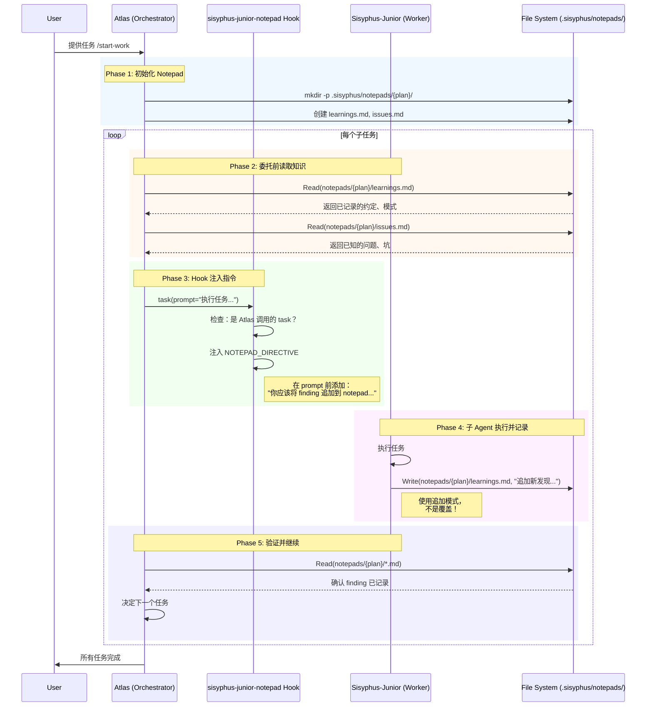
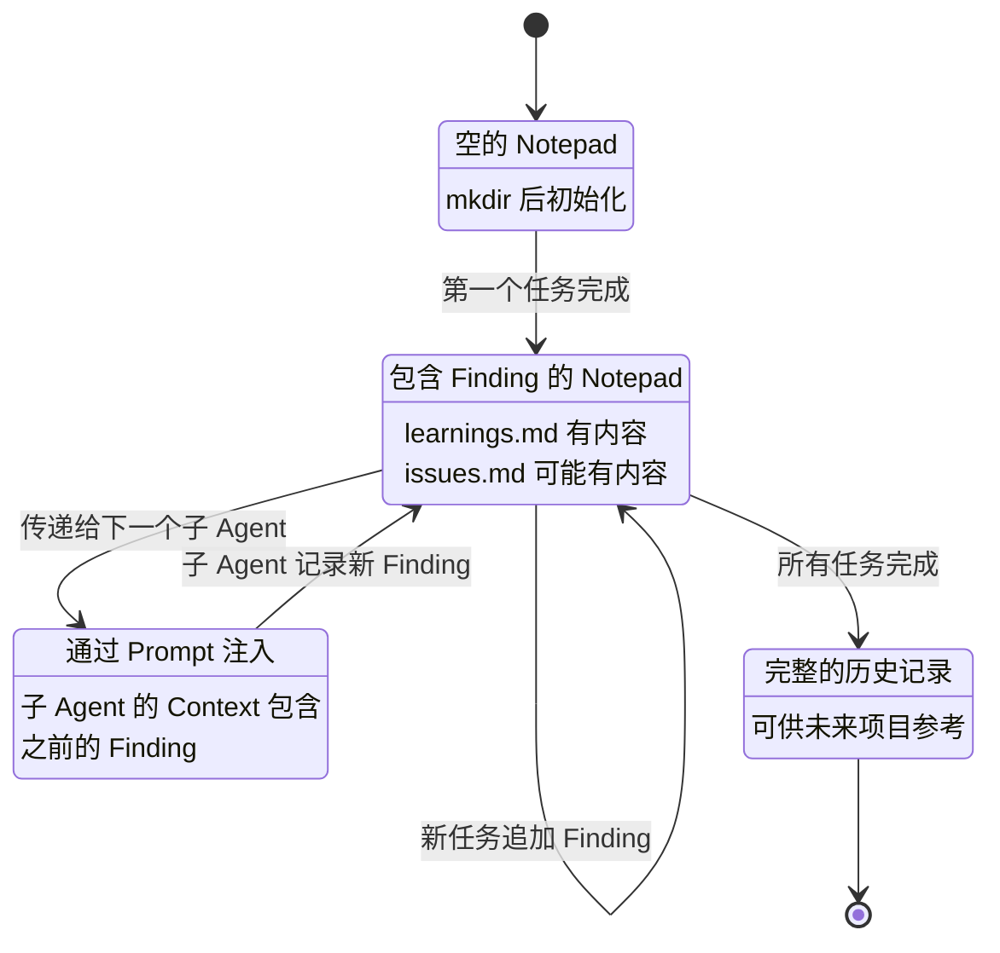
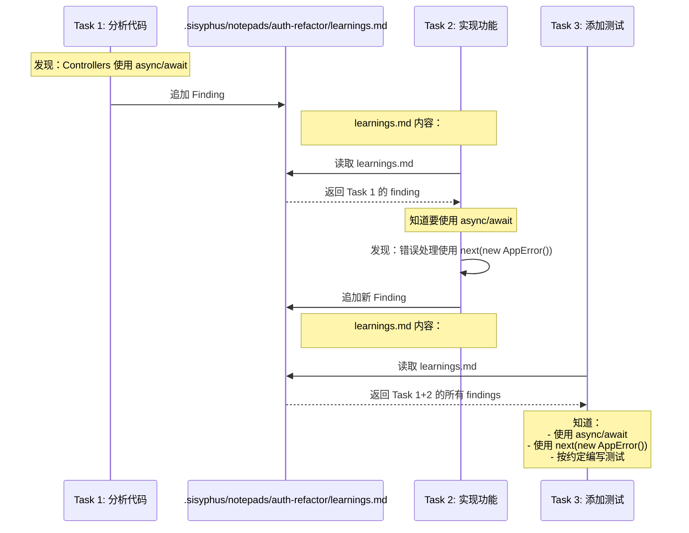
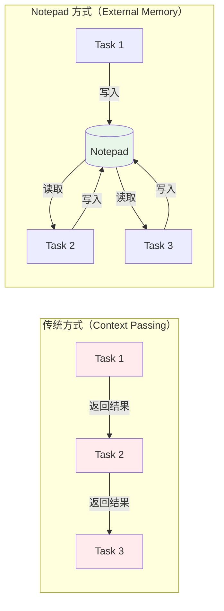

# Oh-My-OpenCode Notepad 系统架构图

## 数据流图



## 组件关系图

```mermaid
graph TB
    subgraph "Atlas Agent (Orchestrator)"
        A1[default.ts / gpt.ts]
        A2[System Prompt]
        A3[工作流：读取→委托→验证]
    end

    subgraph "Hook Layer"
        H1[sisyphus-junior-notepad Hook]
        H2[tool.execute.before]
        H3[NOTEPAD_DIRECTIVE 注入]
    end

    subgraph "Worker Agent (Sisyphus-Junior)"
        W1[接收带 Notepad 指令的 Prompt]
        W2[执行任务]
        W3[记录 Finding 到文件]
    end

    subgraph "File System"
        F1[".sisyphus/notepads/{plan}/"]
        F2[learnings.md]
        F3[issues.md]
        F4[decisions.md]
        F5[problems.md]
    end

    A1 -->|Prompt 定义| A2
    A2 -->|包含| A3
    A3 -->|调用 task()| H1
    
    H1 -->|触发| H2
    H2 -->|修改 args| H3
    H3 -->|增强后的 prompt| W1
    
    W1 --> W2
    W2 -->|追加| W3
    W3 -->|写入| F1
    
    F1 --> F2
    F1 --> F3
    F1 --> F4
    F1 --> F5
    
    F1 -->|读取| A3
    
    style A1 fill:#e1f5fe
    style H1 fill:#f3e5f5
    style W1 fill:#e8f5e9
    style F1 fill:#fff3e0
```

## Prompt 与 Hook 分工图

```mermaid
flowchart TD
    subgraph "Prompt 驱动的行为（Soft Constraint）"
        P1[Atlas Prompt 要求:<br/>委托前读取 Notepad]
        P2[Atlas Prompt 要求:<br/>指令子 Agent 记录 Finding]
        P3[Worker Prompt 要求:<br/>追加 Finding 到 notepad]
        P4[Worker Prompt 要求:<br/>永不覆盖，只追加]
    end

    subgraph "Hook 驱动的行为（Hard Constraint）"
        H1[Hook 自动注入:<br/>NOTEPAD_DIRECTIVE]
        H2[Hook 自动注入:<br/>Read-Only Plan 提醒]
        H3[Hook 确保:<br/>每个子 Agent 都获得指令]
    end

    P1 -->|Prompt 指导| R1[模型"应该"读取]
    P2 -->|Prompt 指导| R2[模型"应该"要求记录]
    P3 -->|Prompt 指导| R3[模型"应该"追加]
    P4 -->|Prompt 指导| R4[模型"应该"不覆盖]
    
    H1 -->|Hook 强制执行| R3
    H2 -->|Hook 强制执行| R5[模型知道 Plan 只读]
    H3 -->|Hook 确保一致性| R6[所有子 Agent 统一行为]

    style P1 fill:#e3f2fd
    style P2 fill:#e3f2fd
    style P3 fill:#e3f2fd
    style P4 fill:#e3f2fd
    style H1 fill:#fce4ec
    style H2 fill:#fce4ec
    style H3 fill:#fce4ec
```

## Notepad 状态流转图



## 示例：Finding 的生命周期



## 对比：传统方式 vs Notepad 方式


