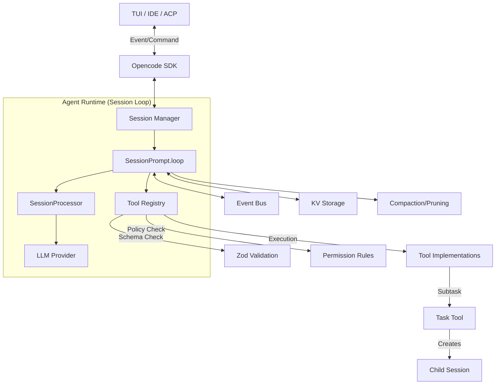

# OpenCode Architecture Research: Agent, Session, and Tools

Based on the analysis of the `opencode` repository, here is a detailed breakdown of the abstractions and logic for Agent, Session Orchestration, and Tools. This structure provides a strong reference for building modular and safe agentic systems.

## 1. Agent Abstraction

In `opencode`, an Agent is designed as a **lightweight, configuration-driven entity**.

- **Definition**: `packages/opencode/src/agent/agent.ts`.
- **Core Structure (`Agent.Info`)**:
  - **Identity**: Defined by `name`, `description`, and `mode` (primary vs subagent).
  - **Permission Ruleset**: The most critical design element. Instead of hardcoding tools, the system defines a policy-based ruleset (e.g., `read: allow`, `bash: ask`, `edit: deny`).
  - **Model Configuration**: Default model and provider for the agent.
- **Dynamic Generation**: Support for LLM-generated agent configs (`Agent.generate`), allowing on-the-fly persona creation.

**Key Takeaway**: Agent = Prompt + Permission Policy + Model Config. Decoupling permissions from tool implementations allows reusing tools with different safety profiles.

## 2. Session Orchestration (The "Agent Runtime")

The "Runtime" is not a single class but a functional loop that manages conversation state and execution.

- **Session Loop (`SessionPrompt.loop`)**: The heart of the system. It continuously:
  1. Streams and filters messages.
  2. Resolves tools based on agent permissions.
  3. Calls the LLM via a `SessionProcessor`.
  4. Handles tool execution and results.
- **Event-Driven Architecture**: A central `Bus` (pub-sub) allows decoupling. Components subscribe to events like `session.created`, `message.part.updated`, or `permission.asked`.
- **Hierarchical Sessions**: Subagents (invoked via `TaskTool`) run in child sessions linked by `parentID`. This enables task isolation and parallel delegation.

## 3. Tool Abstraction

Tools are standardized, functional units with strict validation.

- **Definition**: `packages/opencode/src/tool/tool.ts`.
- **Standard Interface**: Tools use Zod schemas for parameters, driving both validation and LLM tool definitions.
- **Context Injection**: Tools receive a `Context` object providing access to `sessionID`, `abortSignal`, and an `ask()` method for proactive permission requests.
- **Parallel Execution**: The `batch` tool uses `Promise.all` to execute up to 10 tool calls in parallel, significantly increasing throughput for research tasks.

## 4. State & Context Management

Reliable state management is handled through a tiered approach.

- **Persistent Storage**: Hierarchical file-based key-value store (`packages/opencode/src/storage/`). Uses file-locking for concurrent safety.
- **Message Parts**: Messages are composed of "Parts" (Text, Tool, File, etc.). Tool parts track execution state: `pending` -> `running` -> `completed` | `error`.
- **Compaction**: When context limits are reached, `SessionCompaction` summarizes history or prunes large, non-essential tool outputs to free up tokens.
- **Revert/Undo**: `SessionRevert` uses snapshots and patches to allow undoing changes and rolling back the conversation state.

## 5. Plugin & Extension System

The system is highly extensible via hooks.

- **Plugin Hooks**: Plugins can intercept various stages:
  - `tool.execute.before/after`: Monitor or modify tool behavior.
  - `chat.messages.transform`: Modify messages before they hit the LLM.
  - `experimental.session.compacting`: Custom compaction logic.
- **Dynamic Loading**: Tools and plugins can be loaded from the `.opencode/` directory at runtime.

## Architecture Diagram

**Overall Design Philosophy**: Prefer functional composition over deep inheritance. Use a centralized event bus for decoupling and a strict permission layer for safety.
