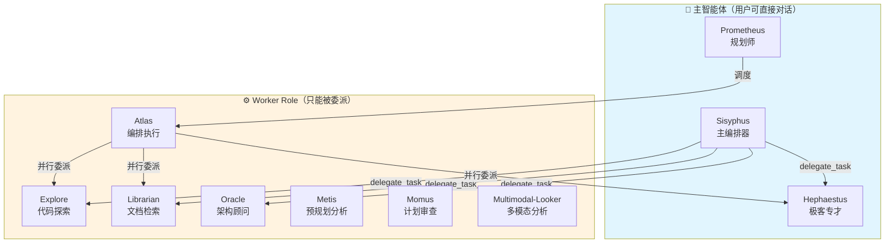
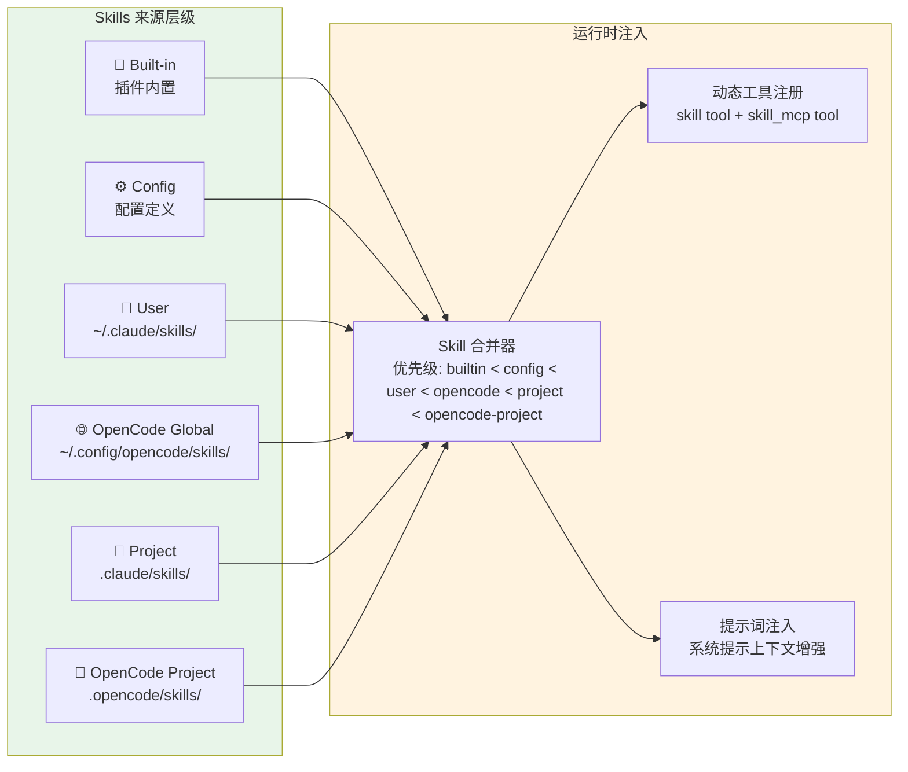

# 智能编程的演进与实践：OpenCode 架构、多智能体协同及生态深度解析

软件工程领域正经历一场由大语言模型（LLM）驱动的底层范式转移。从早期的代码自动补全，到对话式的编程助手，再到如今具备高度自主性的目标导向型智能体（Agent），人工智能在开发环境中的角色已经发生了结构性的改变。在这一技术演进的最前沿，各类深度集成于终端（Terminal）和集成开发环境（IDE）的框架正在重塑代码的设计、编写、测试与交付流程。本报告将对 Agentic Coding 的演进时间线、核心技术基座、模型能力评估体系进行深度调研，并全景式剖析 OpenCode 及其常用插件生态（特别是 oh-my-opencode 和 opencode-dcp）的技术架构、前世今生、配置规范以及结合 RFC 与 TDD 的开发最优实践，最终探讨其与 OpenClaw 结合的高级自动化应用场景。

## 1. 编程范式的代际跃迁：从 Vibe Coding 到 Agentic Engineering

过去数年间，AI 辅助软件开发的发展呈现出显著的阶段性特征，其核心标志是模型自主性权限的不断提升以及人类开发者在语法生成环节的逐渐退出 [^1]。为了准确理解当前的工具生态，必须首先厘清「Vibe Coding（直觉驱动编程）」与「Agentic Coding（智能体编程）」这两个代表不同人机交互哲学的核心概念。

Vibe Coding 这一概念在 2025 年初由 AI 领域的研究者（如 Andrej Karpathy）普及，它指的是一种「自然语言主导、人类在环（Human-in-the-loop）」的开发工作流 [^2]。其核心逻辑可以概括为「发现问题、表达意图、运行生成的代码」 [^2]。在 Vibe Coding 范式下，人类开发者扮演着类似「导演」的角色，通过不断向 LLM 发出提示，审查代码的内联差异（Inline diffs），并引导模型逐步完成功能开发 [^2]。尽管极大降低了编程的语法门槛，但开发者仍然需要对系统架构、安全漏洞以及最终的代码质量负全责 [^2]。这种模式使得非传统开发者也能通过表达业务逻辑来实现产品，但同时也带来了潜在的代码维护隐患 [^3]。

相比之下，Agentic Coding 则代表了更高维度的自动化，强调部署具备长周期规划和推理能力的完全自主型开发智能体 [^2]。在智能体工作流中，人类开发者仅需设定一个高层次的宏观目标（例如：「将此代码库升级至 Django 5 并确保所有测试用例通过」），AI 智能体便会自动进行任务拆解、多文件编辑、运行持续集成（CI）脚本、处理依赖冲突、甚至自主开启 Pull Request [^2]。到 2026 年，Agentic Coding 的趋势已从单一智能体的单打独斗，演进为多智能体团队的协同作战，使得耗时数天的复杂工程能够在极少的人类干预下于数小时内完成 [^5]。


*图 1：Agentic Workflow 的核心循环——规划（Planning）、工具使用（Tool Use）、反思（Reflection）*

### 1.1 技术演进时间线与关键节点

- **2023 年之前（纯手工编码时代）**：开发者完全依赖手工编写每一行代码，查阅静态文档和搜索引擎解决问题 [^1]。
- **2023–2024 年（AI 辅助编程时代）**：以 GitHub Copilot 为代表的内联补全工具和早期对话式助手出现。开发者开始利用 AI 生成样板代码和解决局部逻辑问题，但受限于当时的上下文窗口和模型推理能力，AI 难以理解全局项目结构 [^1]。
- **2025 年（Vibe Coding 爆发期）**：具备超大上下文窗口的模型（如 Claude 3.5 Sonnet、Gemini 1.5 Pro）普及，深度集成于 IDE 的 AI 工具（如 Cursor、Windsurf）成为主流。开发者开始习惯于通过自然语言描述直接生成完整的组件或前端交互 [^1]。
- **2026 年（Agentic Engineering 成熟期）**：多智能体编排框架、后台长期运行的 Worker 以及标准化工具调用协议（如 MCP）走向成熟。AI 智能体不再局限于编辑器内部，而是接管了终端控制权，能够跨仓库、跨服务进行系统级构建和测试 [^1]。

### 1.2 代表性智能体框架多维度对比矩阵

当前的 AI 编程工具生态极其丰富，为了清晰呈现其发展脉络，可根据其运行环境和自主权级别将其划分为「IDE 辅助型（Assistive IDE）」、「IDE 全自动扩展型」以及「CLI 全自动工作流型」。

| 框架名称 | 类别定位 | 交互模式与核心机制 | 支持模型与上下文能力 | 核心优势 | 局限性 |
| :--- | :--- | :--- | :--- | :--- | :--- |
| **Cursor** | IDE 辅助/半自动型 | 深度定制的 VS Code 分支。采用 Vibe Coding 模式与云端 Agent (Cloud Agents) 结合。 | 多模型切换（Claude 4.5, GPT-5.3, 内置 Composer）。依赖供应商标准窗口。 | 极致顺滑的 Tab 补全、可视化内联差异对比（Diffs）、低使用门槛，适合日常高频迭代 [^7]。 | 基于积分的计费在重度使用时成本高昂；生态被锁定在单一编辑器内，不适合远程服务器纯终端场景 [^8]。 |
| **RooCode (Cline)** | IDE 全自动扩展型 | 以外挂插件形式接入 VS Code。支持完全的终端访问和多文件自主编辑权限。 | 广泛支持各家 API（自带 Key），甚至本地 Ollama 模型。最高支持 200k 上下文 [^9]。 | 零加价（按 API 计费）、视觉化展示智能体执行轨迹、隐私安全性高、支持多模型无缝切换 [^9]。 | 缺乏类似于 Cursor 的后台预测性编辑和秒级补全体验 [^9]。 |
| **Claude Code** | CLI 全自动型 | 官方闭源的终端原生 CLI 工具。通过终端直接分析目录并执行 Shell 指令。 | 独占 Anthropic 模型系列（Opus 4.6, Sonnet 4.5 等）。 | 被认为是当前「最强代码大脑」，擅长处理极高难度的多文件重构、脚本自动化和复杂逻辑闭环 [^7]。 | 严重的供应商锁定（Vendor Lock-in）；缺乏代码修改的可视化界面；在处理极大型重构时缺乏多智能体原生支持 [^8]。 |
| **Gemini CLI** | CLI 全自动型 | 谷歌推出的开源终端 Agent 工具。自带 Google 搜索接地（Grounding）能力。 | 独占 Gemini 系列模型（如 Gemini 2.5/3 Pro）。支持高达 1M+ 的超大上下文 [^8]。 | 拥有压倒性的上下文窗口优势，极其适合处理包含大量杂乱日志、超大型代码库的宏观分析；支持网络实时查证 [^8]。 | 仅限谷歌模型；在复杂代码重构的精细度上尚不成熟；缺乏原生子智能体（Subagent）拆分机制 [^8]。 |
| **Codex CLI** | CLI 全自动型 | OpenAI 推出的一流 Agent 原生开发平台工具。 | 独占 OpenAI 模型系列（GPT-5.3 Codex 等）。 | 代码生成的精准度极高，推理速度快（可达 240+ tokens/s），非常适合快速生成高密度的算法片段和自动代码审查 [^7]。 | API 使用成本极为昂贵；缺乏开箱即用的复杂多智能体协作架构 [^15]。 |
| **OpenCode** | TUI 编排/全能型 | 极其灵活的终端 TUI、桌面端与 IDE 插件整合体。支持复杂的钩子（Hooks）与多智能体编排。 | 绝对的平台不可知论者（Agnostic），支持 75+ API 供应商及本地大模型 [^12]。 | 消除供应商锁定；支持极度强大的插件系统（如 oh-my-opencode）；自带可视化 TUI 界面，不闪烁；支持并行运行会话 [^12]。 | 对新手而言配置复杂度较高，需要精心调优 AGENTS.md 和选择合适的模型才能发挥最大威力 [^18]。 |

### 1.3 Agentic Coding 核心底层技术

实现从对话式 AI 到全自动代码智能体的跨越，绝非仅仅依赖底层模型参数量的扩大，而是引入了一系列工程化的上下文管理技术与抽象机制，以解决大型项目中的「上下文污染（Context Pollution）」问题。当模型被输入大量无价值的、杂乱的信息（如冗长的错误堆栈、无关的编译输出、巨型日志文件）时，会迅速引发「上下文腐败（Context Rot）」，导致模型的逻辑推理能力断崖式下降，出现幻觉或陷入死循环 [^19]。以下几项核心技术的引入彻底改变了这一现状：

1. **Slash Command（斜杠指令）**：这是早期为了规范 AI 行为而引入的技术。在终端或 IDE 中，开发者可以通过输入 `/test` 或 `/lint` 等预设指令，直接触发底层脚本并将结果自动喂给模型 [^19]。尽管这减少了人类的复制粘贴工作，但斜杠指令依然会将杂乱的执行结果直接倾倒（dump）在主对话流中，迅速消耗主模型的上下文窗口 [^19]。

2. **Skills（智能体技能）**：随着模型上下文协议（MCP）的普及，Skills 被引入作为便携式的领域知识和工具包 [^20]。Skills 就像是预先打包的「培训手册」和「微型服务器」，它们在全局范围内为 AI 提供特定任务的执行能力（例如：浏览器自动化测试技能、特定的 API 认证技能） [^20]。当智能体加载某项 Skill 时，它不仅获得了相关的上下文规则，还获得了动态调用外部系统所需的临时权限，且无需在主系统提示词中堆砌冗长的说明 [^20]。

3. **Subagent / Spawn Workers（子智能体与派生工作进程）**：这是目前解决上下文污染最关键的架构突破。子智能体（Subagents）是拥有独立上下文窗口和工具权限的专门化 AI 工作者 [^20]。当主推理智能体面临一项需要消耗大量 Token 的脏活累活（例如：在包含上万个文件的代码库中执行正则搜索并分析匹配结果）时，主智能体会「派生（Spawn）」一个隔离的子智能体去执行该任务 [^19]。子智能体在后台静默处理所有杂乱的日志和输出，完成后，仅仅将提炼出的高价值结论（Insights）返回给主推理线程 [^19]。这种架构隔离极大地提升了效率：相同的排错任务，将全量日志塞入主线程可能需要消耗 169,000 个 tokens（其中 91% 是垃圾信息），而使用子智能体模式，主线程仅需处理 21,000 个 tokens，信息纯度提高了 8 倍 [^19]。

## 2. 智能体编程能力的前沿评估与模型评分体系

随着模型在代码生成能力上的指数级进步，传统的评测基准（Benchmarks）已面临全面失效的困境。2021 年推出的 GSM8K（小学数学）和 HumanEval（简单函数生成）等基准测试，在当今的前沿模型面前已彻底饱和，GPT-5.3 Codex、Claude 3.5 等模型在这些测试上的得分普遍超过 95%，甚至达到 99% [^22]。更严重的问题在于「数据污染（Data Contamination）」：大量公开的评测集已被无意或有意地混入了模型的预训练语料中，导致模型展现出的高分仅仅是「机械记忆」的产物，而非真正的泛化推理能力 [^22]。

为了准确丈量 Agentic Coding 的真实水平，业界构建了全新的、面向复杂系统级工程的评分体系：

### 2.1 SWE-bench 体系

这是目前被业界广泛认可的代码智能体黄金标准 [^25]。该基准不再要求模型编写孤立的代码片段，而是直接向智能体抛出一个真实的、历史开源项目（如 Django、Scikit-learn）中的 GitHub Issue 描述以及代码库仓库，要求智能体自主阅读代码、定位 Bug、编写修复逻辑、生成补丁（Patch），并确保能通过隐蔽的验收测试 [^25]。


*图 2：SWE-bench 评测流程——从真实 GitHub Issue 到自动化补丁验证*

- **演进**：由于最初的 SWE-bench 中包含了一些连人类专家都认为表述不清或无法解决的任务，OpenAI 联合原作者推出了 **SWE-bench Verified**，这是一个经过人类专家严格过滤的高质量子集，能够更准确地反映模型在真实场景下的自治能力 [^25]。目前，顶级模型配合优秀的工程框架（如 Claude Opus 4.5 配合 Claude Code）在 Verified 子集上可达到 80.9% 的解决率 [^14]。

- **反作弊升级**：为了彻底解决大模型在开源代码上的「记忆污染」，Scale AI 等机构推出了 **SWE-Bench Pro (Private Dataset)**，其测试用例完全来源于初创企业合作伙伴未公开的私有代码库，模型在此类纯零样本（Zero-shot）的陌生复杂环境中，得分往往会暴跌至 23% 左右，这才是目前最真实的前沿能力底线 [^24]。

### 2.2 OpenCode 内部生态基准

针对其多模型特性，OpenCode 团队开发了专门的评估框架。OpenCode Bench (命令行工具为 `orvl`) 摒弃了学术化的谜题，直接从成熟开源项目提取生产级 Pull Requests 作为考题 [^26]。每次评估会执行三个隔离的回合（Episodes），并利用独立的多模型评委小组（LLM Judges）从五个核心维度进行打分：API 签名合规性、逻辑等效性、集成正确性、测试覆盖率以及项目检查，通过方差惩罚机制确保评分的绝对严谨性 [^27]。

### 2.3 Chimera 与 Phoenix 基准测试

社区在测试多智能体插件时，引入了针对 Token 效率和执行效率的量化分析 [^28]。Chimera 侧重于基础的智能体逻辑完成度，而 Phoenix 则是针对海量代码库的高压测试 [^28]。测试表明，不同框架完成同一任务的效率天差地别：缺乏精细编排的系统可能会消耗高达 400 万的 Token 和 180k 的上下文，而优秀的子智能体编排（搭配 DCP 插件）则能将消耗压缩至 80 万 Token 且仅需 100k 上下文 [^28]。这证明了在 Agentic 时代，「框架的提示词工程与上下文修剪能力」与「基础模型智商」同样重要。

## 3. OpenCode 的前世今生：开源抗争、Crush 纠葛与 TUI 架构演进

[](https://www.youtube.com/watch?v=IGsbARhERqc)

> 图 3：OpenCode 核心贡献者 Dax Raad 探讨 OpenCode 的起源、设计哲学与 AI 编程的未来 [^65]

在众多由科技巨头（如 Anthropic, OpenAI, Google, GitHub）投入数亿美元构建的闭源护城河中，OpenCode 以一种极为特殊的方式崛起，成为全球最受欢迎的开源 AI 编程智能体（在 GitHub 上斩获超 12 万星标，月活跃开发者达 500 万） [^16]。它的发展历程伴随着强烈的开源极客精神、企业并购的戏剧性冲突以及底层架构的重大重构。

### 3.1 TermAI、Charm 与 Crush 的爱恨纠葛

OpenCode 项目最初的源头是一个名为 TermAI 的个人项目，由开发者 Kujtim Hoxha 发起 [^30]。该项目大量依赖于一家名为 Charm（Charmbracelet）的公司所维护的开源终端 UI 库 [^30]。在发展初期，著名的 Serverless 架构框架 SST (Serverless Stack) 的联合创始人 Dax Raad (网名 thdxr) 以及明星开发者 Adam Elmore 发现了这个项目的潜力并积极介入 [^12]。他们凭借极高的工程敏锐度重塑了项目的用户体验，购买了 opencode.ai 域名，并以「OpenCode」为品牌进行了高强度的推广，使得该项目在极短的时间内获得了爆炸性的 GitHub 星标和社区关注 [^30]。

戏剧性的转折发生在项目的巅峰期。为底层的 UI 库提供支持的商业公司 Charm 看中了 OpenCode 的惊人流量，向原作者 Kujtim 伸出了橄榄枝，提供了一份全职工作（实质上的 Acqui-hire 人才收购） [^30]。Kujtim 接受了提议，并利用其作为原始仓库所有者的权限，将 OpenCode 的代码仓库及其所有星标强行转移到了 Charm 公司的企业组织名下 [^30]。

这一行为立即引发了 Dax 和 Adam 的强烈抗议。他们坚信，这个由社区共同建设起来的、旨在打破科技巨头封锁的自由工具，绝不能沦为某家 VC 投资机构的私有资产 [^30]。冲突迅速升级，社区指控 Charm 公司为了掩盖夺权事实，恶意篡改了 Git 的提交历史，抹除了 Dax 编写的大量核心代码贡献，甚至在仓库中封禁了 Adam，并删除了所有提出批评的 issue 和评论 [^30]。

面对这种开源「窃取」行为，握有 opencode.ai 域名控制权的 Dax 和 Adam 决定发起反击。他们硬分叉（Hard Fork）了该项目，并在社区的鼎力支持下，彻底抛弃了原有包袱，用 TypeScript 重新从零开始编写了全新的 OpenCode 引擎 [^29]。面对排山倒海的公众舆论压力与反噬，Charm 公司最终妥协，放弃了 OpenCode 这个名字，将其企业控制的分支更名为 **「Crush」** [^30]。至此，Crush 继续作为一个基于 Go 语言的、与特定生态绑定的工具存在，而重生的 OpenCode 则在 Dax 的带领下，演进为今天这个架构先进、支持全网模型的王者框架 [^31]。

### 3.2 终端架构的进化：TUI 的崛起

在重构 OpenCode 的过程中，Dax 及其团队解决了一个长期困扰终端工具（CLI）的痛点：状态管理和 UI 渲染的冲突 [^17]。传统的 CLI 工具（如 Claude Code 或早期的 Crush）在处理大段流式代码输出或频繁派生子智能体时，极易导致终端屏幕疯狂闪烁、历史输入记录丢失甚至终端崩溃（SIGABRT 错误） [^17]。

为了彻底解决这一问题，OpenCode 创造性地开发了名为 **opentui** 的渲染引擎 [^17]。这是一个极其硬核的技术实现，它在终端中支持了一个有效的 HTML/CSS 子集，允许开发者使用 React 范式和庞大的 TypeScript 生态来绘制终端界面 [^17]。

在此基础上，OpenCode 采用了前后端解耦的架构：

1. **本地 Server (基于 Hono)**：在后台启动一个本地无头（Headless）服务器，负责管理所有的 LLM 会话状态、构建复杂的多级提示词（组装系统指令、合并 AGENTS.md、注入本地 Git 上下文等）、管理并发网络请求，以及最核心的安全执行本地工具（如文件读写、Bash 命令执行） [^34]。

2. **Generic Client (TUI/Web/Desktop)**：终端界面（TUI）仅仅作为连接到该本地服务器的一个轻量级客户端 [^34]。

这种设计的红利是巨大的：它不仅使得 TUI 在运行包含数十个步骤的复杂多智能体逻辑时丝般顺滑、毫无闪烁，而且让 OpenCode 能够直接复用同一套核心逻辑，零成本派生出 VS Code IDE 插件版本以及独立的 macOS/Windows 桌面客户端 [^16]。开发者甚至可以通过 `opencode attach [url]` 命令，在远程服务器上开启后台任务，然后在本地终端随时切入和接管该会话 [^35]。

## 4. OpenCode 的核心安装与配置范例

[](https://www.youtube.com/watch?v=WXffHkvfRpM)

> 图 4：OpenCode 全面安装指南、LLM 供应商配置（含 Ollama）与自定义工具演示 [^66]

OpenCode 的设计哲学是「极致的部署自由与零摩擦（Zero-Friction Insurgency）」 [^29]。它不强制要求用户注册账号，也不绑定任何单一的模型供应商。

### 4.1 安装机制

OpenCode 支持几乎所有的现代环境。最便捷的全局安装方式是利用官方 Shell 脚本，或者使用各种 Node 包管理器：

```bash
# 最快的跨平台安装 (YOLO 模式)
curl -fsSL https://opencode.ai/install | bash

# 通过包管理器安装
npm install -g opencode-ai
# 或者
bun install -g opencode-ai

# macOS/Linux 推荐使用 Homebrew，以确保及时获取最新版本
brew install anomalyco/tap/opencode
```

> 注：对于 Windows 用户，官方强烈建议在 WSL (Windows Subsystem for Linux) 环境下运行，以确保各种系统级 Bash 指令的无缝执行，尽管也可以通过 Chocolatey 或 Scoop 进行原生安装 [^36]。

### 4.2 环境初始化与模型配置

安装完成后，在目标项目目录下运行 `opencode` 即可启动 TUI 界面。首次进入项目时，最关键的一步是执行 `/init` 命令：

```bash
# 在 TUI 内部输入
/init
```

这会促使 OpenCode 扫描你的项目结构，并自动在根目录下生成一个 `AGENTS.md` 文件。这个文件极其重要，它相当于项目的「宪法」，应将其提交至 Git 仓库中。后续任何 LLM 的介入都会优先读取该文件，从而深刻理解项目的架构约束、命名规范和特有设计模式 [^36]。

#### 配置层级与合并策略

OpenCode 采用基于 JSON 的配置文件（支持 JSONC 注释），其最强大的特性在于「合并而非覆盖（Merged, not replaced）」的优先级顺序 [^37]：

1. 项目级配置 (`.opencode.json`) → 决定该项目的强制规范（例如锁定特定的安全审核模型）。
2. 全局用户配置 (`~/.config/opencode/opencode.json`) → 决定开发者的个人偏好（主题、快捷键）。
3. 远程组织配置 (`.well-known/opencode`) → 用于企业内网安全下发。

如果全局配置了 `autoupdate: true`，而项目级配置了 `model: "anthropic/claude-sonnet-4-5"`，最终生效的配置将是二者的结合 [^37]。

#### 身份验证与 OpenCode Zen

通过 `/connect` 命令，用户可以无缝对接超过 75 家 API 供应商。如果用户拥有 GitHub Copilot 或 ChatGPT Plus 的订阅，OpenCode 甚至可以通过插件直接借用其背后的算力配额，实现「白嫖」 [^38]。此外，为了解决第三方 API 经常对特定大模型（如需要超长并发的编码模型）限流的问题，Dax 团队推出了 **OpenCode Zen** 服务，这是一个专门为 Coding Agent 调优的 API 网关，提供经过基准测试的、性能最稳定的模型节点 [^39]。

## 5. 核心插件生态推荐与深度拆解：DCP 与 Oh-My-OpenCode

[](https://www.youtube.com/watch?v=G_Snfh2M41M)

> 图 3：实战演示：Oh My OpenCode 如何调度多个智能体并行工作并构建全栈应用 [^67]

OpenCode 本身提供了一个强壮的底层执行沙盒，但其真正的灵魂在于高度可扩展的插件（Plugins）生态。通过在 `opencode.json` 中声明 npm 包，插件可以拦截、修改或劫持 OpenCode 的 25+ 种内置生命周期事件（Hooks） [^40]。在企业级应用中，最不可或缺的两个插件是 `opencode-dynamic-context-pruning` (DCP) 和 `oh-my-opencode`。

### 5.1 opencode-dcp（动态上下文修剪）深度解析

在长周期的代理式编程中，由于 AI 需要不断读取文件、执行测试、查阅错误日志，会话历史会迅速膨胀。这种膨胀不仅会导致天价的 API 账单，还会因为充斥着大量过时的「死数据」而引发幻觉 [^42]。传统的上下文压缩方案要么完全依赖 LLM 进行有损摘要（成本高、可能丢失关键信息），要么硬性截断历史（导致上下文断裂），而 DCP 通过**智能的上下文垃圾回收器**机制，在成本与信息保留之间实现了精妙的平衡。

#### 5.1.1 DCP 与传统 Context Compaction 的本质区别

| 维度 | OpenCode 内置 Compaction | DCP 动态上下文修剪 |
| :--- | :--- | :--- |
| **机制** | LLM 驱动的「破坏性压缩」，将多条消息替换为 LLM 生成的摘要 | **Placeholder 非破坏式修剪**，保留消息结构，仅替换特定工具输出 |
| **可逆性** | 不可逆，原始内容被 LLM 摘要覆盖 | 可逆，仅替换为 placeholder 字符串，便于调试追溯 |
| **成本控制** | 每次压缩需消耗 LLM tokens 生成摘要 | 自动策略**零 LLM 成本**，仅 LLM 主动调用工具时产生成本 |
| **触发方式** | OpenCode 内部自动触发（用户不可控） | **用户可控**：自动策略 + LLM 主动触发（`discard`/`extract`） |
| **智能程度** | 统一摘要，可能丢失关键细节 | **三层策略组合**：去重、写覆盖、错误清理，精准识别冗余 |
| **保护机制** | 有限的内置保护 | **多层保护**：工具保护、文件保护、轮次保护 |

**为什么 DCP 优于传统 Compaction？**

传统 Compaction 的核心问题是其**破坏性和不可控性**——当 OpenCode 决定压缩历史时，用户无法干预，且 LLM 生成的摘要可能遗漏关键上下文线索。而 DCP 采用 **Placeholder 机制**：并不真正删除消息，而是将冗余的工具输出（如已被覆盖的文件内容、重复的搜索结果）替换为简短的占位符描述，如「[Output removed to save context - information superseded or no longer needed]」。这种方式在大幅节省 tokens 的同时，保留了对话的时间线结构，便于问题追溯。

#### 5.1.2 DCP 的三层自动化修剪策略（零 LLM 成本）

DCP 的核心优势在于其**无需 LLM 介入即可运行的自动化策略**，在每次请求时自动执行，零成本识别并标记冗余内容：

**策略一：去重（Deduplication）**
- **原理**：检测重复调用的相同工具（如同一个 `read` 或 `grep` 被多次执行）
- **行为**：仅保留最新的工具输出，将旧版本标记为可修剪
- **示例**：连续 3 次 `read("/lib/auth.ts")` → 仅保留第 3 次，前 2 次标记

**策略二：写覆盖（Supersede Writes）**
- **原理**：追踪文件写入与读取关系，当 `write` 后被 `read` 覆盖时，该 `write` 的输入内容为冗余
- **行为**：标记被后续读取操作覆盖的旧写入内容
- **示例**：`write("config.json")` → `read("config.json")` → 旧 `write` 标记

**策略三：错误清理（Purge Errors）**
- **原理**：移除已失败的旧工具的大输入内容，但保留错误消息本身（用于诊断）
- **行为**：仅修剪输入，保留错误输出，默认 4 轮后才清理
- **示例**：第 2 轮失败的 `bash("npm test")` → 第 6 轮修剪其大输入，保留错误消息

#### 5.1.3 LLM 驱动工具：`discard` vs `extract`

除了自动化策略，DCP 还提供两个 LLM 可主动调用的工具，实现语义级的智能修剪：

| 工具 | 用途 | 知识保留 | 适用场景 |
| :--- | :--- | :--- | :--- |
| **discard** | 无损移除冗余工具输出 | 无 | 已完成的噪音任务、已失效的中间结果 |
| **extract** | 对内容进行蒸馏后移除 | 有（distillation） | 需要保留关键见解的复杂输出 |

**典型的 `extract` 调用示例**：
```
extract(
  ids: ["5", "20"],
  distillation: [
    "Auth flow defined in /lib/auth.ts with JWT token validation",
    "API routes use middleware for rate limiting"
  ]
)
```

#### 5.1.4 DCP 的保护机制

为防止过度修剪破坏关键上下文，DCP 实现了多层保护：

1. **工具保护**：`task`、`write`、`edit`、`plan_enter/exit` 等核心工具永不修剪
2. **文件保护**：配置 `protectedFilePatterns` 保护敏感文件（如 `*.secret`、`.env`）
3. **轮次保护**：用户在 `n` 轮内引用的工具不被修剪（默认 4 轮），给 AI 反应时间

#### 5.1.5 配置与激活

在 `opencode.json` 中激活：

```json
{
  "plugin": ["@tarquinen/opencode-dcp@latest"]
}
```

实测表明，在单次长会话中，DCP 能够轻易剔除 50k+ tokens 的冗余上下文，同时通过 `extract` 保留关键知识，极大保持了主模型的推理敏锐度 [^28][^42]。

### 5.2 oh-my-opencode：终极多智能体编排引擎

如果说标准的 OpenCode 是一个能力强大的全栈工程师，那么引入 oh-my-opencode 插件后，你的终端就变成了一个拥有明确分工的完整软件工程团队 [^41]。

该插件彻底打破了「单体巨石智能体（Monolithic Agent）」的局限，它抛弃了让单一庞大模型同时处理搜索、规划、编码和审查的低效模式（这极易导致 Token 爆炸和逻辑混乱）。相反，它建立了一套基于**纪律智能体（Discipline Agent）**的层级分发架构 [^21]。当任务进入系统时，首先会被 [Intent Gate]（意图网关）拦截，分析用户的真实目的，随后移交给主编排器进行分发。

#### 5.2.1 智能体分类架构：主智能体 vs Worker Role

oh-my-opencode 采用**双层智能体架构**，明确区分了**用户可交互的主智能体（Primary Agents）**和**只能被委派调用的 Worker Role（Subagents）**：



##### 主智能体（Primary Agents）

主智能体拥有 `mode: "primary"`，是用户直接交互的入口点：

| 角色 | 模式 | 用户可见 | 核心职责 |
| :--- | :--- | :--- | :--- |
| **Sisyphus** | `primary` | ✅ 是 | 默认主智能体，负责理解与意图分类，直接处理简单任务或委派复杂任务 |
| **Prometheus** | `primary` | ✅ 是（Tab切换） | 规划师模式，通过面试澄清需求并生成 RFC 规格说明书 |
| **Hephaestus** | `primary` | ✅ 是 | 深度实现专才，处理极其复杂的逻辑和算法任务 |

**关键特性**：
- 主智能体可以被用户在 TUI 中通过 **Tab 键切换**（Sisyphus ↔ Prometheus ↔ Hephaestus）
- 拥有完整的工具权限（包括 `write`、`edit`、`bash` 等）
- 负责维护与用户的主要对话流

##### Worker Role（Subagents）

Worker Role 拥有 `mode: "subagent"`，**用户不能直接调用**，只能通过 `delegate_task` 工具由主智能体委派：

| 角色 | 模式 | 用户直接调用 | 核心职责 | 典型调用方式 |
| :--- | :--- | :--- | :--- | :--- |
| **Explore** | `subagent` | ❌ 否 | 本地代码库探索（Contextual Grep） | `delegate_task(subagent_type="explore", run_in_background=true)` |
| **Librarian** | `subagent` | ❌ 否 | 外部资源检索（Reference Grep） | `delegate_task(subagent_type="librarian", run_in_background=true)` |
| **Oracle** | `subagent` | ❌ 否 | 高智商架构咨询（只读模式） | `delegate_task(subagent_type="oracle", run_in_background=false)` |
| **Metis** | `subagent` | ❌ 否 | 预规划分析顾问 | `delegate_task(subagent_type="metis", ...)` |
| **Momus** | `subagent` | ❌ 否 | 计划审查专家 | `delegate_task(subagent_type="momus", ...)` |
| **Atlas** | `subagent` | ❌ 否 | 复杂计划编排执行器 | `/start-work` 命令触发 |
| **Multimodal-Looker** | `subagent` | ❌ 否 | PDF/图像内容分析 | `delegate_task(subagent_type="multimodal-looker", ...)` |

**Worker Role 关键约束**：
- **Oracle** 具有**只读权限**（Read-only），明确禁止 `write`、`edit` 等修改操作
- **Explore/Librarian** 必须使用 `run_in_background=true`，并行执行不阻塞主线
- **Atlas** 接收增强的委派输出（包含文件变更摘要、验证清单、LIE 警告）

#### 5.2.2 核心 Agent Role 详细解析

通过精确的模型-角色匹配（Agent-Model Matching），不同职能的智能体被赋予了最契合其行为方式的大模型后台 [^45]：

| Agent Role | 类型 | 概念设定与核心职责 | 推荐模型 | 触发场景 |
| :--- | :--- | :--- | :--- | :--- |
| **Sisyphus** | Primary | 团队的 Lead Engineer。负责与人类用户沟通，理解全局上下文，维护 Master Todo List。主要工作是监督和**分发任务** [^45]。 | Claude 4.5 Opus / Sonnet / Kimi / GLM | 默认入口，处理用户日常开发请求 |
| **Prometheus** | Primary | 极其严谨的高级架构师。**坚决不写任何代码**，只负责面试澄清需求并输出 RFC 规格说明书 [^44]。 | 深度推理模型 | 大型重构/新特性立项（Tab 切换） |
| **Hephaestus** | Primary | 不善言辞的底层极客。在孤立环境下深度探索，原则导向型执行，专门啃硬骨头 [^45]。 | GPT-5.3 Codex | 复杂算法/底层重构 |
| **Atlas** | Worker | 任务调度引擎。接收 Prometheus 的 RFC，拆解为原子化微任务并并行派发，跟踪验收 [^44]。 | Claude 4.5 | `/start-work` 执行计划 |
| **Oracle** | Worker | 具有「只读」权限的资深顾问。审阅代码安全性、性能瓶颈及提供 Debug 第二视角 [^46]。 | Claude Opus / GPT-5.2 | Sisyphus 修复失败 2+ 次时强制唤醒 |
| **Librarian** | Worker | 图书管理员。利用 GitHub CLI、Exa Web Search、Context7 检索官方文档和 OSS 范例 [^46]。 | Gemini Flash / Claude Haiku | 陌生 API/报错/最佳实践 |
| **Explore** | Worker | 飞毛腿侦察兵。使用 AST-Grep 光速穿梭代码库，建立文件依赖拓扑树 [^46]。 | Grok-Code / 高速模型 | Sisyphus 动笔前理解代码库结构 |

#### 5.2.3 概念澄清：Category Agent、Subagent、Workers 与 OMO Agent 的区别

在多智能体架构中，不同术语常被混用，理解它们的精确区别至关重要：

```
┌─────────────────────────────────────────────────────────────────┐
│                    OpenCode 智能体类型体系                      │
├─────────────────────────────────────────────────────────────────┤
│  第一层：调用方式区分                                            │
│  ┌─────────────────────┐    ┌─────────────────────────────┐    │
│  │   Category Agent    │    │      Subagent/Worker        │    │
│  │   (领域智能体)       │    │      (专用子智能体)          │    │
│  │                     │    │                             │    │
│  │  • 按能力领域分类    │    │  • 按具体任务类型指定         │    │
│  │  • 由 Sisyphus 委派 │    │  • 底层执行单元              │    │
│  │  • 动态选择模型      │    │  • 如：Explore/Librarian    │    │
│  └─────────────────────┘    └─────────────────────────────┘    │
├─────────────────────────────────────────────────────────────────┤
│  第二层：Oh-My-OpenCode 扩展层                                  │
│  ┌─────────────────────────────────────────────────────────┐    │
│  │              OMO Agent (Oh-My-OpenCode Agent)           │    │
│  │                                                         │    │
│  │  在 OpenCode 原生 Subagent 基础上增加：                   │    │
│  │  • 特定角色定义 (Persona)                                │    │
│  │  • 专用工具集 (load_skills)                              │    │
│  │  • Hook 增强 (Atlas Hook、DCP Hook)                     │    │
│  │  • 增强输出 (文件变更摘要、验证清单)                      │    │
│  └─────────────────────────────────────────────────────────┘    │
└─────────────────────────────────────────────────────────────────┘
```

##### Category Agent（领域智能体）

**定义**：按**能力领域**划分的智能体分类，由 `delegate_task` 的 `category` 参数指定。

**本质**：一种**模型选择策略**——根据任务类型自动路由到最适合的底层模型，而非特定代码实现的智能体。

| Category | 适用场景 | 底层模型 | 特点 |
| :--- | :--- | :--- | :--- |
| `visual-engineering` | 前端/UI/设计任务 | Gemini 2.5 Pro | 多模态能力强，擅长视觉处理 |
| `ultrabrain` | 复杂逻辑/算法 | GPT-5.2 Codex | 纯代码逻辑极强，高吞吐量 |
| `artistry` | 创意/非标准问题解决 | Gemini 2.5 Max | 创造性思维，突破常规模式 |
| `quick` | 简单任务/快速响应 | Claude Haiku | 低延迟，高速度 |
| `deep` | 深度研究/复杂问题 | Claude Opus 4.5 | 长上下文，深度推理 |
| `writing` | 文档/技术写作 | GPT-4.1 | 语言流畅，结构清晰 |

**使用示例**：
```typescript
delegate_task(
  category="visual-engineering",  // ← 指定领域智能体
  description="Redesign sidebar",
  prompt="Create a collapsible sidebar with animations...",
  load_skills=["frontend-ui-ux"]
)
```

**关键点**：
- Category Agent **不是具体的代码实体**，而是一种**模型路由标记**
- 由 OpenCode 调度层根据 category 选择对应的底层 LLM
- 同一 category 可以运行多个并行的 Subagent 实例

##### Subagent vs Worker

| 术语 | 含义 | 关系 |
| :--- | :--- | :--- |
| **Subagent** | 广义概念：任何被主智能体委派的**从属智能体** | 上位概念 |
| **Worker** | 特指：在后台并行运行的**具体执行单元** | 下位概念 |

**详细说明**：

在 OpenCode 原生语境中：
- **Subagent** = 所有通过 `delegate_task` 启动的从属智能体，包括：
  - `subagent_type` 指定的特定智能体（Explore、Librarian 等）
  - `category` 指定的领域智能体实例
  - 后台运行的 Worker 实例

- **Worker** = 特指在 `run_in_background=true` 模式下运行的 Subagent，强调：
  - 并行执行（不阻塞主线）
  - 独立生命周期（主智能体继续处理其他任务）
  - 异步结果返回（通过消息通知）

**代码层面的区别**：
```typescript
// Subagent（通用术语）
const result = await delegate_task({
  subagent_type: "librarian",
  run_in_background: false  // ← 同步等待结果
})

// Worker（特指后台模式）
const taskId = await delegate_task({
  subagent_type: "explore",
  run_in_background: true   // ← 异步Worker模式
})
```

##### OMO Agent（Oh-My-OpenCode Agent）

**定义**：oh-my-opencode 插件在 OpenCode 原生智能体基础上**增强的特定角色智能体**。

**核心增强点**：

| 增强维度 | OpenCode 原生 Subagent | OMO Agent | 说明 |
| :--- | :--- | :--- | :--- |
| **角色定义** | 通用（subagent_type） | 特定 Persona（Prometheus、Hephaestus 等） | 详细的角色设定和世界观 |
| **工具集** | 标准工具 | `load_skills` 动态注入 | 任务特定的技能组合 |
| **Hook 增强** | 基础 Hook | Atlas Hook、DCP Hook、Keyword Detector | 增强的委派控制和上下文管理 |
| **输出增强** | 标准输出 | 变更摘要、验证清单、LIE 警告 | 结构化的执行反馈 |
| **交互模式** | 仅后台/前台 | Tab 键切换、Interview Mode | 多样的用户交互方式 |

**OMO Agent 的角色体系**：

```
OMO Agent
├── Primary Agents（用户直接交互）
│   ├── Sisyphus（主编排器 + 默认入口）
│   ├── Prometheus（规划师 - 不写代码）
│   └── Hephaestus（极客专才 - 深度实现）
│
└── Subagent Workers（委派执行）
    ├── Explore（代码探索）
    ├── Librarian（文档检索）
    ├── Oracle（架构顾问 - 只读）
    ├── Metis（预规划分析）
    ├── Momus（计划审查）
    ├── Atlas（编排执行）
    └── Multimodal-Looker（多模态分析）
```

**关键区别总结**：

| 问题 | Category Agent | Subagent | Worker | OMO Agent |
| :--- | :--- | :--- | :--- | :--- |
| **是什么** | 模型选择策略 | 委派智能体类型 | 后台执行单元 | 增强角色智能体 |
| **如何指定** | `category` 参数 | `subagent_type` 参数 | `run_in_background=true` | `persona` + `load_skills` |
| **实现方式** | 调度层路由 | 特定代码/提示词 | 进程模式 | oh-my-opencode 插件 |
| **典型示例** | `visual-engineering` | `explore`、`librarian` | 后台并行 Explore | `prometheus`、`atlas` |
| **用户可见** | ❌ 不可见（底层路由） | ⚠️ 部分可见（如 Primary） | ❌ 不可见（后台运行） | ✅ 可见（可 Tab 切换） |

**调用关系示例**：

```typescript
// Sisyphus (OMO Primary Agent) 决定委派任务
// ↓
// 选择 Category: "ultrabrain"（领域智能体）
// ↓
// 指定 Subagent: "hephaestus"（OMO Agent）
// ↓
// 作为 Worker 后台运行: run_in_background=true
// ↓
delegate_task(
  category="ultrabrain",           // Category Agent - 模型选择
  subagent_type="hephaestus",      // OMO Agent - 特定角色
  run_in_background=true,          // Worker - 后台执行
  load_skills=["git-master"],      // OMO 增强 - 专用技能
  description="Implement algorithm"
)
```

理解这四个概念的区别，是正确使用 oh-my-opencode 多智能体编排的基础：
- **Category** 解决"用什么模型"
- **Subagent** 解决"执行什么任务"  
- **Worker** 解决"如何执行（同步/异步）"
- **OMO Agent** 解决"以什么身份和工具执行"

#### 5.2.4 动态 Skills 注入机制与委派时技能指定

oh-my-opencode 的 Skills 系统支持**两种独立的技能注入模式**：主会话的全局技能加载，以及委派子智能体时的针对性技能注入。

##### 模式一：主会话全局技能加载（静态配置）

主智能体（Sisyphus/Prometheus/Hephaestus）通过 `skill` 工具按需加载技能：

```typescript
skill(name="git-master")  // 动态注入 Git 工作流知识
skill(name="playwright")  // 动态注入浏览器自动化能力
```

Skills 来源遵循**6级优先级合并**（高优先级覆盖低优先级）：

| 优先级 | 来源 | 路径 |
| :--- | :--- | :--- |
| 1 | Built-in | 插件内置（playwright, git-master, frontend-ui-ux, dev-browser） |
| 2 | Config | `opencode.json` 中 `skills` 字段定义 |
| 3 | User | `~/.claude/skills/` |
| 4 | OpenCode Global | `~/.config/opencode/skills/` |
| 5 | Project | `.claude/skills/` |
| 6 | OpenCode Project | `.opencode/skills/`（最高优先级） |

##### 模式二：委派时动态技能指定（`load_skills` 参数）⭐

这是 oh-my-opencode **最关键的设计特性**：在调用 `delegate_task` 委派子智能体时，可以通过 `load_skills` 参数**精确控制子智能体可用的技能集合**，实现：**不同子任务使用不同技能组合**的精细化控制。

**为什么这个机制至关重要？**

传统方式是所有子智能体继承父智能体的全部技能，导致：
- **上下文污染**：子智能体接收到与当前任务无关的技能说明
- **Token 浪费**：无用的技能内容占用宝贵的上下文窗口
- **决策干扰**：无关技能可能误导子智能体的工具选择

**`load_skills` 委派机制的优势**：

| 维度 | 传统继承模式 | `load_skills` 按需注入 |
| :--- | :--- | :--- |
| **上下文精准度** | ❌ 继承全部技能，噪音高 | ✅ 仅加载任务相关技能，噪音低 |
| **Token 效率** | ❌ 固定开销大 | ✅ 按任务动态调整 |
| **安全性** | ❌ 敏感技能可能被子智能体误用 | ✅ 可排除危险技能（如 `write`） |
| **调试性** | ❌ 难以追踪子智能体行为来源 | ✅ 技能清单明确，可追溯 |

**`delegate_task` 的 `load_skills` 参数规范**：

```typescript
delegate_task(
  description: string,           // 任务描述（3-5词）
  prompt: string,               // 详细任务指令
  category?: string,            // 智能体类别（与 subagent_type 二选一）
  subagent_type?: string,       // 特定智能体类型（如 "explore", "librarian"）
  run_in_background: boolean,   // 是否后台运行
  session_id?: string,          // 续接现有会话
  load_skills: string[]         // ⭐ REQUIRED: 技能名称数组，无则传 []
)
```

**使用示例**：

```typescript
// 示例 1：代码探索任务 - 仅加载搜索相关技能
delegate_task(
  subagent_type="explore",
  description="Find auth patterns",
  prompt="Search codebase for JWT authentication implementations...",
  run_in_background=true,
  load_skills=[]  // Explore 不需要额外技能
)

// 示例 2：Git 历史分析 - 加载 git-master 技能
delegate_task(
  subagent_type="librarian",
  description="Analyze git history",
  prompt="Use git bisect to find the commit that introduced the regression...",
  run_in_background=false,
  load_skills=["git-master"]  // 注入 Git 高级操作知识
)

// 示例 3：前端测试任务 - 组合多个技能
delegate_task(
  category="visual-engineering",
  description="Add E2E tests",
  prompt="Create Playwright tests for the login flow...",
  run_in_background=false,
  load_skills=["playwright", "frontend-ui-ux"]  // 浏览器自动化 + UI 设计
)

// 示例 4：安全审计任务 - 明确排除 write 技能
delegate_task(
  subagent_type="oracle",
  description="Security audit",
  prompt="Review the auth module for security vulnerabilities...",
  run_in_background=false,
  load_skills=[]  // Oracle 只读审计，不加载任何修改类技能
)
```

**最佳实践原则**：

1. **最小必要原则**：仅加载完成任务必需的技能，宁可少载也不多载
2. **危险技能隔离**：对于 `write`、`edit` 等破坏性技能，仅在编码类任务中加载，审计、探索类任务应排除
3. **Skill-Agent 匹配**：根据子智能体角色选择技能
   - `explore`：通常不需要额外技能
   - `librarian`：可加载 `git-master` 用于版本历史分析
   - `hephaestus`：可加载 `playwright` 用于自动化测试
4. **MCP 服务器联动**：如果 Skill 配置了 MCP（如 `playwright` 的 `@playwright/mcp`），`load_skills` 会自动注入 MCP 工具调用能力

**技术实现机制**：

当 `delegate_task` 被调用时，oh-my-opencode 会执行以下步骤：

1. **Skill 内容解析**：通过 `resolveSkillContent(load_skills)` 并行解析所有指定技能的内容
2. **错误处理**：如果技能不存在，返回可用技能列表供排查
3. **系统提示组装**：将技能内容注入子智能体的系统提示词（System Prompt）
4. **MCP 能力附加**：如果技能配置了 MCP 服务器，动态附加 `skill_mcp` 工具调用能力

这种设计使得每个子智能体都拥有**为其特定任务量身定制的工具集和知识库**，实现了真正的精细化多智能体协作。



#### 5.2.5 @ 符号调用机制

oh-my-opencode 支持通过 **@mention** 语法在代码或提示词中触发特定的智能体或能力：

| 语法 | 含义 | 触发行为 |
| :--- | :--- | :--- |
| `@sisyphus` | 召唤主编排器 | 明确将当前任务路由给 Sisyphus 处理 |
| `@explore` | 召唤代码探索器 | 触发 Explore agent 进行代码库搜索 |
| `@librarian` | 召唤文档专家 | 触发 Librarian agent 检索外部资源 |
| `@oracle` | 召唤架构顾问 | 触发 Oracle 进行深度分析（只读） |
| `@skill:<name>` | 加载特定 Skill | 动态注入 Skill 的提示词和 MCP 能力 |

**@ 符号的工作原理**：

1. **Keyword Detection**：在 `chat.message` Hook 中，系统解析用户输入检测 `@` 符号
2. **Agent Mapping**：根据 `@` 后的名称映射到对应的 `subagent_type`
3. **Delegation Trigger**：自动构建 `delegate_task` 调用并注入上下文

**示例场景**：
```markdown
用户输入：
"@explore 帮我找出项目中所有使用 JWT 认证的地方"

系统自动转换为：
delegate_task(
  subagent_type="explore",
  run_in_background=true,
  prompt="找出项目中所有使用 JWT 认证的地方..."
)
```

该插件还解决了一个极其致命的「代码覆写覆盖灾难」。传统的 AI 经常会依赖记忆去重写代码，导致行号偏移时引发代码损坏。oh-my-opencode 强制引入了**哈希锚点编辑工具（Hash-Anchored Edit Tool）**。AI 读取的每一行代码都会被加上类似 `11#VK| function()` 的加密哈希标签。当 AI 提交修改时，必须带上这个哈希值，如果文件在这期间被其他智能体或人类修改过，哈希验证失败，修改将被拒绝，从而将多文件编辑的成功率从极低水平提升至 68.3% [^21]。

## 6. 围绕 Oh-My-OpenCode 的开发最优实践：RFC 与 TDD 驱动

在引入了强大的多智能体框架后，放任 AI 自由发挥（纯粹的 Vibe Coding）往往会导致代码结构混乱和技术债飙升。高级开发团队必须对 AI 施加严格的工程纪律限制，其核心理念是「架构与规范即代码（Specification-as-code）」 [^47]。

### 6.1 场景一：大型重构与新模块立项 —— RFC 驱动的规划工作流

对于牵一发而动全身的复杂任务，必须遵循严格的「架构即代码」流程。oh-my-opencode 内置的 **RFC → Plan → RDD** 三层规划体系，确保复杂工程可控、可验证、可执行。

```mermaid
flowchart LR
    subgraph Stage1["阶段1: RFC 设计"]
        S[Sisyphus<br/>主编排器]
        R[rfc-specification<br/>Skill]
        SRFC["RFC Document<br/>.sisyphus/rfcs/"]
    end
    
    subgraph Stage2["阶段2: 方案验证"]
        M[Metis<br/>预规划分析]
        Mo[Momus<br/>计划审查]
    end
    
    subgraph Stage3["阶段3: 计划制定"]
        P[Prometheus<br/>规划师]
        PLAN["Plan Document<br/>.sisyphus/plans/"]
    end
    
    subgraph Stage4["阶段4: RDD 执行"]
        A[Atlas<br/>编排执行]
        H[Hephaestus<br/>极客专才]
        E[Explore<br/>代码探索]
        L[Librarian<br/>文档检索]
    end
    
    S -->|load_skills=[rfc-specification] + delegate_task| R
    R -->|生成| SRFC
    SRFC -->|人工 Review| Stage2
    M -->|可行性分析| Mo
    Mo -->|验证通过| P
    P -->|制定| PLAN
    PLAN -->|/start-work| A
    A -->|并行委派| H
    A -->|并行委派| E
    A -->|并行委派| L
    
    style Stage1 fill:#e3f2fd
    style Stage2 fill:#fff3e0
    style Stage3 fill:#f3e5f5
    style Stage4 fill:#e8f5e9
```

**最优实践路径：**

#### 阶段1：RFC 设计（Sisyphus + rfc-specification Skill）

**不是直接激活 Prometheus！** 正确流程是：

1. **Sisyphus 发起 RFC 委托**：使用 `rfc-specification` Skill 来结构化地收集需求
   ```
   skill(name="rfc-specification")
   ```
   
2. **生成 RFC 文档**：Sisyphus 基于技能指导，在 `.sisyphus/rfcs/` 目录下生成初始化 RFC 文档，包含：
   - 背景与动机
   - 目标与非目标
   - 技术方案概述
   - 风险与限制

3. **人工 Review**：**关键步骤**——开发者必须人工审阅 RFC，提出修改意见，循环迭代直到 RFC 达到可接受状态。

#### 阶段2：方案验证（Metis + Momus 双审机制）

当 RFC 通过人工 Review 后，进入自动化验证阶段：

- **Metis（预规划分析）**：深度分析 RFC 的可行性，检测潜在的技术债务、依赖冲突、边缘用例遗漏
- **Momus（计划审查）**：从不同角度审视方案完整性，确保计划可执行

```typescript
// Sisyphus 同时委托 Metis 和 Momus 进行验证
delegate_task(subagent_type="metis", load_skills=[rfc-specification], ...)
delegate_task(subagent_type="momus", load_skills=[rfc-specification], ...)
```

只有当两个审核智能体都通过时，才允许进入下一阶段。

#### 阶段3：计划制定（Prometheus）

**此时才激活 Prometheus**：

- 切换到 Prometheus 模式（Tab 键）
- Prometheus 读取已验证的 RFC
- 生成详细的 **Plan 文档** 在 `.sisyphus/plans/` 目录
- 将 RFC 拆解为原子的、可验收的微任务

#### 阶段4：RDD 驱动执行（Atlas + 多 Worker）

执行 `/start-work`，Atlas 接管：

- Atlas 读取 Plan 文档
- 并行委派给 Hephaestus（核心实现）、Explore（代码探索）、Librarian（文档检索）
- 跟踪每个微任务的验收状态
- 跨越多次会话保持项目进度

**这个四层架构的核心价值**：将「需求澄清 → 方案验证 → 计划制定 → 执行交付」彻底解耦，每个阶段都有明确的进入/退出标准和质量门禁。

### 6.2 场景二：复杂业务逻辑与算法实现 —— Agentic TDD (测试驱动开发) 工作流

在执行 RFC 规划的具体逻辑文件（如支付引擎、基于规则的验证器）时，让 AI 一次性生成所有逻辑极其危险。将测试驱动开发（TDD）与 Agentic 代码结合，能够形成一种完美的闭环：TDD 为 AI 提供不可动摇的边界，而 AI 则利用其速度瞬间填补这些边界 [^47]。

在 `AGENTS.md` 或全局指令中，强制设定智能体遵循 **Agentic TDD 协议 (Red-Green-Refactor)** [^50]：

- **Phase 0 (环境侦测与同步)**：智能体开始编码前，必须首先使用 `ls` 或查找工具定位现有的测试套件（如 jest 或 pytest），并锁定执行单个测试用例的具体 Bash 命令 [^50]。通过前置的钩子（Pre-commit hooks），如果检测到某个文件没有对应的测试，系统将强行打断 AI，迫使其先生成测试文件 [^51]。

- **Phase 1: RED (建立失败基线)**：智能体被要求为该项微小的行为编写**一个且仅一个**极其聚焦的测试用例。执行该测试，确保它因为预期内的原因失败（报红）。智能体必须输出对报错堆栈的分析，证明它理解了期望的输出是什么 [^50]。

- **Phase 2: GREEN (最小可用变异)**：负责编码的子智能体（如 Hephaestus）介入修改目标文件。此阶段的铁律是：**只需实现能让该测试通过的最少代码量**，优先保证正确性而非优雅性，甚至允许暂时使用硬编码的脏逻辑来搭建桥梁 [^50]。

- **Phase 3: REFACTOR (结构级重构)**：一旦测试变绿，唤醒具有高超推理能力的 Oracle 智能体。它负责将硬编码替换为泛型逻辑，确保代码符合项目的架构模式，并清理临时日志。在重构的每一步，必须反复运行之前的测试确保绿灯常亮 [^50]。

通过这种单断言（Single assertion）、极其紧凑的范围控制，人类开发者实际上利用 TDD 测试充当了套在 AI 智能体脖子上的「缰绳」，杜绝了模型陷入死循环或产生庞大的无用代码块 [^49]。

### 6.3 场景三：日常零碎特性的全自动处理 —— Ultrawork 死亡循环

对于边界清晰、相对简单的日常开发任务（例如添加一个登录按钮并绑定已有的后端 API），可以使用 oh-my-opencode 提供的终极大招：包含关键字 `ultrawork` 或 `ulw` 的直接调用 [^48]。

当输入 `ulw 在设置页面增加与鉴权模块相同的逻辑` 时，系统会启动 **Ralph Loop (或 `/ulw-loop`)** [^21]。这是一个基于「自我指涉验证」的无情循环闭环引擎。它会自动将 Explore (全局检索) 和 Librarian (文档查询) 智能体投入后台并发运行收集信息 [^48]。如果主导代码写入的 Sisyphus 因为遇到了意外的报错、模型上下文截断、或突然变得「懒惰（Lazy）」而中途停下，Todo-continuation-enforcer（待办强制执行钩子）会立刻将其抓回工作状态，重新审视报错并继续编写，直到任务达到 100% 的完成度才会将控制权交还给用户 [^21]。

---

## 7. 以点窥面：从 OpenCode 看 AgentOS 的演进与商业逻辑

OpenCode 的诞生与演进，远非一款简单的「AI 编程助手」那么简单。它是当前 Agentic 技术浪潮中最前沿、最成熟、也最具商业价值的应用形态——**AgentOS（智能体操作系统）**的典型代表。

通过深入剖析 OpenCode 的架构设计、多智能体编排、生态演进，我们可以窥见整个 AI Agent 领域的底层逻辑与未来趋势。

### 7.1 AgentOS 的核心架构范式

当前 Agent 框架正在快速收敛为一个清晰的架构范式：**以 LLM 为内核，Agent Framework 为 OS 层，通过标准化抽象对接外部系统与能力**。

```
┌─────────────────────────────────────────────────────────────┐
│                      应用层 (Applications)                  │
│  ┌─────────────┐  ┌─────────────┐  ┌─────────────┐         │
│  │  OpenCode   │  │  OpenClaw   │  │  其他领域OS │         │
│  │  (Coding)   │  │ (Assistant) │  │  (医疗/法律)│         │
│  └──────┬──────┘  └──────┬──────┘  └──────┬──────┘         │
└─────────┼────────────────┼────────────────┼───────────────┘
          │                │                │
          ▼                ▼                ▼
┌──────────────────────────────────────────────────────────────┐
│                    Agent Framework (OS 层)                  │
│  ┌─────────────┐  ┌─────────────┐  ┌─────────────┐          │
│  │   Agent     │  │   Tools     │  │   Memory    │          │
│  │   - main    │  │   - std     │  │   - ctx     │          │
│  │   - worker  │  │   - custom  │  │   - persist │          │
│  └─────────────┘  └─────────────┘  └─────────────┘          │
│  ┌─────────────┐  ┌─────────────┐  ┌─────────────┐          │
│  │   Hooks     │  │   Skills    │  │   MCP       │          │
│  │   - transform│ │   - module  │  │   - server  │          │
│  │   - observe  │ │   - dynamic │  │   - client  │          │
│  └─────────────┘  └─────────────┘  └─────────────┘          │
└────────────────────────┬─────────────────────────────────────┘
                         │
                         ▼
┌──────────────────────────────────────────────────────────────┐
│                    抽象层 (Abstractions)                     │
│  ┌─────────────┐  ┌─────────────┐  ┌─────────────┐  ┌──────┐│
│  │     ACP     │  │     MCP     │  │     FS      │  │ TERM ││
│  │  (Agent)    │  │  (Model)    │  │  (File)     │  │ (UI) ││
│  └─────────────┘  └─────────────┘  └─────────────┘  └──────┘│
└────────────────────────┬─────────────────────────────────────┘
                         │
                         ▼
┌──────────────────────────────────────────────────────────────┐
│                    执行层 (LLM Kernel)                      │
│  ┌─────────────┐  ┌─────────────┐  ┌─────────────┐          │
│  │ Claude 4.5  │  │ GPT-5.2     │  │ Gemini 2.5  │          │
│  │ Opus/Sonnet │  │ Codex       │  │ Pro         │          │
│  └─────────────┘  └─────────────┘  └─────────────┘          │
└──────────────────────────────────────────────────────────────┘
```

#### 关键抽象层解析

| 抽象层 | 全称 | 用途 | OpenCode 中的体现 |
| :--- | :--- | :--- | :--- |
| **ACP** | Agent Calling Protocol | 智能体间通信标准 | `delegate_task` 工具、Subagent 生命周期管理 |
| **MCP** | Model Context Protocol | 模型与外部工具交互标准 | `skill_mcp` 工具、MCP Server 动态接入 |
| **FS** | File System | 代码/文档/配置的持久化 | 本地项目文件读写、`.sisyphus/` 目录结构 |
| **TERM** | Terminal | 用户交互界面 | TUI 界面、日志输出、交互式 Shell |

这种「OS 层」抽象的意义在于：**应用开发者不再需要针对每个模型、每个工具单独适配**，只需面向 AgentOS 的标准接口编程，底层由 Framework 负责调度到具体的 LLM、工具、存储。

### 7.2 成熟度梯度：OpenCode vs OpenClaw

| 维度 | **OpenCode** | **OpenClaw** | 说明 |
| :--- | :--- | :--- | :--- |
| **定位** | **高阶版** 企业级 Coding OS | **中阶版** 个人助理 OS | OpenCode 面向专业开发者，OpenClaw 面向个人用户 |
| **成熟度** | 生产就绪、企业落地 | 快速迭代、生态构建 | OpenCode 有 12万+ Stars，OpenClaw 相对年轻 |
| **核心能力** | 多智能体编排·TDD·DCP·RFC | 消息监听·跨平台·技能市场 | OpenCode 深度集成编码工作流，OpenClaw 侧重连接 |
| **商业价值** | **极高**（降本增效可量化） | **中等**（工具整合价值） | 工程团队愿意为 Coding OS 付费，个人助理较难变现 |
| **技术壁垒** | 高（Subagent·Hook·Skill架构） | 中（Gateway·Adapter·Skill） | OpenCode 的多智能体编排是核心竞争力 |

**关键洞察**：OpenCode 和 OpenClaw 本质上是同一套 AgentOS 范式在不同领域的实例化。理解 OpenCode 的深度设计，就相当于理解了 AgentOS 的核心原理——这些原理可以迁移到任何需要「任务分解 → 多智能体协作 → 工具编排 → 结果交付」的领域。

### 7.3 为什么 Agentic Coding 是前沿中的前沿？

当前 LLM 发展存在一个清晰的**数据飞轮效应**：

```
     ┌─────────────────┐
     │  LLM 能力提升    │
     │ (推理·代码·Agent)│
     └────────┬────────┘
              │ 训练数据
              ▼
     ┌─────────────────┐
     │ Agentic Coding  │◄──── 最前沿·商业价值最大
     │  实践与反馈      │
     └────────┬────────┘
              │ 使用数据 + 报错数据
              ▼
     ┌─────────────────┐
     │   Framework     │
     │  开放·前沿实践   │
     └────────┬────────┘
              │ 模式抽象·工具沉淀
              ▼
     ┌─────────────────┐
     │   能力外溢       │
     │ 医疗·法律·教育   │
     └─────────────────┘
```

**飞轮的起点是 Agentic Coding**，原因有三：

1. **代码是最严格的规范语言**：编程语言无二义性、可验证、可执行，是 LLM 训练的最优质语料。Agentic Coding 的成功直接证明了 LLM 的规划和执行能力。

2. **商业价值明确可量化**：工程团队的效率提升可以精确计算（代码产出量、Bug 修复速度、交付周期），企业愿意为明确 ROI 买单。

3. **数据闭环最完整**：Coding 场景天然形成「需求 → 代码 → 测试 → 部署 → 监控 → 反馈」的闭环，每一个环节的输入输出都可以被记录、分析、用于模型改进。

**Framework 是飞轮的加速器**：

- OpenCode 等 Framework 将最佳实践开源，降低行业门槛
- Hook、Skill、MCP 等标准接口让工具生态快速繁荣
- 高级编排模式（Subagent、DCP、TDD）被验证后迅速成为行业共识

**能力外溢到其他领域**：

当 Coding OS 成熟后，其底层抽象（ACP、MCP、FS、TERM）可以向其他领域迁移：
- **医疗 OS**：患者数据抽象 → 诊断智能体 → 处方审核智能体
- **法律 OS**：案卷抽象 → 法条检索智能体 → 合同审查智能体
- **教育 OS**：知识图谱抽象 → 诊断智能体 → 教学智能体

### 7.4 核心结论：读懂 OpenCode，就读懂了 Agentic 的未来

本文档从 OpenCode 的技术细节出发，逐层剖析了：

- **Vibe Coding 到 Agentic Engineering** 的范式跃迁
- **多智能体架构**（Primary vs Worker、Skill 动态注入、DCP 上下文管理）
- **工程纪律**（RFC → Plan → RDD 四层工作流、Agentic TDD）
- **OS 层抽象**（ACP、MCP、FS、Terminal）

这些知识体系不仅适用于 Coding 场景，更是**理解整个 Agentic 时代的钥匙**。

**如果你想站在 Agentic 的最前沿**：
- 深度使用 OpenCode 及其 oh-my-opencode 插件生态
- 研究其 Hook 机制、Subagent 设计、Skill 加载原理
- 参与开源社区，贡献你的最佳实践

因为在这个 LLM 快速迭代、OS 层日趋标准化的时代，**掌握 OpenCode 的深度原理，就是掌握了 Agentic 时代的「操作系统内核」知识**。

---

## 图片清单

| 图号 | 标题 | 来源 | 位置 |
| :--- | :--- | :--- | :--- |
| 图 1 | Agentic Workflow 架构示意图 | Aisera | 第 1 节 |
| 图 2 | SWE-bench 评测流程图 | SWE-bench | 第 2.1 节 |
| 图 3 | OpenCode 核心贡献者 Dax Raad 探讨 OpenCode 的起源、设计哲学与 AI 编程的未来 | YouTube | 第 3 节 |
| 图 4 | OpenCode 全面安装指南、LLM 供应商配置（含 Ollama）与自定义工具演示 | YouTube | 第 4 节 |
| 图 5 | Oh My OpenCode 如何调度多个智能体并行工作并构建全栈应用 | YouTube | 第 5.2 节 |
| 图 6 | RFC → Plan → RDD 四层驱动工作流示意图 | Mermaid | 第 6.1 节 |
| 图 7 | AgentOS 架构范式示意图 | ASCII Art | 第 7.1 节 |
| 图 8 | Agentic Coding 数据飞轮效应 | ASCII Art | 第 7.3 节 |

## 引用的著作

[^1]: [Agentic Engineering: The Complete Guide to AI-First Software Development Beyond Vibe Coding (2026) | NxCode](https://www.nxcode.io/resources/news/agentic-engineering-complete-guide-vibe-coding-ai-agents-2026)
[^2]: [Vibe Coding vs. Agentic Coding: 2025 Beginner's Guide to AI‑Driven Development](https://dev.to/dumebii/vibe-coding-vs-agentic-coding-2025-beginners-guide-to-ai-driven-development-2oao)
[^3]: [From vibe coding to agentic AI: A roadmap for technical leaders - GitLab](https://about.gitlab.com/the-source/ai/from-vibe-coding-to-agentic-ai-a-roadmap-for-technical-leaders/)
[^4]: [Vibe Coding vs Agentic Coding: A Beginner's AI Guide for 2026 - Sourcedesk](https://www.sourcedesk.io/blog/vibe-coding-vs-agentic-coding-what-beginners-need-to-know-about-ai-driven-software-development-in-2026)
[^5]: [2026 Agentic Coding Trends Report - Anthropic](https://resources.anthropic.com/hubfs/2026%20Agentic%20Coding%20Trends%20Report.pdf)
[^6]: [Vibe Coding Trend: 2025's Biggest Shift in How We Code - Eliya](https://www.eliya.io/blog/vibe-coding/top-trends)
[^7]: [Ranking AI Coding Agents : From Cursor to Claude Code | by Mehul Gupta - Medium](https://medium.com/@mehulgupta_7991/ranking-ai-coding-agents-from-cursor-to-claude-code-dda0984b737f)
[^8]: [Claude Code Alternatives (2026): 11 Tested, 3 Worth the Switch - Morph](https://www.morphllm.com/comparisons/claude-code-alternatives)
[^9]: [Gemini CLI vs RooCode: Features and Comparisons](https://createaiagent.net/comparisons/gemini-cli-vs-roocode/)
[^10]: [Coding Agents Comparison: Cursor, Claude Code, GitHub Copilot, and more - Artificial Analysis](https://artificialanalysis.ai/insights/coding-agents-comparison)
[^11]: [Best AI Coding Agents for 2026: Real-World Developer Reviews | Faros AI](https://www.faros.ai/blog/best-ai-ai-coding-agents-2026)
[^12]: [OpenCode: The background story on the most popular open source coding agent in the world - Tech Funding News](https://techfundingnews.com/opencode-the-background-story-on-the-most-popular-open-source-coding-agent-in-the-world/)
[^13]: [Testing AI coding agents (2025): Cursor vs. Claude, OpenAI, and Gemini | Render Blog](https://render.com/blog/ai-coding-agents-benchmark)
[^14]: [We Tested 15 AI Coding Agents (2026). Only 3 Changed How We Ship. - Morph](https://morphllm.com/ai-coding-agent)
[^15]: [Major AI coding tools comparison 2026 (Claude Code, Codex, Gemini) | by Terry Cho - Medium](https://medium.com/@terrycho/major-ai-coding-tools-comparison-2026-claude-code-codex-gemini-55f1140cd05e)
[^16]: [OpenCode | The open source AI coding agent](https://opencode.ai/)
[^17]: [Anthropic blocks third-party use of Claude Code subscriptions - Hacker News](https://news.ycombinator.com/item?id=46549823)
[^18]: [The definitive guide to OpenCode: from first install to production workflows - Reddit](https://www.reddit.com/r/opencodeCLI/comments/1qssabi/the_definitive_guide_to_opencode_from_first/)
[^19]: [Slash Commands vs Subagents: How to Keep AI Tools Focused - Jason Liu](https://jxnl.co/writing/2025/08/29/context-engineering-slash-commands-subagents/)
[^20]: [Claude Code Skills vs. Spawned Subagents : r/ClaudeCode - Reddit](https://www.reddit.com/r/ClaudeCode/comments/1q63g6l/claude_code_skills_vs_spawned_subagents/)
[^21]: [code-yeongyu/oh-my-openagent: omo; the best agent ... - GitHub](https://github.com/code-yeongyu/oh-my-opencode)
[^22]: [LLM Benchmarks Explained: What Each One Measures and How to Choose for Your Use Case (2026) - LXT](https://www.lxt.ai/blog/llm-benchmarks/)
[^23]: [The SWE-Bench Illusion: When State-of-the-Art LLMs Remember Instead of Reason - arXiv](https://arxiv.org/html/2506.12286v3)
[^24]: [SWE-Bench Pro (Public Dataset) | SEAL by Scale AI](https://scale.com/leaderboard/swe_bench_pro_public)
[^25]: [Introducing SWE-bench Verified - OpenAI](https://openai.com/index/introducing-swe-bench-verified/)
[^26]: [Dax Raad: How OpenCode Benchmarks AI Coding Agents - YouTube](https://www.youtube.com/watch?v=FtxY5qRJAYw)
[^27]: [anomalyco/opencode-bench - GitHub](https://github.com/anomalyco/opencode-bench)
[^28]: [Benchmarking with Opencode (Opus,Codex,Gemini Flash & Oh-My-Opencode) : r/opencodeCLI - Reddit](https://www.reddit.com/r/opencodeCLI/comments/1qlqj0q/benchmarking_with_opencode_opuscodexgemini_flash/)
[^29]: [OpenCode and the Quiet Victory of Open Source AI - Technori](https://technori.com/2025/12/23781-opencode-and-the-quiet-victory-of-open-source-ai/aaronadogy-com/)
[^30]: [This used to be opencode but was renamed after some fallout between the devs I t... | Hacker News](https://news.ycombinator.com/item?id=44738140)
[^31]: [Both are go based using charmbracelet's gui libraries. There's actually a note a... | Hacker News](https://news.ycombinator.com/item?id=44483340)
[^32]: [Your CLI, But SMARTER: Crush, Your AI Bestie for the Terminal : r/ClaudeAI - Reddit](https://www.reddit.com/r/ClaudeAI/comments/1mda0yw/your_cli_but_smarter_crush_your_ai_bestie_for_the/)
[^33]: [TUI crashes during prompt edit · Issue #3749 · anomalyco/opencode - GitHub](https://github.com/sst/opencode/issues/3749)
[^34]: [A Brief Analysis of opencode Technology | Welcome to train.sh](https://train.sh/blog/2025-12-opencode-notes/)
[^35]: [CLI | OpenCode](https://opencode.ai/docs/cli/)
[^36]: [Intro | AI coding agent built for the terminal - OpenCode](https://opencode.ai/docs/)
[^37]: [Config | OpenCode](https://opencode.ai/docs/config/)
[^38]: [Ecosystem - OpenCode](https://opencode.ai/docs/ecosystem/)
[^39]: [Zen | OpenCode](https://opencode.ai/docs/zen/)
[^40]: [Plugins - OpenCode](https://opencode.ai/docs/plugins/)
[^41]: [oh-my-opencode - NPM](https://www.npmjs.com/package/oh-my-opencode)
[^42]: [Dynamic Context Pruning (DCP) Plugin : r/opencodeCLI - Reddit](https://www.reddit.com/r/opencodeCLI/comments/1p7epwl/dynamic_context_pruning_dcp_plugin/)
[^43]: [Dynamic context pruning plugin for OpenCode - intelligently manages conversation context to optimize token usage - GitHub](https://github.com/Opencode-DCP/opencode-dynamic-context-pruning)
[^44]: [oh-my-opencode/docs/guide/overview.md at dev - GitHub](https://github.com/code-yeongyu/oh-my-opencode/blob/dev/docs/guide/overview.md)
[^45]: [Agent-Model Matching Guide - oh-my-opencode - GitHub](https://github.com/code-yeongyu/oh-my-opencode/blob/dev/docs/guide/agent-model-matching.md)
[^46]: [sisyphus-prompt.md - code-yeongyu/oh-my-opencode - GitHub](https://github.com/code-yeongyu/oh-my-opencode/blob/dev/sisyphus-prompt.md)
[^47]: [Test-Driven Agentic Development: How TDD and Specification-as-Code Can Enable Autonomous Coding Agents | by Jeff Monnette | Medium](https://medium.com/@JeffInUptown/test-driven-agentic-development-how-tdd-and-specification-as-code-can-enable-autonomous-coding-6b1b4b7dd816)
[^48]: [oh-my-opencode | Skills Marketplace - LobeHub](https://lobehub.com/en/skills/openclaw-skills-oh-my-opencode)
[^49]: [Test-Driven Development | Agentic Coding Handbook](https://tweag.github.io/agentic-coding-handbook/WORKFLOW_TDD/)
[^50]: [\[FEATURE\]: TDD workflow Life is good · Issue #11518 · anomalyco/opencode - GitHub](https://github.com/anomalyco/opencode/issues/11518)
[^51]: [I got obsessed with making AI agents follow TDD automatically : r/ClaudeCode - Reddit](https://www.reddit.com/r/ClaudeCode/comments/1mjg1m1/i_got_obsessed_with_making_ai_agents_follow_tdd/)
[^52]: [Agentic TDD - Nizar's Blog](https://nizar.se/agentic-tdd/)
[^53]: [oh-my-opencode/docs/reference/features.md at dev - GitHub](https://github.com/code-yeongyu/oh-my-opencode/blob/dev/docs/reference/features.md)
[^54]: [OpenClaw + OpenCode: Your AI, Now a Fully Autonomous Engineering Team! Automate Your Code!](https://lilys.ai/en/notes/unreal-engine-5-20260221/openclaw-opencode-ai-autonomous-team)
[^55]: [OpenClaw Tutorial for Beginners - Crash Course](https://www.youtube.com/watch?v=u4ydH-QvPeg)
[^56]: [OpenClaw Gateway Complete Guide: Remote Deployment & Headless Cloud Architecture | Meta Intelligence](https://www.meta-intelligence.tech/en/insight-openclaw-gateway.html)
[^57]: [I built an OpenClaw-like agent with Claude Code, Cron, and App Integrations - Reddit](https://www.reddit.com/r/ClaudeAI/comments/1r78tuq/i_built_an_openclawlike_agent_with_claude_code/)
[^58]: [A Practical Guide to Securely Setting Up OpenClaw. I Replaced 6+ Apps with One " Whatsapp Twin"](https://medium.com/@srechakra/sda-f079871369ae)
[^59]: [The Ultimate Guide to OpenClaw (Formerly Clawdbot -> Moltbot) From setup and mind-blowing use cases to managing critical security risks you cannot ignore. This is the Rise of the 24/7 Proactive AI Agent Employees : r/ThinkingDeeplyAI - Reddit](https://www.reddit.com/r/ThinkingDeeplyAI/comments/1qsoq4h/the_ultimate_guide_to_openclaw_formerly_clawdbot/)
[^60]: [OpenClaw + OpenCode Turns Your AI Into a Full Autonomous Engineering Team! Automate Your Code! - YouTube](https://www.youtube.com/watch?v=kIWMLL0S8X8)
[^61]: [A top-downloaded OpenClaw skill is actually a staged malware delivery chain - Reddit](https://www.reddit.com/r/LocalLLaMA/comments/1qxrogr/a_topdownloaded_openclaw_skill_is_actually_a/)
[^62]: [The Top 100+ Agent Skills For OpenClaw, Codex and Claude | DataCamp](https://www.datacamp.com/blog/top-agent-skills)
[^63]: [Show HN: Oh-My-OpenClaw – agent orchestration for coding, from Discord/Telegram | Hacker News](https://news.ycombinator.com/item?id=47161721)
[^64]: [oh-my-opencode | Skills Marketplace - LobeHub](https://lobehub.com/bg/skills/duclm1x1-dive-ai-oh-my-opencode)
[^65]: [Building the Future of coding, OpenCode with Dax Raad - YouTube](https://www.youtube.com/watch?v=IGsbARhERqc)
[^66]: [OpenCode CRASH Course | OPEN SOURCE AI CODING AGENT - YouTube](https://www.youtube.com/watch?v=WXffHkvfRpM)
[^67]: [Oh My OpenCode Is Actually Insane - YouTube](https://www.youtube.com/watch?v=G_Snfh2M41M)
